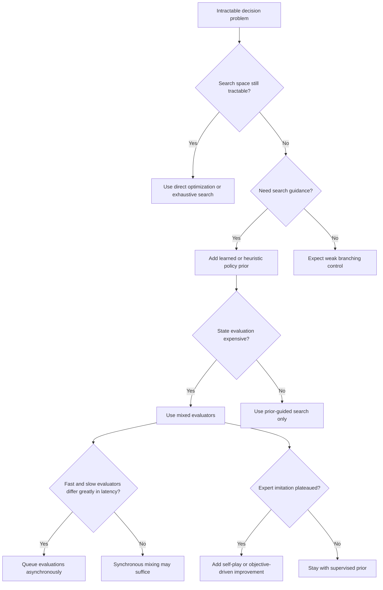

# AlphaGo Deep RL Patterns

Use this skill when the main problem is not "train a better model," but "compose multiple imperfect components so an intractable search problem becomes solvable."

## When to Use

- Exhaustive search is impossible because branching factor, depth, or evaluation cost explodes.
- You need learned priors to focus search rather than score every option equally.
- One evaluator is accurate but slow, while another is cheap but noisy, and both are useful.
- Expert imitation gets you to competence, but real performance requires optimizing the true objective through self-play or self-improvement.
- Fast search and slow deep evaluation must collaborate without constant synchronization.

## NOT for

- Plain supervised learning tasks with no meaningful search component.
- Small optimization problems where exhaustive evaluation is cheap enough.
- Single-model benchmarking where the issue is model quality, not system composition.
- Domains where expert labels already encode the real objective and imitation is sufficient.

## Core Mental Models

### Cascading Approximation Beats One Perfect Evaluator

Use different approximators at different points in the pipeline. Narrow the search with learned priors, evaluate critical states with stronger models, and use cheap rollouts or heuristics for breadth.

### Self-Play Extends Beyond Expert Imitation

Expert data provides a strong starting point, but mastery often requires optimizing against the real objective rather than against human imitation accuracy.

### Mixed Evaluators Win Through Complementary Error Modes

Accurate-but-narrow evaluators and noisy-but-exploratory evaluators should often be combined, not forced into a winner-take-all choice.

### Asynchronous Fast and Slow Loops Scale Better

Do not block a fast search loop on every expensive deep evaluation. Let the fast path keep moving with approximate information while slower evaluators refine the frontier.

### Learned Representations Matter When Handcrafted Features Plateau

In complex domains, the ability to discover useful abstractions can outweigh the benefit of manually engineered features that are faster but capped by human assumptions.

## Decision Points

- Add a prior network when the branching factor is the bottleneck.
- Add a value model when deep evaluation, not move generation, dominates cost.
- Mix evaluators when their failure modes differ meaningfully.
- Prefer self-play or closed-loop optimization once imitation no longer tracks real performance.

## Failure Modes

### Single-Evaluator Fantasy

Cue: the design keeps searching for one perfect scorer that must be both cheap and fully reliable.

Fix: split the job across priors, deep evaluators, and cheap exploratory estimators.

### Imitation Ceiling

Cue: prediction accuracy against expert data improves, but objective performance stalls.

Fix: switch to self-play or objective-driven improvement rather than optimizing the proxy harder.

### Correlated Ensemble Errors

Cue: multiple evaluators agree often, but all fail on the same corner cases.

Fix: combine evaluators with genuinely different information or bias-variance profiles.

### Synchronous Bottleneck

Cue: the fast search loop spends most of its time waiting for expensive model calls.

Fix: decouple search from deep evaluation and apply updates asynchronously.

### Uniform Compute Allocation

Cue: the system spends similar compute on all branches even though only a few deserve depth.

Fix: use the prior to allocate attention and reserve expensive evaluation for the most consequential states.

## Worked Examples

### Patch Search for Automated Code Repair

Use a lightweight policy model to rank candidate patch families, a stronger verifier to score likely fixes, and cheap execution traces to explore branches quickly. If imitation of human patches plateaus, optimize directly for passing tests and regression safety.

### Materials Search Pipeline

Use a cheap heuristic to generate promising compound families, a stronger learned evaluator for expensive property prediction, and asynchronous scheduling so the search loop can continue while the slower model evaluates high-value candidates.

## Reference Files

- `diagrams/01_flowchart_alphago_decision_framework:_wh.md` — Decision tree: when search space is intractable, evaluation uncertain, and single models insufficient. **Read when** deciding whether AlphaGo patterns apply to your problem.
- `diagrams/02_sequenceDiagram_alphago_asynchronous_heterogen.md` — CPU search thread + GPU evaluation queue interaction; shows how fast and slow loops decouple. **Read when** designing async coordination between search and neural evaluation.
- `diagrams/03_quadrantChart_cascading_approximation:_speed.md` — Speed vs. accuracy trade-offs for policy network, value network, and fast rollouts. **Read when** choosing which evaluators to cascade in your pipeline.
- `references/asynchronous-heterogeneous-architecture.md` — Computational asymmetry: tree search (µs), rollouts (µs), policy net (ms), value net (ms). Explains why decoupling fast and slow paths is essential. **Read when** architecting parallel search + evaluation systems.
- `references/cascading-approximation-architecture.md` — Why exhaustive search fails (250^150 positions); how cascading approximators avoid exploring most of the space. **Read when** designing multi-stage filtering or evaluation pipelines.
- `references/coordinating-without-central-understanding.md` — Decentralized coordination: 40 threads, 1,202 CPUs, 176 GPUs building shared tree asynchronously without global locks. **Read when** implementing distributed search without bottleneck synchronization.
- `references/evaluation-approximation-tradeoffs.md` — Speed vs. accuracy landscape: random rollouts (1000/sec, MSE 0.45), fast policy (1000/sec, MSE 0.30), value net (slower, more accurate). **Read when** allocating compute budget across fast/slow evaluators.
- `references/learned-representations-vs-handcrafted-features.md` — Why end-to-end learning beats hand-designed features in complex domains; historical context of Go AI before neural nets. **Read when** deciding whether to learn representations or use domain heuristics.
- `references/multiple-imperfect-evaluators.md` — Mixed evaluation (λ=0.5) beats pure value net or pure rollout; complementary error modes. Figure 4b shows ≥95% win rate. **Read when** combining heterogeneous evaluators with different accuracy/speed profiles.
- `references/self-play-curriculum-generation.md` — Supervised learning ceiling: SL policy 57% accuracy on expert moves, but self-play breaks through by optimizing true objective. **Read when** moving beyond imitation to self-improvement loops.

## Quality Gates

- The design names where priors, deep evaluation, and cheap exploration each enter.
- Compute allocation is intentionally asymmetric rather than uniform.
- Mixed evaluators have meaningfully different strengths or error modes.
- The objective used for self-improvement is the real success metric, not a convenience proxy.
- Fast and slow loops are coupled loosely enough that latency does not dominate throughput.

## Shibboleths

- If someone says "the value model replaces search," they have missed the whole composition pattern.
- If they cannot explain why imitation accuracy can drop while true performance rises, they have not internalized self-play.
- If every evaluator uses the same inputs and fails the same way, it is duplication, not a useful ensemble.

## Reference Routing

- `references/cascading-approximation-architecture.md`: load when the main issue is how to decompose the overall evaluator stack.
- `references/self-play-curriculum-generation.md`: load when imitation has plateaued and objective-driven improvement is needed.
- `references/multiple-imperfect-evaluators.md`: load when deciding whether and how to mix evaluators.
- `references/asynchronous-heterogeneous-architecture.md`: load when fast and slow components must collaborate at different latencies.
- `references/evaluation-approximation-tradeoffs.md`: load when compute allocation and precision tradeoffs dominate the design.
