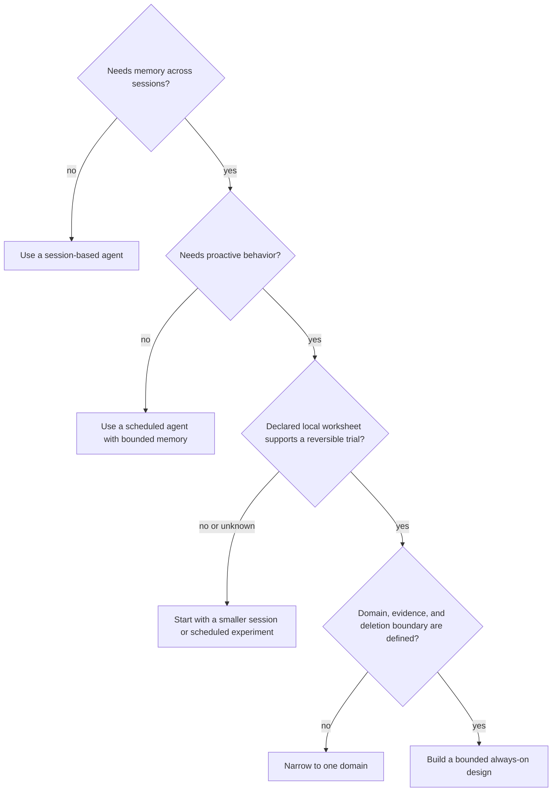
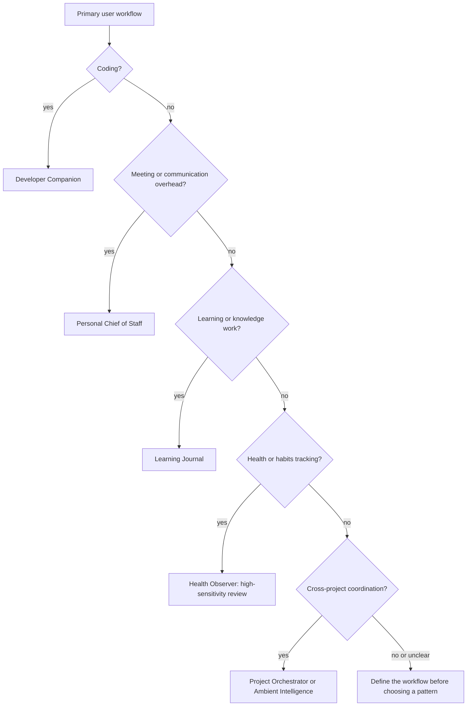
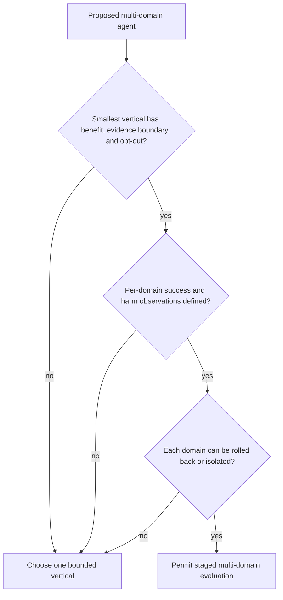
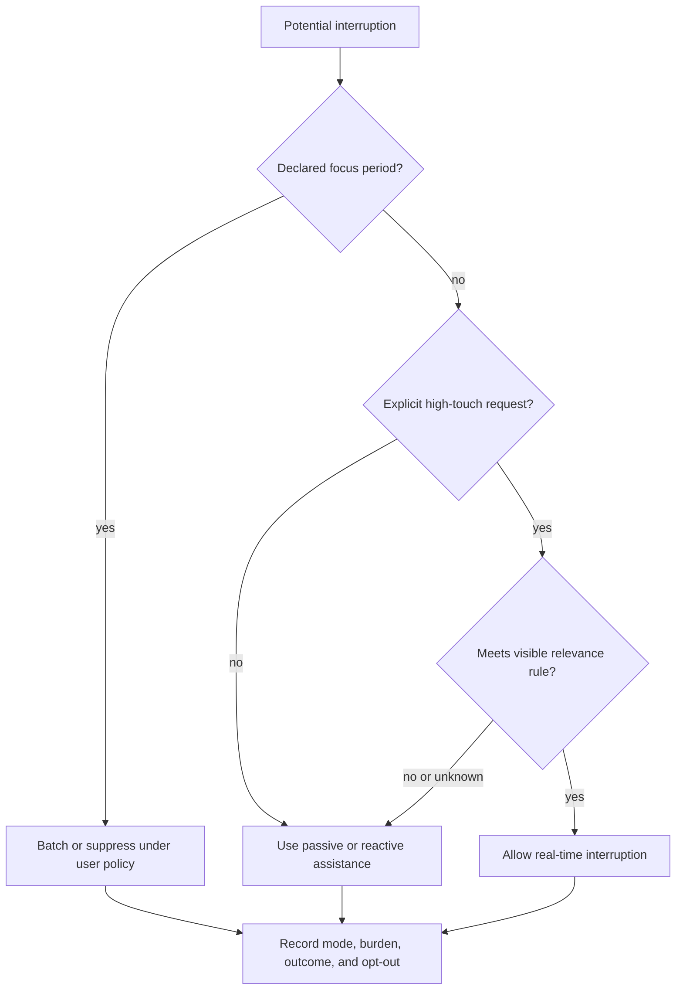
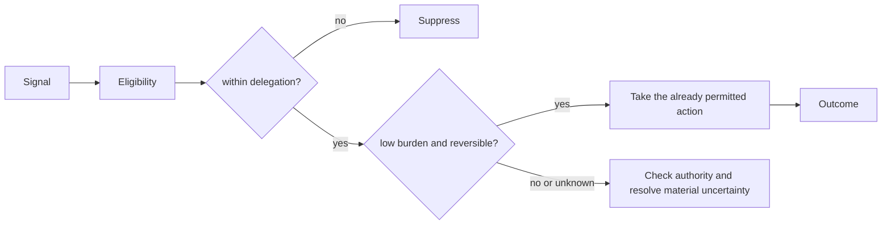
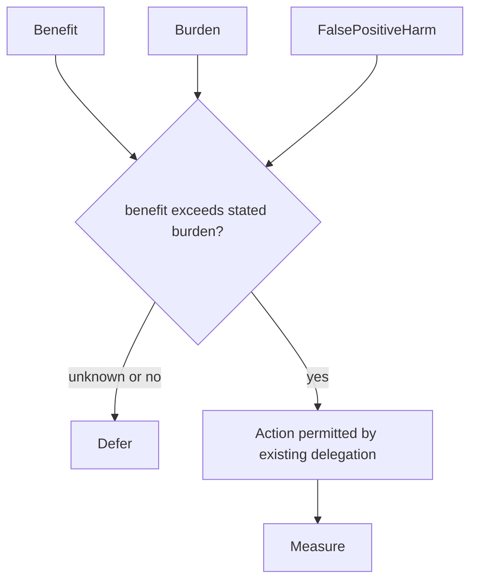

# /always-on-agent-applications — Designing Useful Persistent Workflows

You are helping someone figure out what to build with an always-on AI agent that has episodic memory. Start with a user workflow and a comparison: what benefit would persistence or event-triggered assistance add over a session-based tool with the same task information?

## Decision Points

### 1. Always-On vs Session-Based Decision

Use this sequence. First establish whether the task needs memory across sessions. If it does not, keep a session-based agent. If it does, establish whether a schedule with memory is enough or whether proactive behavior is actually needed. Then compare a declared local value worksheet with implementation and operating costs; where the result is unknown, start with the smaller reversible experiment. Finally, narrow the memory domain (for example, meetings-only or code-only) until its evidence and deletion boundary are clear.



**ROI Calculation:**
- Gross time value per period = task frequency × hours saved per task × value per hour.
- Net value per period = gross time value − service/storage cost − review and interruption cost − amortized development/maintenance cost.
- Compare all terms over the same period. Record uncertainty and the fraction of saved time that is actually useful.

Choose the cutover rule with the affected user or product owner. The former three-tier multiplier was a local heuristic, not a universal threshold or forecast.

### 2. Application Category Selection

Map the primary workflow before naming an application: coding suggests a Developer Companion; meeting or communication overhead suggests a Personal Chief of Staff; learning or knowledge work suggests a Learning Journal; health or habit tracking needs a high-sensitivity Health Observer review; and cross-project coordination may suggest a Project Orchestrator or Ambient Intelligence. These are design patterns, not capability or safety certifications.



### 3. Scope Boundaries Decision

For a proposed multi-domain agent, begin with the smallest vertical that has a declared user benefit, evidence boundary, and opt-out. Expand only after the team can define per-domain success and harm observations, and can roll back or isolate each domain. Development duration alone does not authorize wider scope; the former six-month value was an illustrative planning input.



### 4. Proactive Behavior Calibration

Treat interruptions as a user-specific policy. During declared focus periods, batch notifications or suppress them. Real-time interruptions require an explicit high-touch request and a relevance rule the user can inspect and change. Record reactive, passive-proactive, and active-proactive interaction counts for a declared evaluation period; the former 80/15/5 split was an example allocation, not a default.



## Failure Modes

### 1. Hallucinated Memory Syndrome
**Symptoms**: Agent confidently references conversations or events that never happened
**Detection Rule**: A claimed event, quote or date lacks a matching authorized source, or the source fails to entail it; a timestamp alone does not establish truth
**Root Cause**: Poor memory boundaries between retrieved context and generated responses
**Fix**: Link memory-derived claims to versioned source entries, check their content, and preserve corrections and uncertainty rather than inventing a recollection

### 2. Memory Pollution Cascade  
**Symptoms**: Agent performance degrades over time, contradictory information in responses
**Detection Rule**: If the declared evaluation detects conflicting advice on the same topic without an acknowledged source or policy change
**Root Cause**: Low-quality observations accumulating faster than valuable signal
**Fix**: Preserve source identity and corrections; evaluate compaction against required facts and obligations before replacing memory. Relevance ranking alone cannot resolve contradiction or verify truth. Provide user-triggered cleanup with readback.

### 3. Cost Creep Explosion
**Symptoms**: Monthly bills rise without a corresponding value signal in the declared evaluation
**Detection Rule**: If a declared baseline and observation window show rising cost per useful interaction without the agreed value signal
**Root Cause**: Agent over-processing low-value inputs (notifications, spam, automated emails)
**Fix**: Input filtering pipeline, memory access budgets, proactive cost monitoring with auto-throttling

### 4. Scope Creep Paralysis
**Symptoms**: Agent tries to handle everything, excels at nothing, or users disengage during the declared evaluation period
**Detection Rule**: If the active verticals outnumber the domains with explicit success, harm, and rollback criteria
**Root Cause**: Building "general assistant" instead of focused tool
**Fix**: Force single-vertical start, require graduation criteria before expansion

### 5. Privacy Violation Drift
**Symptoms**: Agent accidentally shares sensitive information across contexts
**Detection Rule**: If agent mentions personal/work details in wrong context (work info in personal chat)
**Root Cause**: Memory boundaries not aligned with user privacy expectations
**Fix**: Context isolation, explicit memory compartmentalization, regular privacy audits

## Worked Examples

### Example: Building Developer Companion Agent

**Scenario**: Software engineer wants agent to help with code reviews and PR descriptions

**Step 1 - Scope Definition**
- User: "I want an AI that helps me code better"
- Apply Decision Tree: Coding workflow = Developer Companion pattern
- Narrow scope: "PR description generation only" (not full coding assistant)

**Step 2 - Local value worksheet (constructed example, not a forecast)**
- Task frequency: 3 PRs/day × 5 days = 15 PRs/week
- Time saved: 5 min per PR description = 75 min/week = 65 hours/year
- User value: $150/hour × 65 hours = $9,750/year
- Infrastructure cost: ~$50/month = $600/year
- Gross time-value/service-cost ratio = 16.25x before development, review, maintenance and interruption costs. This is not net ROI; all inputs are constructed assumptions. Compare an event-triggered draft with an on-demand draft using the same repository context before attributing value to persistence.

**Step 3 - Memory Strategy**
- Core memory: Source-bound branch and base/head snapshot, relevant changes and authorized task context; re-read after the branch moves
- Recall memory: PR templates user prefers, reviewer feedback patterns, project coding standards
- Archival: Historical PRs, team communication style, project decisions and rationale

**Step 4 - Trigger Design**
```yaml
triggers:
  - git_push_to_feature_branch: Draft PR description
  - pr_opened: Prepare contextual enhancement for review
  - code_review_received: Log feedback patterns for future
```

**Step 5 - Quality Gates**
- PR descriptions include actual rationale (not generic summaries)
- Agent references specific commits/files mentioned
- A predeclared cohort target specifies the share of descriptions needing only brief editing; record the cohort, comparison method, and observed edits.
- Agent correctly identifies when PR spans multiple concerns

**What novice would miss**: Starting with "AI coding assistant for everything"
**What expert catches**: Test a focused workflow (PR descriptions) against an on-demand tool with equal context. Preference memory and timely triggering are separate candidate benefits; neither is established by the worksheet.

## Quality Gates

Application design is complete when all conditions are met:

- [ ] A local value worksheet, its assumptions, and its decision rule are recorded
- [ ] Single vertical scope with defined boundaries  
- [ ] Memory growth bounded with compaction strategy
- [ ] Proactive behavior policy, declared observation period, and opt-out are configured
- [ ] Success metrics defined and measurable
- [ ] User privacy boundaries explicitly mapped
- [ ] Cold start experience works without accumulated memory
- [ ] Kill switch implemented for user memory control
- [ ] Cost monitoring with auto-throttling thresholds set
- [ ] Graduation criteria defined for scope expansion

## NOT-FOR Boundaries

**Do NOT use this skill for:**

- **Building the memory architecture** → Use `always-on-agent-architecture` instead
- **Designing input feeds and triggers** → Use `always-on-agent-inputs` instead  
- **Safety, privacy, and cost concerns** → Use `always-on-agent-safety` instead
- **General agent patterns and loops** → Use `agentic-patterns` instead
- **Evaluating AI safety risks** → Use `ai-safety-engineer` instead
- **Technical infrastructure decisions** → Use `systems-architecture` instead

**Delegate to other skills when user asks:**
- "How do I store episodic memory?" → `always-on-agent-architecture`
- "What data should my agent watch?" → `always-on-agent-inputs`
- "Is this safe/private?" → `always-on-agent-safety`
- "How do I build agent loops?" → `agentic-patterns`

## Evidence boundary and repaired diagrams

Proactive behavior is a delegation and interruption-policy choice, not a general value claim. Use constructed examples only when inputs and outcomes are labeled. Record opt-out, false-positive, false-negative, burden, and reversibility observations for a declared cohort.





See [`references/evidence-scope.md`](references/evidence-scope.md), [`references/proactive-delegation-and-interruption.md`](references/proactive-delegation-and-interruption.md), and [`references/retention-and-evidence.md`](references/retention-and-evidence.md) for source scope, diagrams, and heading-by-heading retention. Existing bundle references are preserved as source snapshots and need primary-source revalidation before supporting current framework, platform, price, limit, legal, clinical, or performance claims.

## Evaluate the reason for persistence

Use three separate questions: did the agent acquire a needed preference; did it retain and correctly apply it later; and did it intervene at a useful time? A single helpfulness score hides these failures. Compare equal-context session, scheduled and event-triggered modes before paying for continuous observation. Include cancellation, changed preferences, quiet periods and manual invocation.

[Mixed-initiative methods and current evaluation designs](references/mixed-initiative-evaluation.md) supplies inspected primary sources and a constructed event trace. The scheduling application has substantial prior art; candidate Book value is in the discriminating example, not a claim to invent proactive assistants.
