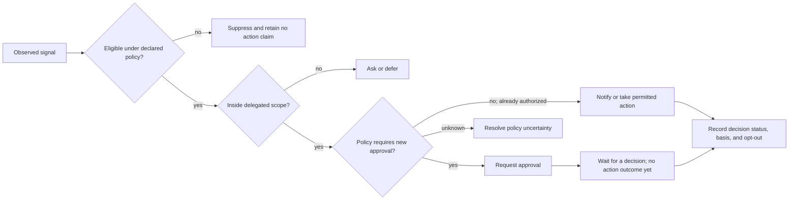
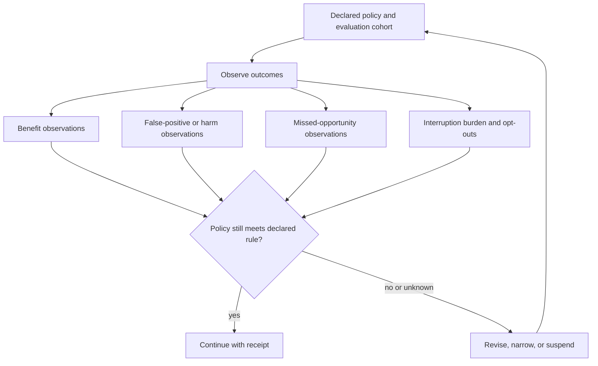

# Proactive delegation and interruption

## Source boundary

**Primary source:** National Institute of Standards and Technology, *Artificial Intelligence Risk Management Framework (AI RMF 1.0)*, January 2023, https://www.nist.gov/publications/artificial-intelligence-risk-management-framework-ai-rmf-10. **Accessed:** 2026-09-24. **Access depth:** official publication landing page and framework identity; this reference applies only the framework's risk-management framing. It does not establish a platform capability, legal conclusion, local runtime result, universal metric, or approval threshold.

The workflow below is a local design procedure. A product team supplies the delegated scope, permitted action types, evaluation cohort, and opt-out route before it relies on the procedure.

An interruption policy needs outcome evidence, not an assumed “helpfulness” percentage. The review loop makes false positives, false negatives, interruption burden, and opt-out visible alongside benefit.

## Constructed weekly scheduling assistant

For a Book-candidate specimen, a scheduling assistant may observe a calendar conflict, check a user-declared delegation rule, ask before any consequential change, and show the resulting receipt with an opt-out. Scheduling assistance has direct prior art in LookOut; see [method sources and evaluation](mixed-initiative-evaluation.md). This constructed illustration makes no efficacy or novelty claim. Any Book treatment must compare prior art and gather evaluation evidence before making broader claims.

Honor existing delegation and approvals. Consequence and reversibility inform the policy; they do not erase a valid prior authorization or require the user to approve the same action repeatedly.
