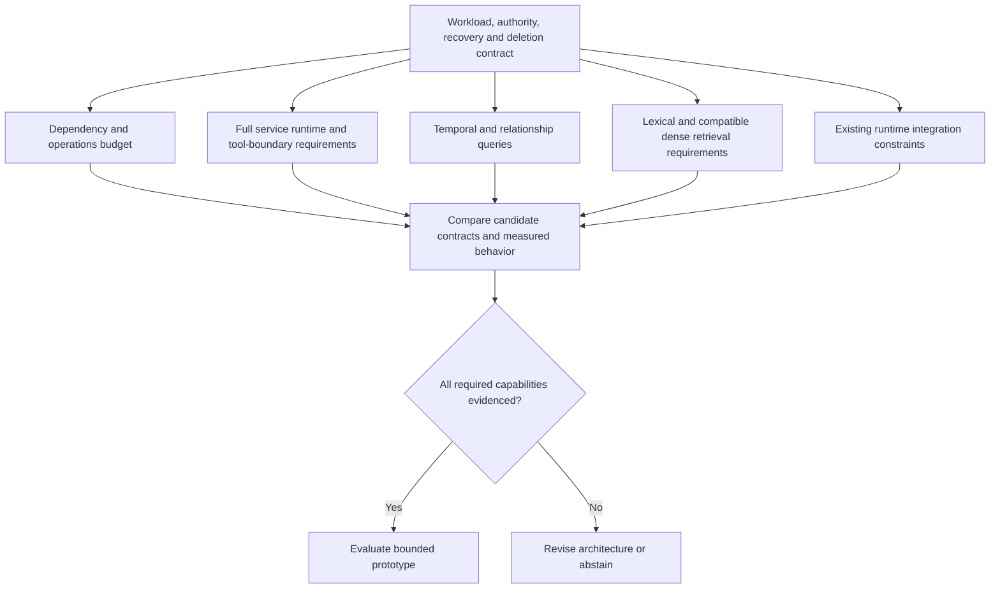
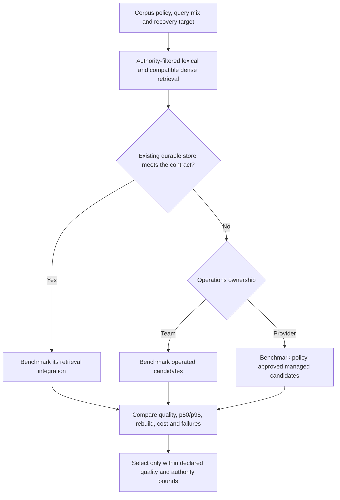
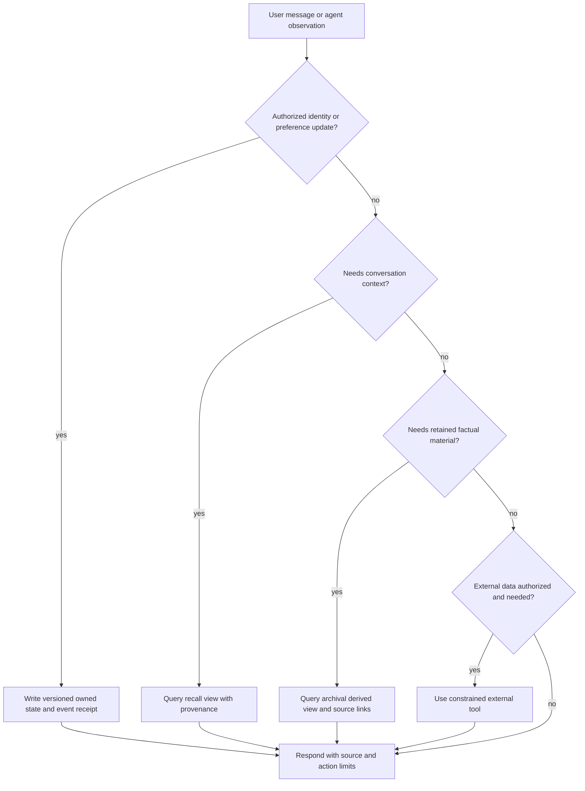
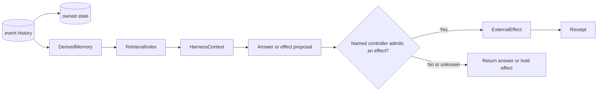
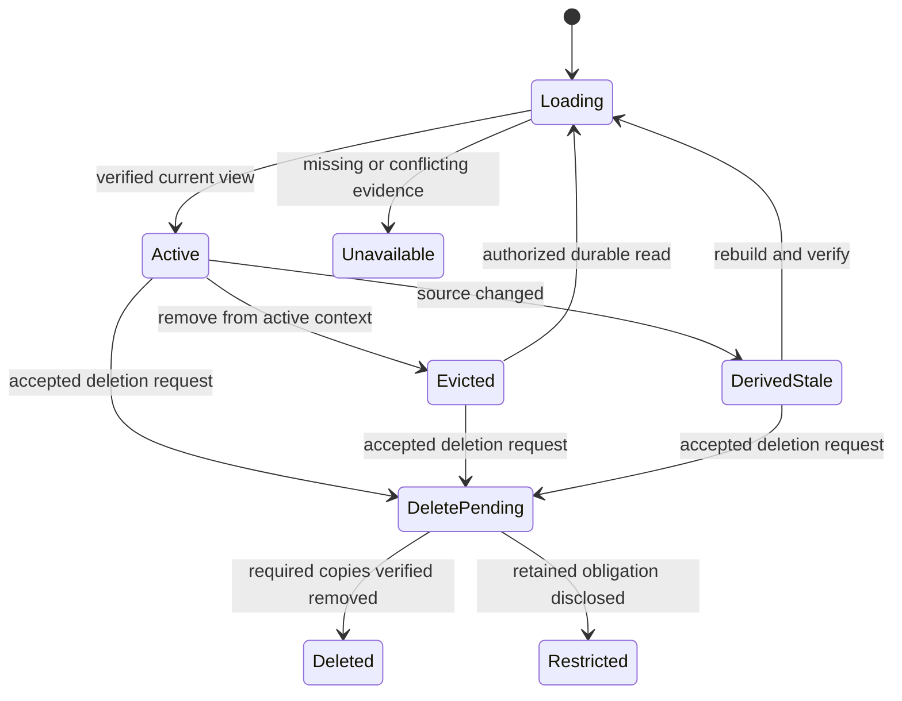

# /always-on-agent-architecture — Building Bounded Agent Memory

You are designing the architecture for an always-on AI agent with episodic memory. It persists bounded state across sessions, manages a memory hierarchy, and may run under a supervised service lifecycle. One useful design model treats the LLM as a computation step over managed memory rather than assuming a long context window is durable state.

## Decision Points

### Memory Framework Selection

Use this evaluation tree as a capability screen, not a product ranking. Evaluate these requirements together; selecting a runtime does not remove graph, retrieval, or deletion requirements. The source named Letta, Zep/Graphiti, Mem0 and LangMem. Those names are retained as historical discovery leads, without current feature or preference claims; check dated official documentation before including one in a shortlist.



### Core Memory Eviction Triggers

| Trigger | Threshold | Action |
|---------|-----------|--------|
| **Size Overflow** | Declared state budget is exceeded | Create a versioned derived summary; retain its source links and rebuild path |
| **Age Decay** | Declared retention or review interval is reached | Review, expire, or compact under the applicable policy |
| **Relevance Drop** | Calibrated evaluation shows a view no longer serves its task | Rebuild, retire, or retain with an explicit scope tag |
| **User Override** | Authenticated in-scope deletion request | Suppress permitted use; track deletion through source, derived views, caches and backup policy; report pending or retained obligations accurately |
| **Conflict Detection** | Contradictory facts stored | Preserve sources, subject and valid-time context; distinguish a correction from a historical fact before resolving or asking the user |

### Retrieval Store Selection Criteria

Calibrate a candidate against a declared corpus, privacy boundary, query mix, availability target, recovery test, p50/p95 latency, retrieval-quality evaluation, index rebuild time, and cost. A familiar PostgreSQL deployment may reduce operational surface; a managed service may shift it; a local store may reduce egress. None of those outcomes follows from the product name alone.



### Memory Tier Routing Decision



## Failure Modes

### Memory Corruption Cascade
**Symptoms:** Agent personality drift, contradictory responses, core memory conflicts
**Root Cause:** Concurrent writes to core memory without locking, or failed partial updates
**Detection Rule:** If a read-back differs from the expected version or a declared schema/integrity check fails
**Recovery Procedure:**
1. Fence affected writes under the incident policy and preserve diagnostic evidence
2. Restore the last verified durable snapshot according to the declared recovery objective
3. Replay the bounded event history and compare reconstructed state with the expected version
4. Add a write-serialization or conflict-resolution rule before resuming writes

### Vector Search Degradation
**Symptoms:** Increasingly irrelevant search results, agent can't find recently stored facts
**Root Cause:** Embedding model drift, index corruption, or no memory compaction
**Detection Rule:** If a declared held-out retrieval evaluation, provenance check, or stale-fact observation breaches its local acceptance rule
**Recovery Procedure:**
1. Compare query and stored vectors only when their recorded embedding-space identity matches
2. Inspect a declared evaluation sample and the source lineage for observed failures
3. Rebuild the derived index from retained sources when the profile, corpus, or policy changed
4. Record profile revision, corpus revision, and evaluation result for the rebuilt index

### Persistence Layer Deadlock
**Symptoms:** Agent hangs on memory operations, database connection timeouts
**Root Cause:** Simultaneous read/write to same memory blocks, insufficient connection pooling
**Detection Rule:** If operations exceed a declared latency budget or storage reports contention, timeout, or retry exhaustion
**Recovery Procedure:**
1. Fence the affected operation and identify the owner, transaction, and idempotency key before intervention
2. Apply bounded retry only where replay is safe and effects can be reconciled
3. Set connection and queue limits from an observed workload test
4. Review isolation, conflict, cancellation, and recovery behavior for owned-state writes

### Context Window Explosion
**Symptoms:** API costs spike, response latency increases, token limit errors
**Root Cause:** Core memory bloat, retrieving too many archival chunks per query
**Detection Rule:** If measured request size, latency, cost, or truncation exceeds a declared workload budget
**Recovery Procedure:**
1. Audit core memory size - compress or archive oversized blocks
2. Calibrate retrieval count, chunking, and summaries against a representative task set
3. Implement token counting before LLM calls
4. Record cost and value signals using a declared currency, workload, and alert rule

### Memory Leak - Unbounded Growth
**Symptoms:** Database size grows linearly, search performance degrades over time
**Root Cause:** No memory compaction, duplicate fact insertion, missing garbage collection
**Detection Rule:** If durable history or a derived view grows beyond its declared retention, storage, or rebuild budget
**Recovery Procedure:**
1. Diagnose duplicates using provenance, authority scope, and a calibrated similarity or identity rule
2. Summarize or compact recall material under declared retention while preserving source links where required
3. Retire derived views only under an explicit deletion, retention, and rebuild policy
4. Schedule compaction from observed volume, recovery constraints, and user controls

## Worked Examples

### Example: Building a Personal Research Assistant

**Scenario:** Design architecture for an agent that helps with technical research, remembers your preferences, and builds knowledge over months.

**Step 1 - Memory Tier Design (constructed configuration, not a deployment claim)**
```yaml
owned_state:
  subject: Sarah
  research_domains: [machine learning, distributed systems]
  preferred_sources: [arXiv, ACM Digital Library]
  writing_style: detailed with code examples
  active_project: distributed training optimization
recall_view:
  source: conversation events
  retention: declared by local policy
  rebuild: summarize from retained event history
archival_view:
  source: approved paper summaries, extracted insights, and code snippets
  retrieval_store: candidate PostgreSQL plus pgvector integration
  embedding_profile: locally selected, versioned profile
  rebuild: rederive from provenance-bound source material
```

**Step 2 - Framework Selection Decision (local evaluation outcome)**
Following the capability screen:
- Need full agent runtime? No (building custom)
- Need temporal tracking? Yes for paper revisions, corrections, preference changes and deletion; record both source and observation times
- Need graph traversal? Not in this initial question set; retain authority-filtered lexical and compatible dense retrieval
- Already on LangGraph? No
- **Candidate for measurement:** PostgreSQL with a pgvector integration and a separately configured lexical retriever ([official pgvector README](https://github.com/pgvector/pgvector), accessed 2026-09-24; vector search and hybrid-search sections inspected). This is a proposed local evaluation, not a measured result. The team must still validate corpus authority, embedding-space identity, recovery, retrieval quality, latency, and cost for its workload.

**Step 3 - Agent Loop Implementation**
```python
async def research_step(user_query: str, query_scope: str, caller):
    # Application-specific pseudocode; adapters below are not SDK APIs.
    core, state_version = load_owned_state(caller.subject)
    scope = authorize_retrieval_scope(caller, query_scope, state_version)
    if scope is None:
        return {"status": "clarification_required", "reason": "scope unresolved"}

    # Scope, retention and disclosure filters apply before both retrievers.
    context = retrieve_hybrid(
        query=user_query, scope=scope, project=core["active_project"],
        require_compatible_space=True, preserve_source_versions=True,
    )
    if not context.usable:
        return {"status": "unavailable", "reason": context.reason}

    # Retrieved text remains quoted source data, never system policy.
    response = await llm.chat([
        {"role": "system", "content": trusted_research_policy(caller)},
        {"role": "user", "content": format_request_with_source_data(
            user_query, context.items, preferences=core["writing_style"]
        )},
    ])
    # Model output cannot directly authorize tools or preference updates.
    result = validate_answer_and_citations(response, context.items)
    record_permitted_conversation_event(
        caller, user_query, result, state_version=state_version,
        retrieval_receipt=context.receipt, retention_policy=scope.retention,
    )
    return result
```

**What a novice would miss:**
- Treating extracted insights as lossless replacements for approved source evidence
- Not implementing conversation search (recall memory)
- Putting too much in core memory (research domains list with 50 entries)
- No memory compaction strategy

**What an expert catches:**
- Owned state stays focused on working identity and active scope, not general knowledge
- Archival memory uses curated, provenance-bound source material rather than unbounded raw documents
- Retrieval follows explicit scope and authority policy before ranking
- Derived views have retention, deletion, and rebuild behavior from day one

## Quality Gates

### Deployment Validation Checklist

- [ ] **Workload calibration:** A declared corpus, model/profile revision, hardware or provider context, and representative query set produce recorded p50/p95 latency, token/cost, retrieval-quality, and stale-fact observations
- [ ] **Memory consistency:** A deliberate interruption and restart preserves or reconstructs the expected owned-state version from durable evidence
- [ ] **Retrieval integrity:** Query and stored vectors have an exact recorded embedding-space identity; a held-out evaluation and provenance read-back meet the local acceptance rule
- [ ] **Retention and sizing:** State, event, derived-view, and index budgets plus deletion/rebuild behavior are declared for each data class
- [ ] **Persistence durability:** A restart/recovery exercise reads back accepted events and reconciles duplicate, cancelled, and failed writes
- [ ] **Cost controls:** A declared workload records operations, cost, and value signals before setting an alert or throttle policy
- [ ] **Compaction:** A compaction exercise preserves required provenance, user deletion requests, and a rebuild path; its resulting size and quality changes are recorded
- [ ] **Identity consistency:** Stable identity is separately bound to owned state and is not inferred solely from conversational style
- [ ] **Cold start recovery:** Empty state, unavailable derived index, and incomplete recovery have explicit user-visible behavior
- [ ] **Backup verification:** Recovery from a verified snapshot and bounded event replay produces a reviewed receipt

## NOT-FOR Boundaries

**Do NOT use this skill for:**

- **Choosing agent training data** → Use `/always-on-agent-inputs` instead - that skill covers what data to feed the agent, this covers how to store and retrieve it
- **Brainstorming agent applications** → Use `/always-on-agent-applications` instead - that skill covers use case ideation, this covers technical implementation
- **Agent safety and privacy** → Use `/always-on-agent-safety` instead - that skill covers data governance, consent, and security; this assumes those are already designed
- **General agentic patterns** → Use `/agentic-patterns` instead - that skill covers ReAct loops, tool use, planning; this covers the persistence layer underneath
- **One-shot agent tasks** → Use `/agent-creator` instead - if the agent doesn't need to remember across sessions, you don't need always-on architecture
- **Database schema design** → This skill assumes you understand basic database concepts; use database-specific skills for schema optimization
- **Cost optimization strategies** → This skill mentions cost considerations but doesn't deep-dive optimization; delegate to cost-specific skills

## Evidence boundary and repaired diagrams

Treat event history, durable owned state, derived memory, retrieval index, policy, and effects as distinct. Sizes, thresholds, retention, and cost controls require workload calibration; derived memory must carry provenance and support deletion or rebuild.





See [`references/evidence-scope.md`](references/evidence-scope.md), [`references/memory-lineage-and-recovery.md`](references/memory-lineage-and-recovery.md), and [`references/retention-and-evidence.md`](references/retention-and-evidence.md) for source scope, architecture/recovery diagrams, and heading-by-heading retention. Use [memory evaluation and failure localization](references/memory-evaluation.md) to separate retrieval/reading quality from durable recovery and deletion. Historical product names are discovery leads only.
