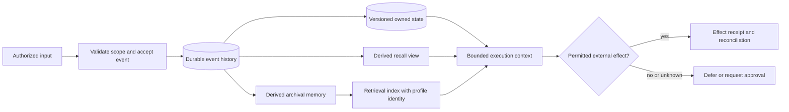
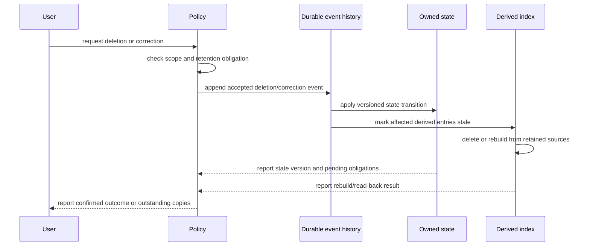

# Memory lineage and recovery

## Evidence boundary

**Primary source:** National Institute of Standards and Technology, *Artificial Intelligence Risk Management Framework (AI RMF 1.0)*, January 2023, https://www.nist.gov/publications/artificial-intelligence-risk-management-framework-ai-rmf-10. **Accessed:** 2026-09-24. **Access depth:** official publication landing page and framework identity. It supports a risk-management framing only; it does not establish a memory-system API, a product comparison, a latency target, or local recovery behavior.

The diagrams below are an original engineering proposal. A team must supply its event schema, authority boundaries, durability guarantees, retention rules, and workload evidence before treating it as an implementation contract.

See [memory-evaluation.md](memory-evaluation.md) for agent-memory research and the separate retrieval, reading, recovery and deletion checks.

## State plane and derived views

The event record is evidence of an accepted input, not proof that an external effect occurred. Derived views remain rebuildable from their retained source material; they do not become an authority boundary merely because they are convenient to query.

## Deletion, index rebuild, and recovery trace

If policy requires a retained audit record, it must describe the deletion request and result without retaining the deleted payload as a hidden shadow copy. Rebuild and recovery need read-back evidence and an explicit rule for events that cannot be replayed safely.

## Book candidate

“Memory as a versioned, provenance-bound derived view over event history” is a Book candidate only when shown through a concrete correction or deletion trace like the one above. It is a design proposal, not a novelty or efficacy claim; compare it against the Book reviews before inclusion.
