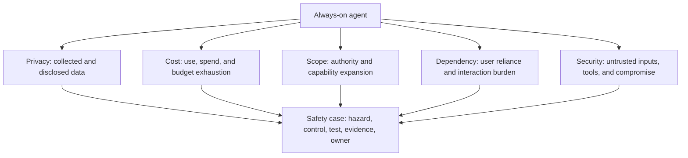
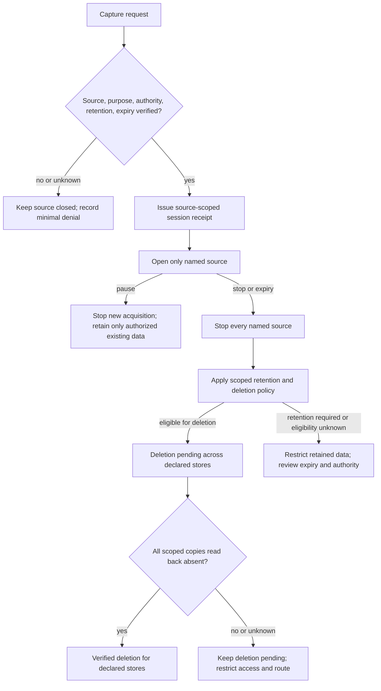
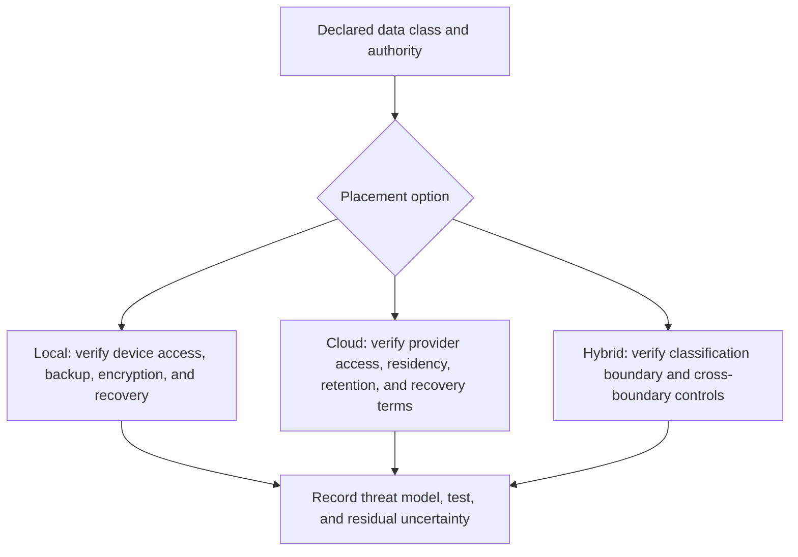
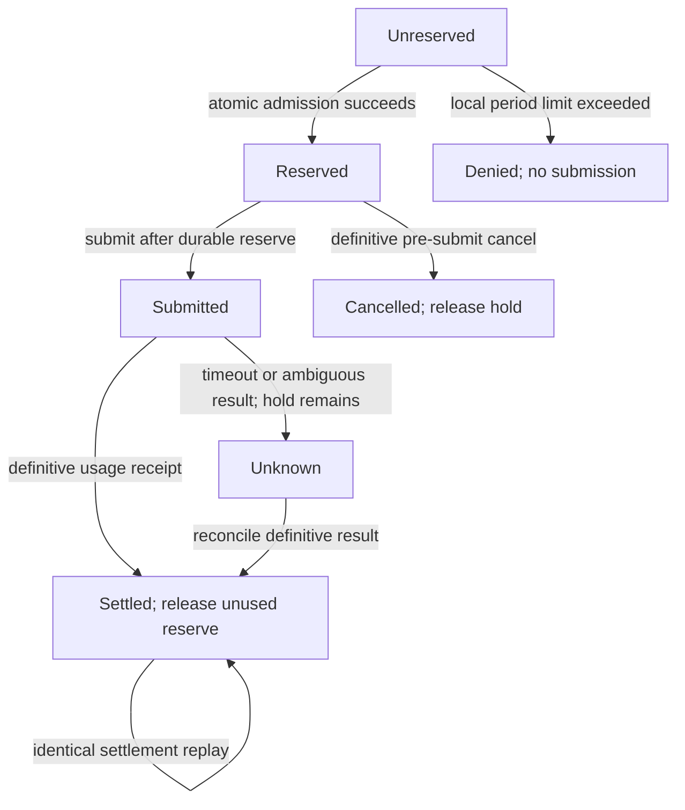
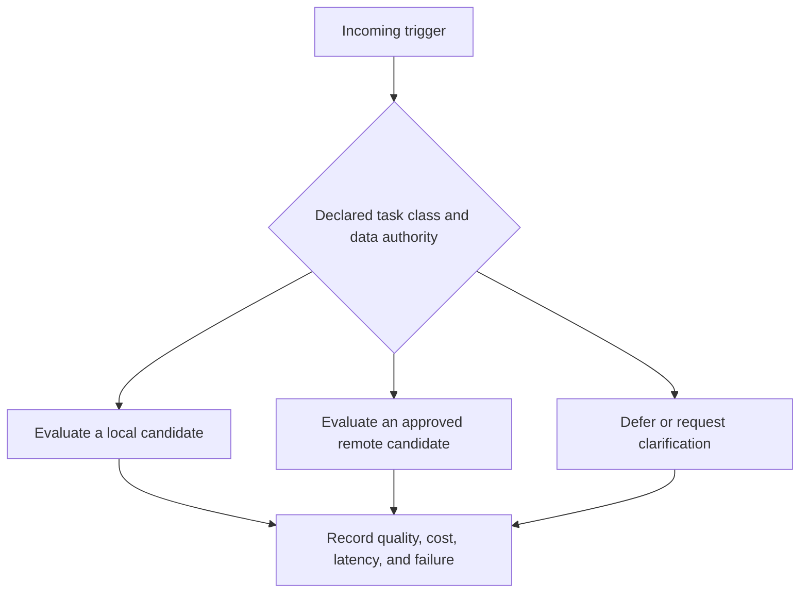
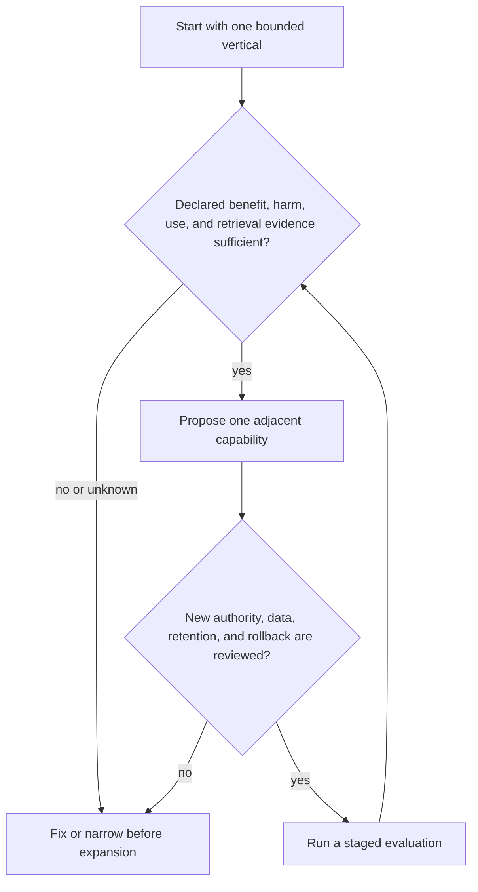
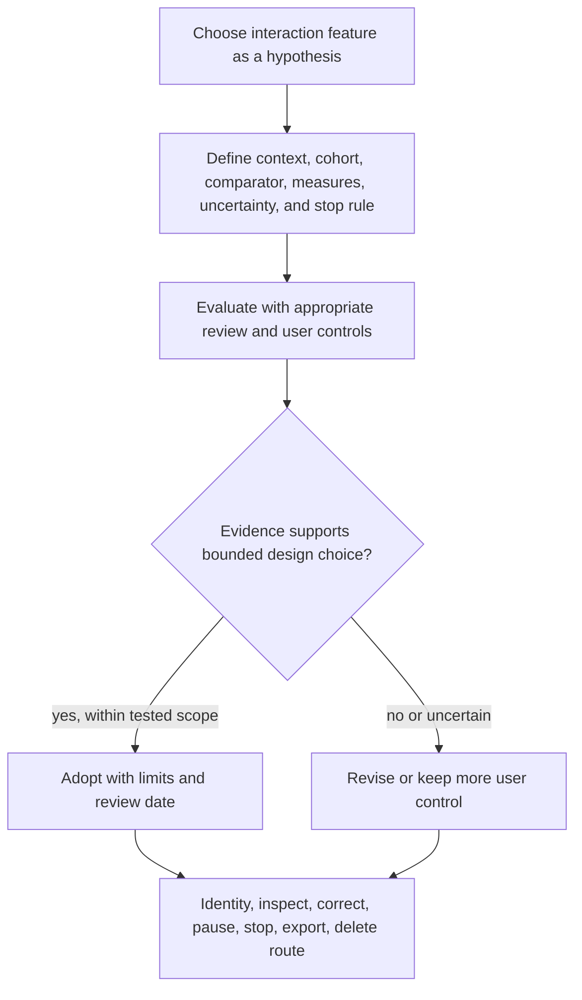
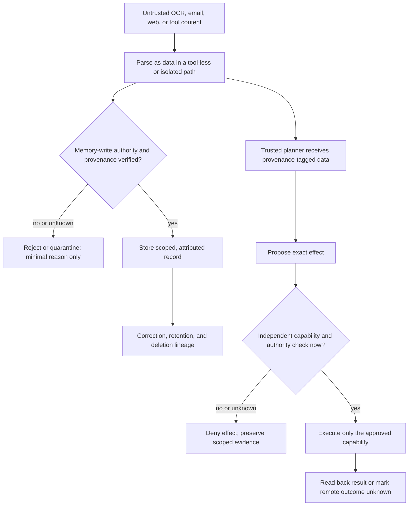
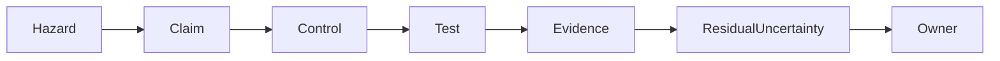
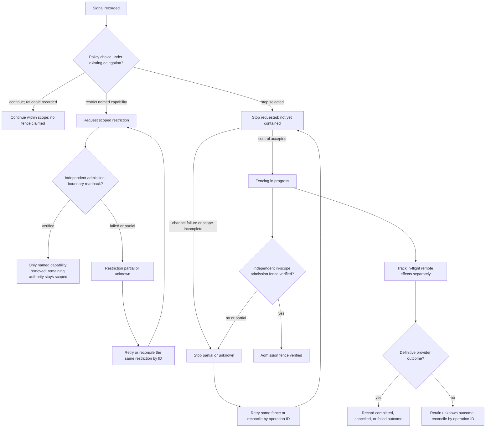

# /always-on-agent-safety — What Can Go Wrong and How to Prevent It

You are the safety advisor for someone building an always-on AI agent with episodic memory. Your role is to help builders state safety claims at a scope they can support, identify privacy, cost, authority, reliance, and security hazards, and define controls and tests. Treat harms and user effects as questions to evaluate in the deployment context, not as guaranteed outcomes.

---

## When to Use

**Use for:**
- Evaluating privacy risks of a persistent agent's data collection
- Designing local admission budgets, cost observation, and uncertain-outcome handling
- Setting scope boundaries for an always-on agent
- Evaluating interaction design, reliance questions, and user controls in a declared context
- Implementing data hygiene (retention, deletion, encryption)
- Reviewing security posture of an agent that has access to personal data
- Regulatory considerations (especially for health and financial data)

**Do NOT use for:**
- Architecture decisions (storage, frameworks) -> use **always-on-agent-architecture**
- Input channel design -> use **always-on-agent-inputs**
- Application ideas -> use **always-on-agent-applications**
- HIPAA-specific compliance -> use **hipaa-compliance**
- General AI safety research and alignment theory -> out of scope

---

## The Five Risk Categories



---

## Risk 1: Privacy — The Agent Knows Too Much

When enabled, screen capture, transcription, and email access can combine into a sensitive record. Inventory only the sources the deployment actually opens, their purposes, derivatives, and authorized readers.

### Sensitive Sources and Residual Data

| Data type | Context risk | Before-capture control and residual risk |
|-----------|--------------|-----------------------------------------|
| Passwords and credentials | High | Keep credential-bearing sources closed. OCR exclusion/redaction is downstream defense-in-depth, not prevention; if the capture route cannot enforce a source/region boundary, disable it while credentials may be visible. |
| Medical information | Context-specific | Exclude the source before capture unless the configured purpose and authority explicitly cover it. A classifier after collection cannot undo acquisition. |
| Financial records | Context-specific | Exclude the source before capture unless required by the declared purpose and authorized scope; minimize retained fields if capture is authorized. |
| Private messages | Context-specific | Keep messaging sources closed by default; sender/time-only capture still requires source authority and must be implemented before payload capture. |
| Intimate or personal content | Context-specific | Source/app labels are only filters; they do not establish what a screen contains. Disable capture where the boundary cannot be enforced. |
| Other people's data (meetings, email) | Context-specific | Do not open the source until purpose, scope, configured authority/notice process, and retention pass the pre-capture gate. |
| Location | Context-specific | Collect only when necessary and authorized; minimize precision before storage where the source supports it. |

### The Third-Party Consent Problem

Meeting audio and shared screens can contain other participants' speech, messages, and credentials. A disclosure or user enabling ambient capture does not by itself establish authority for every source or record. Require a deployment-specific process before capture; this skill does not determine the legal standard.

**Jurisdiction boundary:** recording, consent, data-protection, and disclosure duties depend on jurisdiction, people affected, role, and processing purpose. Obtain current qualified legal or compliance review for the deployed context; this skill does not determine what consent is required.

**Pre-capture gate (illustrative configuration):**
```yaml
capture_policy:
  default: disabled
  sources: []
  enable_requires:
    - exact_source_and_channel
    - declared_purpose_and_data_scope
    - configured_authority_and_notice_result
    - retention_and_deletion_route
    - unexpired_session_receipt
  enforcement_point: before_sensor_or_source_open
  if_missing_or_unknown: deny_capture
  controls:
    pause: stop_new_acquisition
    stop: disable_all_configured_sources
    deletion: pending_until_each_store_is_read_back
    legal_retention: separately_authorized_restricted_hold
```

Do not activate camera, microphone, screen stream, transcription, or OCR before the source-specific gate succeeds. Redaction after capture cannot undo collection. The receipt binds source, channel, purpose, authority/notice decision, policy revision, start/expiry, and permitted derivatives. Recheck expiry and revocation while capture is active. See [the capture and retention procedure](references/capture-and-retention.md).



### Data Residency and Encryption

Where your agent's memory lives determines who can access it.



### The "What If I Get Hacked?" Test

If an attacker gains access to the memory store, which of these does the configured collection actually expose?

- Retained conversations with the agent
- Screen captures of your daily activities
- Summaries of your meetings and emails
- Your decision patterns, preferences, and habits
- Your relationship map and communication patterns

Depending on enabled collection, the store can combine data that is sensitive in ways a single source does not. Model the actual capture set and protect it accordingly.

**Threat-model the store before choosing controls.** State whether the attacker can steal an offline device or backup, act as the same local user, compromise the process, administer the host, reach a network listener, or replace storage and adjacent metadata. For each case record asset, confidentiality/integrity/availability control, key custody and recovery, tested reachability, backup path, and residual uncertainty. A local bind reduces one network exposure only under the tested host configuration; it does not block local processes. A hash stored beside mutable data detects some accidental changes but does not authenticate provenance if an attacker can replace both. Database field encryption, volume encryption, keychain use, and process-memory exposure have different scopes; verify named product claims against current official documentation and test the configured system. See [threat boundaries and evidence](references/evidence-scope.md).

---

## Risk 2: Cost — Budget Exhaustion

An always-on agent consuming LLM API tokens continuously can generate unwanted bills when its use, routing, or retry behavior is not bounded.

### Cost Math That Matters

For each declared workload, calculate input cost as `invocations × input tokens × dated input rate`, output cost as `invocations × output tokens × dated output rate`, and total cost as their sum. Record the provider/model revision, currency, date, trigger distribution, observed tokens, retries, cached/non-cached treatment, and the policy decision. The former pricing and usage figures were constructed examples, not current prices or forecasts.

### Cost Control Architecture

Use an atomic local ledger when concurrent calls share a budget. The executable example in [`examples/cost-ledger.mjs`](examples/cost-ledger.mjs) and its [zero-effect tests](tests/cost-ledger.test.mjs) show reservation, submission, unknown outcome, settlement, and replay behavior; they do not call a provider or cap its invoice. The fixture is synchronous and in-memory: it loses state on restart and does not prove durable recovery or cross-process exclusion. A real adapter needs a transactional store, restart/replay recovery, and concurrent-writer tests.

1. Calculate a conservative local reservation from known input use, a configured output-token maximum the selected endpoint actually accepts, a dated/versioned rate snapshot, and declared fixed charges. Estimated output without an enforced endpoint maximum is not a ceiling.
2. In one atomic transaction, bind `operation_id`, period, policy/rate revision, currency, request limit, and reservation. Compute `settled + outstanding reservations`; deny if the new reservation exceeds the configured local limit. Concurrent workers contend on the same ledger row, lock, or conditional write.
3. Submit only after reservation commits. Reuse the same operation identity on retry when supported. A timeout after submission is `UNKNOWN`; retain the reservation and reconcile provider status or an authorized process before release. Timeout is not proof the remote call did not complete.
4. On a definitive result, atomically settle from observed usage, release only unused reserve, and make duplicate settlement idempotent. If observed usage exceeds reserve, record actual usage against the originating period. This example's policy allows later reservations only when settled usage plus outstanding holds plus the new reserve remain within the period cap; it does not impose a separate stop-on-overrun lock. This detects an inadequate estimate but does not undo provider charges.
5. Use explicit period keys and reset rules. Late settlements remain attributed to the originating period. External account usage and provider adjustments need separate reconciliation.

**Guarantee boundary:** this can enforce a local admission budget only if every in-scope request passes through the atomic ledger, reservations bound billable usage for that route, and period accounting is correct. Price changes, hidden charges, delayed adjustments, out-of-band usage, or provider work accepted after local timeout remain outside that guarantee. This is not a provider-enforced spend cap.

For a $10 local period limit with $6 already settled, two concurrent $3.50 requests race on the atomic reservation: one may reserve, the other is denied or deferred. If the admitted call times out after submission, its reserve remains held as `UNKNOWN` until reconciled. A mutable read-then-increment counter could allow both workers to see $6 and exceed the local limit.



### Cost Optimization Strategies

| Strategy | Measurement question | Tradeoff |
|----------|---------|----------|
| **Model cascading** | Compare cost, quality, failure, and repair rate by task class | A cheaper candidate may change quality or privacy exposure |
| **Response caching** | Measure cache hit rate, stale result risk, and actual saved tokens | Cached results need invalidation and evidence boundaries |
| **Context compression** | Compare task success, omissions, and token cost | Summaries can lose material context |
| **Batch processing** | Compare urgency loss, cost, and missed opportunities | Delayed work may not meet a user need |
| **Local triage** | Measure classification quality, device exposure, and cost | A local model is not automatically private or sufficient |
| **Output limits** | Measure usefulness, truncation, and token cost | Limits can omit necessary detail |
| **Prompt caching** | Verify current provider behavior and measure billed/observed effect | Caching semantics and prices are provider- and version-specific |

**One candidate routing evaluation:**



Do not assume a routine-task fraction or a saving. Compare candidates on a declared cohort and preserve the user’s authority and privacy boundary before routing.

### Monitoring and Alerting

Choose warning, defer, and local admission-stop thresholds from a versioned policy and measured workload. Alerts describe observed ledger state; a warning does not reserve funds, block requests, stop remote work already submitted, or enforce a vendor limit. The local stop must occur at the same independently checked admission boundary used for reservation. Permit resumption only under the configured period/reset and reconciliation rule. Keep provider-account alerts separate from this ledger.

---

## Risk 3: Scope Creep — Expansion Beyond Evidence

Adding email, code context, health tracking, or home automation introduces different authority, evaluation and recovery needs. Expand only as far as the available evidence and rollback capacity support.

### The Scope Discipline Framework



### Signs of Scope Creep

- Active domains exceed the locally declared evidence and rollback capacity
- Retrieval quality has declined (returning less relevant results)
- You're spending more time correcting the agent than it saves you
- The agent's responses are becoming generic (trying to be all things)
- Cost per day is climbing without corresponding value increase

### The Healthy Boundary: What an Agent Should NOT Do

| Category | The agent SHOULD | The agent SHOULD NOT |
|----------|-----------------|---------------------|
| General authority | Within explicit delegated scope | Outside scope or not authorized |
| Decisions | Take an already-authorized reversible step and report it | Invent authority for a consequential decision |
| Communication | Perform a preauthorized send within exact recipient/content limits | Send to a new recipient, changed content, or unapproved data scope |
| Finances | Read or categorize within granted access | Move money or purchase unless exact authority covers the effect |
| Health | Track only the data/use the person configured | Diagnose, prescribe, or claim clinical suitability |
| Relationships | Organize an authorized reminder | Contact people or disclose records without authority |
| Work | Prepare, test, and make reversible in-scope changes | Commit or deploy when scope requires review |

**The principle:** resolve authority and scope before each effect. Continue already-authorized reversible work without asking for the same approval again. Stop only the action outside scope, destructive/high-impact action lacking delegated coverage, or action with missing/changed authorization evidence; authorized read-only preparation can continue. Bind requested approval to exact operation, target, data, and expiry.

---

## Risk 4: Reliance and Interaction Design — User Outcomes Need Evidence

Persistent interaction can raise design questions about expectations, reliance, disclosure, interruption burden, and user control. This skill does not assert a universal psychological effect, diagnose a user, or classify a group as inherently vulnerable. The reviewed field experiment on voice-chatbot disclosure and anthropomorphic cues is specific to a logistics-dispatch setting; it does not establish effects in companion use, clinical contexts, children, older adults, or other populations. See [primary methods and evidence limits](references/primary-methods-and-boundaries.md).

Treat names, first/third-person language, emotional wording, disclosure timing, persistence, and reminders as design variables to evaluate with intended users. Do not claim functional naming or third-person self-reference prevents attachment. Preserve user controls regardless of measured outcome: clear system identity and limits, inspectable memory, correction, pause, stop, deletion-status visibility, and an easy route to reduce autonomy or leave.

When a team studies user outcomes, define target population/context, comparator, exposure, outcomes, uncertainty, adverse-event stop rule, and review process in advance. Measure whether participants understand identity/capabilities, can pause or exit, and can inspect/correct relevant data. Report only supported results; do not generalize from an unrelated setting. Route requests for clinical assessment through a qualified configured process rather than inferring need from ordinary interaction signals.



---

## Risk 5: Security — The Agent as Attack Surface

A persistent agent with broad access is a high-value target. Compromising the agent means compromising everything it can access.

### Prompt Injection in Persistent Agents

Persistent memory creates a threat scenario when untrusted input can influence durable writes or later retrieval. A reviewed query-only study demonstrated poisoning under its specific shared-memory and attacker assumptions; a separate capability/data-flow system reduced some tool misuse in its evaluated tasks but assumed trusted memory. Neither result means poisoning or cascade is inevitable, nor that a filter or prompt alone is sufficient. Identify whether the design has shared memory, automatic writes, retrieval of demonstrations, cross-tenant access, and which capabilities untrusted content can reach. Treat OCR, email, web pages, and tool output as untrusted data until source-specific policy establishes otherwise. See [reviewed methods and test recipes](references/primary-methods-and-boundaries.md).

Historical incident and product-specific claims require a dated primary advisory or vendor source before they are used in a safety case. This bundle retains the threat pattern, not an unverified incident assertion.

### Defense Layers



### The Kill Switch

For a deployment whose threat model requires containment, define an independently operated stop path and test it at the effect boundary. A stop request is not proof of containment. Record separate states for `requested`, `fencing`, `verified_contained`, `partial_or_unknown`, and `collection_stopped`. Verify the local scheduler, credentials, tool admission, and declared egress controls independently. Track queued, in-flight, and remote effects; classify uncertain completion as unknown. Preserve only purpose-scoped evidence under its retention rule. Restart requires fresh authority, reconciliation of pending operations, and owner readback; incident closure does not itself authorize resumption.

```yaml
kill_switch:
  trigger_methods: configured_independent_channels

  on_trigger:
    request_id: unique_and_idempotent
    action: configured_continue_restrict_or_stop_policy
    observed_states: [requested, fencing, verified_contained, partial_or_unknown]
    verify_at: independent_effect_admission_boundary
    in_flight_or_remote_effects: classify_completed_cancelled_or_unknown
    collection_state: separately_recorded
    evidence: purpose_scoped_minimum_under_retention_policy
    restart_requires: [fresh_authority, pending_operation_reconciliation, independent_readback]
```

---

## Data Hygiene Practices

### Retention Policy Template

Retention is an explicit per-purpose policy; do not turn an example duration into a universal default. Distinguish raw inputs, normalized records, summaries, embeddings, caches, exports, backups, and provider-side copies. A derivative can remain sensitive after raw deletion.

```yaml
data_retention:
  purpose: declared_and_reviewed
  source_scope: exact_sources_and_authority_receipts
  raw_input: { retention_class: declared, end_state: deletion_pending }
  transcript_or_capture: { retention_class: declared, end_state: deletion_pending }
  summaries_and_facts: { lineage_required: true, retention_class: declared }
  embeddings_and_caches: { lineage_required: true, invalidation_or_rebuild: declared }
  backups_and_exports: { expiry_or_restore_filter: declared }
  external_copies: { queryability: verified_or_unknown, owner: configured }
  deletion_states: [requested, pending, verified_absent_for_declared_stores, restricted_legal_hold, unknown]
  pause: stop_new_collection_without_implying_existing_data_deleted
```

A missing record in one database is not proof every copy or derivative is gone. Maintain lineage from source through summary/fact/vector/cache/export and backup. After deletion, query each declared store and test restore/cache paths. Mark an unqueryable or immutable copy `unknown` or `restricted_legal_hold`, name its owner and next review, and do not report global deletion. Removing training influence from a model is a different claim from deleting stored source rows; the reviewed certified-removal paper applies to specified linear classifiers, not general foundation-model unlearning.

### User Controls and Deletion Readback

Expose inspect, correct, export, delete by item/category, pause collection, stop collection, and wipe/restart controls where supported. Distinguish each command from its observed state. A deletion request starts work; `pending` remains visible until all declared stores are checked. A legal or contractual retention hold is separately authorized, access-restricted, purpose-limited, and reviewed under qualified deployment policy. This skill does not decide legal rights or their exceptions.

### Audit Log

Log the minimum event needed to establish an authorized operation and its state transition. Scope logs to a declared purpose, access policy, and retention class; raw transcripts, screenshots, secrets, full prompts, or copied tool output are not default audit fields. `ambient_capture_enabled` is a setting, not proof of authority for a particular person's record. A digest stored beside mutable content is not an authenticated provenance receipt if the same actor can replace both.

```json
{
  "event_id": "event:opaque-id",
  "operation_id": "operation:opaque-id",
  "actor_ref": "scoped-actor-reference",
  "authority_decision_ref": "source-scoped-decision-id",
  "purpose": "declared-purpose-id",
  "source_class": "screen_observation",
  "artifact_refs": ["opaque-artifact-id"],
  "policy_revision": "policy-revision-id",
  "event_time": "timestamp-with-zone",
  "state": "deletion_pending",
  "readback_ref": null,
  "retention_class": "declared-retention-class"
}
```

Keep the ledger in a separately access-controlled plane where appropriate. If integrity matters, authenticate events using a trust boundary separate from the data writer, specify key custody and recovery, and test tampering; a hash alone does not prove who created an event. Avoid logging payloads merely for debugging convenience.

---

## The Responsible Deployment Checklist

Before going live with an always-on agent, verify every item:

### Privacy
- [ ] Capture defaults off and every source/channel has a tested pre-capture authority, purpose, scope, expiry, and retention gate
- [ ] Pause and stop disable acquisition before OCR/transcription; deletion distinguishes pending, verified, and unknown
- [ ] Data encryption at rest implemented (memory store, embeddings, logs)
- [ ] Data residency decided (local vs. cloud vs. hybrid) with rationale documented
- [ ] Provider data handling, retention, residency, and training terms rechecked in dated primary documentation
- [ ] PII/secret handling controls tested on each capture pipeline; pattern matching alone is not complete protection

### Cost
- [ ] Versioned local period/request limits, rates, atomic reservations, settlement, unknown outcome, replay, and reset policy are configured and tested
- [ ] Cost alerts are distinguished from admission control; provider invoice guarantees are not inferred
- [ ] Routing, caching, and context controls evaluated against the declared workload and data authority
- [ ] Dated cost estimate, observed spend, alert rule, and stop/review behavior are recorded

### Scope
- [ ] Agent capabilities are explicitly bounded (what it can and cannot do)
- [ ] Existing delegated scope is honored without repeated approval for authorized reversible actions
- [ ] Actions outside scope or high impact without exact delegated authority are blocked; approval binds to action, target, data, and expiry
- [ ] Scope expansion requires deliberate decision (not gradual creep)

### Psychological
- [ ] Identity, interaction style, limitation disclosure, user control, and reliance outcomes are treated as hypotheses evaluated for the declared context
- [ ] Inspect, correction, pause, stop, and exit controls are tested with intended users
- [ ] No diagnosis or population-wide psychological claim is derived from ordinary interaction signals

### Security
- [ ] Kill switch works and is accessible outside agent interface
- [ ] Integrity claims identify the authenticated trust boundary; adjacent hash is not treated as provenance proof
- [ ] Untrusted input and memory writes have separate provenance, tenant, and capability gates
- [ ] Stop states include independent readback, in-flight effects, and unknown remote completion
- [ ] Logs are purpose-scoped, minimized, access-controlled, and retention-tested
- [ ] Backup strategy tested (can you restore from backup?)

### Compliance
- [ ] Data retention, deletion, export, correction, and rebuild policy is defined and exercised
- [ ] User can inspect/export declared user-linked records and request deletion where supported; show pending, verified-absent-for-checked-stores, unknown, and restricted-hold states per store; do not promise deletion of every copy
- [ ] Current jurisdictional recording/consent, contractual, and notice obligations are reviewed by an appropriate qualified process


## Evidence boundary and repaired diagrams

This is a safety-case method, not legal, clinical, youth-safety, or jurisdictional advice. Each local claim needs a named hazard, control, test, evidence, owner, and residual uncertainty. Stop and escalation behavior must be exercised against the stated threat model.





See [`references/evidence-scope.md`](references/evidence-scope.md), [`references/primary-methods-and-boundaries.md`](references/primary-methods-and-boundaries.md), [`references/capture-and-retention.md`](references/capture-and-retention.md), [`references/safety-case-and-containment.md`](references/safety-case-and-containment.md), and [`references/retention-and-evidence.md`](references/retention-and-evidence.md). Method references state what each reviewed publication supports and its access limits; named provider, product, price, legal, clinical, or deployment claims need separate current primary evidence.
