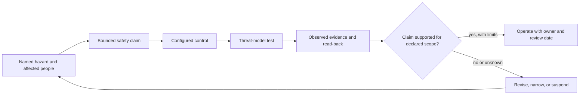
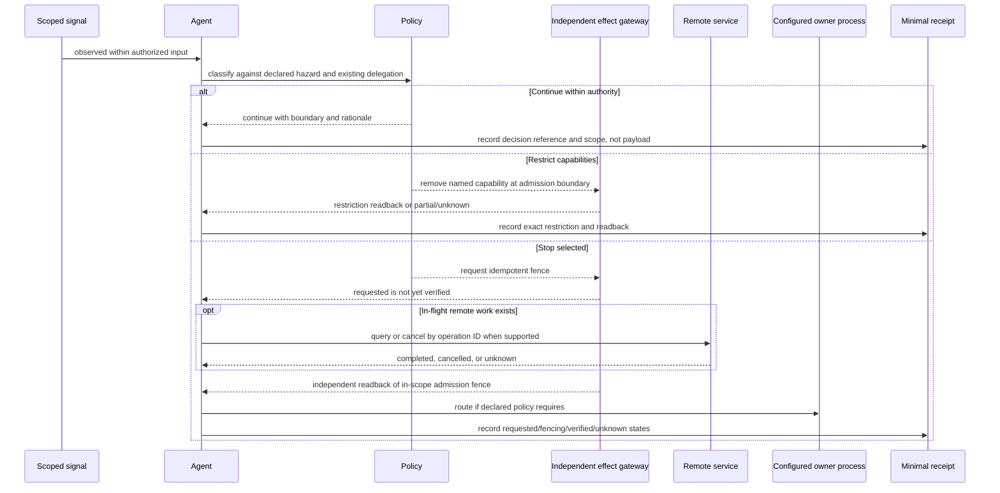
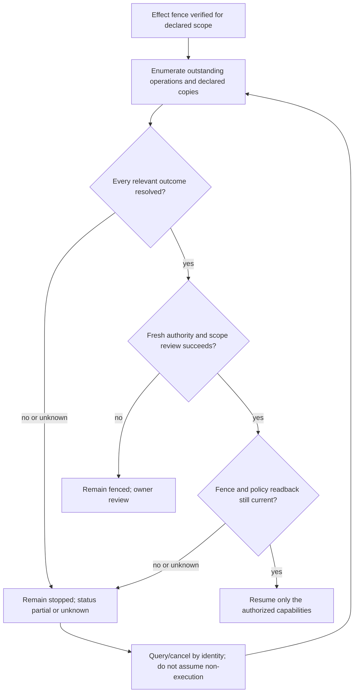

# Safety case and containment

## Evidence boundary

**Primary source:** National Institute of Standards and Technology, *Artificial Intelligence Risk Management Framework (AI RMF 1.0)*, January 2023, https://www.nist.gov/publications/artificial-intelligence-risk-management-framework-ai-rmf-10. **Accessed:** 2026-09-24. **Access depth:** official publication landing page and framework identity. It supports a risk-management framing, not a clinical, legal, youth-safety, platform, incident, price, or local-runtime claim.

These diagrams are a local safety-case method. The deploying team declares the hazard, affected people, authority, threat model, controls, tests, evidence, owner, and residual uncertainty. A requested stop is not a verified fence; distinguish collection state, local effect admission, and in-flight/remote completion.

## Claim-to-evidence path

## Sensitive escalation trace

The route is an operational design example, not a clinical assessment or a guarantee that escalation will resolve an outcome. A policy decision to continue does not trigger a fence. Restriction/stop claims require independent readback at the specific effect boundary; remote in-flight completion may remain unknown. A Book candidate may use this trace to show a safety case in action, provided Book review compares prior art and avoids novelty or efficacy claims.

## Safe restart after containment

A verified local admission fence says only that the tested boundary denied new in-scope effects at readback time. It does not settle remote calls, queued work, or deletion of derived data. Resolve those by stable operation/artifact identifiers before restart; unresolved cases remain partial/unknown.

