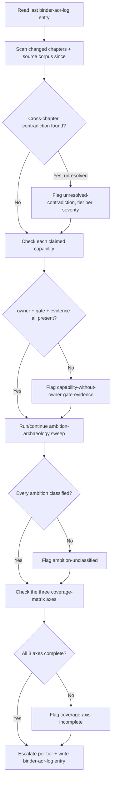

# Architecture Binder Of Record

Own binder truth: is this multi-document product-architecture binder internally consistent, complete against its stated universe, and honest about shipped, partial, speculative, or blocked status — including the ambitions it inherited from before the binder existed.

## Use This For

- Deciding whether a chapter's claimed capability is real: owner assigned, acceptance gate named, evidence linked — not just confident prose.
- Running a periodic ambition-archaeology sweep that classifies every old product promise (absorbed/superseded/deferred/contradicted/orphaned/rejected) instead of letting it rot unaddressed.
- Tracking cross-chapter contradictions (term, authority, schema, shipped-vs-target) to resolution instead of letting two chapters quietly disagree.
- Checking the three coverage axes (customer/deployment type, technical contingency, architecture consistency) for gaps before an implementation chain cites the binder as ready.
- Writing the mandatory append-only `binder-aor-log:` ledger entry every run, including a run that finds nothing.

## Do Not Use This For

- Auditing a single Claude Skill bundle's structure, frontmatter, or file hygiene (`skill-hygiene`).
- Rendering a single-PM accept/reject verdict on one finished deliverable (`port-daddy-user-surrogate-pm-review`).
- Sequencing or stewarding a roadmap's sidequests once a gap or operator decision has been surfaced (`legible-roadmap-with-sidequests`).

## Reconcile Loop

1. **Read the previous `binder-aor-log:` note** and reconcile from its window end, not a fixed time window — absence of a prior entry means start from the beginning.
2. **Scan what changed since**: binder chapters, open PRs touching runtime/binder surfaces, and recent notes mentioning the product's core nouns.
3. **Classify every cross-chapter contradiction** as `term`, `authority`, `schema`, or `shipped-vs-target`, and mark it `resolved` only once a source-linked fix has landed — never by assumption.
4. **Verify every claimed capability** carries an accountable owner, a testable acceptance gate, and a link to real evidence (PR, transcript, screenshot, test run). Prose with no proof is not coverage.
5. **Run or continue the ambition-archaeology sweep**: classify every entry in the older ambition corpus (website, plans, examples, ADRs, idea troves) as absorbed, superseded, deferred, contradicted, orphaned, or rejected — see `references/ambition-archaeology-classification.md`.
6. **Update the three coverage matrices** (customer/deployment, technical contingency, architecture consistency) and escalate per tier — record, block a section, or request an operator decision. See `references/raci-authority-and-escalation.md`.
7. **Write the mandatory `binder-aor-log:` ledger entry** — confidence, findings, gates changed, handover — even when the run finds nothing. Absence of an entry is itself a finding for the next run.

## Output Contract

A binder-coverage-spec that `scripts/binder_coverage_audit.mjs` reads carries:

- `documents[]`: every binder document in scope, each with `claimedCapabilities[]` — `{ name, owner?, gate?, evidenceLink? }`.
- `contradictions[]`: every cross-chapter disagreement found — `{ kind: 'term'|'authority'|'schema'|'shipped-vs-target', resolved: boolean }`.
- `ambitionCorpus[]`: every older ambition family being reconciled — `{ name, classification: 'absorbed'|'superseded'|'deferred'|'contradicted'|'orphaned'|'rejected'|null }`.
- `coverageMatrix`: `{ customerAxisComplete, contingencyAxisComplete, architectureAxisComplete }` — three booleans, each true only when every row on that axis has an owner, status, gate, failure mode, recovery path, and source.

Use `scripts/binder_coverage_audit.mjs` to audit a binder-coverage-spec JSON and return `{ pass, score, findings, recommendations }`, including a `binder-aor-log:`-style summary line in `recommendations` on every run.

## Anti-Patterns

### Capability Claimed Without Proof

**Novice**: A chapter states "supports Work Intent as the sole launch primitive" with no owner, no acceptance gate, and no evidence link — the claim exists only as prose.
**Expert**: A claimed capability is not covered until it names an accountable owner, a testable acceptance gate, and a link to the evidence that proves it actually shipped and works.
**Detection**: `binder_coverage_audit.mjs` fires `capability-without-owner-gate-evidence` (critical) when any claimed capability is missing `owner`, `gate`, or `evidenceLink`.

### Ambition Amnesia

**Novice**: An old public promise — a marketplace story, a pricing model, a named platform surface — quietly disappears from the corpus with no record of what happened to it.
**Expert**: Every entry in the ambition corpus gets one of six classifications (absorbed, superseded, deferred, contradicted, orphaned, rejected) with a rationale and a destination; "we forgot about it" is never a valid resting state.
**Detection**: `binder_coverage_audit.mjs` fires `ambition-unclassified` (critical) when any `ambitionCorpus` item has `classification: null`.

### Coverage Theater

**Novice**: The binder is declared "complete" while two chapters still contradict each other, or a whole coverage axis (customer, contingency, or architecture) has never been checked.
**Expert**: Completeness is a positive, provable claim — zero unresolved contradictions AND all three coverage axes complete — never "nothing is currently flagged as broken."
**Detection**: `binder_coverage_audit.mjs` fires `unresolved-contradiction` (critical) for any contradiction with `resolved:false`, and `coverage-axis-incomplete` (critical) for any of `customerAxisComplete` / `contingencyAxisComplete` / `architectureAxisComplete` that is not `true`.

## References

| File | Load When |
| --- | --- |
| `references/raci-authority-and-escalation.md` | Need to know who is Accountable for a concern, what the Architect of Record may/may not do unilaterally, or which escalation tier a finding belongs to. |
| `references/ambition-archaeology-classification.md` | Need to classify an entry in the older ambition corpus, or need the required shape of a completed sweep. |
| `examples/expected-output.md` | Need to see an incomplete binder audited, then the same binder fixed and passing. |
| `templates/output-template.md` | Need a reusable run template: contradiction list, coverage matrix update, ambition table, and the mandatory ledger entry. |
| `schemas/binder-coverage-spec.schema.json` | Need to validate a binder-coverage-spec JSON payload's structure before auditing it. |
| `scripts/binder_coverage_audit.mjs` | Need deterministic scoring of a binder's completeness and consistency. |
| `agents/openai.yaml` | Need a subagent descriptor for a delegated Architect of Record run. |

<!-- BEGIN BUNDLE INDEX (auto: index_references.py) -->

## Skill Bundle Index

*Every file in this skill, and when to open it. Auto-generated; run `scripts/index_references.py --fix`.*

**root**
- [`CHANGELOG.md`](CHANGELOG.md) — Architecture Binder Of Record — Changelog — - Initial skill creation - Reconcile-loop process, RACI/authority/escalation reference, and ambition-archaeology classification reference de
- [`README.md`](README.md) — Architecture Binder Of Record — Own whether a multi-document product-architecture binder is internally consistent, complete against its stated coverage universe, and honest

**`agents/`**
- [`agents/openai.yaml`](agents/openai.yaml) — openai (data/schema)

**`examples/`**
- [`examples/expected-output.md`](examples/expected-output.md) — Example Output: Architecture Binder Of Record — Scenario: a binder run claims a chapter's headline capability ("Work Intent is the sole launch primitive") with an owner but no acceptance g
- [`examples/sample-input.json`](examples/sample-input.json) — sample input (data/schema)

**`references/`**
- [`references/ambition-archaeology-classification.md`](references/ambition-archaeology-classification.md) — Ambition Archaeology Classification — Use this when you need to classify an older public or internal product promise against the current binder, or when you're writing the ambiti
- [`references/raci-authority-and-escalation.md`](references/raci-authority-and-escalation.md) — RACI, Authority, And Escalation — Use this when you need to know who is Accountable for a specific binder concern, what the Architect of Record may and may not do unilaterall

**`schemas/`**
- [`schemas/binder-coverage-spec.schema.json`](schemas/binder-coverage-spec.schema.json) — binder coverage spec.schema (data/schema)

**`scripts/`**
- [`scripts/binder_coverage_audit.mjs`](scripts/binder_coverage_audit.mjs)

**`templates/`**
- [`templates/output-template.md`](templates/output-template.md) — Binder Architect Of Record — Run Template — Fill in every section before closing a run.

<!-- END BUNDLE INDEX -->
