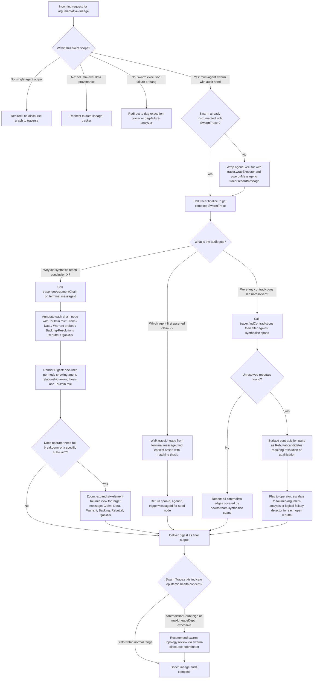

# Diagram 1: flowchart

```mermaid
flowchart TD
  A[Incoming request for argumentative-lineage] --> B{Within this skill's scope?}
  B -->|No: single-agent output| C[Redirect: no discourse graph to traverse]
  B -->|No: column-level data provenance| D[Redirect to data-lineage-tracker]
  B -->|No: swarm execution failure or hang| E[Redirect to dag-execution-tracer or dag-failure-analyzer]
  B -->|Yes: multi-agent swarm with audit need| F{Swarm already instrumented with SwarmTracer?}

  F -->|No| G[Wrap agentExecutor with tracer.wrapExecutor and pipe onMessage to tracer.recordMessage]
  F -->|Yes| H[Call tracer.finalize to get complete SwarmTrace]
  G --> H

  H --> I{What is the audit goal?}

  I -->|Why did synthesis reach conclusion X?| J[Call tracer.getArgumentChain on terminal messageId]
  I -->|Were any contradictions left unresolved?| K[Call tracer.findContradictions then filter against synthesise spans]
  I -->|Which agent first asserted claim X?| L[Walk traceLineage from terminal message, find earliest assert with matching thesis]

  J --> M[Annotate each chain node with Toulmin role: Claim / Data / Warrant probed / Backing-Resolution / Rebuttal / Qualifier]
  K --> N{Unresolved rebuttals found?}
  L --> O[Return spanId, agentId, triggerMessageId for seed node]

  M --> P[Render Digest: one-liner per node showing agent, relationship arrow, thesis, and Toulmin role]
  N -->|Yes| Q[Surface contradiction pairs as Rebuttal candidates requiring resolution or qualification]
  N -->|No| R[Report: all contradicts edges covered by downstream synthesise spans]

  P --> S{Does operator need full breakdown of a specific sub-claim?}
  S -->|No| T[Deliver digest as final output]
  S -->|Yes| U[Zoom: expand six-element Toulmin view for target message: Claim, Data, Warrant, Backing, Rebuttal, Qualifier]
  U --> T

  Q --> V[Flag to operator: escalate to toulmin-argument-analysis or logical-fallacy-detector for each open rebuttal]
  O --> T
  R --> T
  V --> T

  T --> W{SwarmTrace.stats indicate epistemic health concern?}
  W -->|contradictionCount high or maxLineageDepth excessive| X[Recommend swarm topology review via swarm-discourse-coordinator]
  W -->|Stats within normal range| Y[Done: lineage audit complete]
  X --> Y
```
