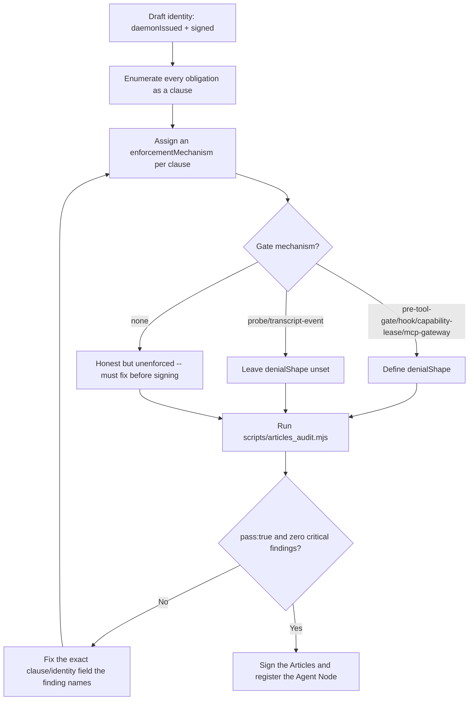

# Articles of Agreement Auditor

Decide whether an Articles of Agreement contract actually binds an agent, or just documents good intentions.

## Use This For

- Drafting a new Agent Node's Articles before it registers: naming a concrete mechanism per obligation, not an aspiration.
- Reviewing a claimed compliance level (C0 Registered through C6 Resumable) against the clauses that supposedly back it.
- Deciding whether a specific clause is genuinely enforced (daemon can observe and, for gates, deny it) or merely written down.
- Auditing whether a signing identity is trustworthy: daemon-issued at `agent.register`, and signed, not self-asserted by the body.
- Catching a gate-style mechanism (pre-tool-gate, hook, capability-lease, mcp-gateway) with no defined denial shape before it ships.

## Do Not Use This For

- Securing the path from an inbound webhook/email/SMS/GitHub comment to an agent spawn — that is `fleet-event-spawn-trust`; this skill audits the signed contract an already-spawned agent operates under.
- Designing the relay's transport PKI, per-publisher signing keys, or Merkle event chains — that is `pd-relay-zero-trust`; this skill is silent on wire-level trust between daemons.
- Tracking a signed identity's behavior, outcomes, or reputation over its whole lifetime — that is `agent-identity-continuity-reputation`; this skill only checks the contract is sound and the identity was legitimately issued at signing time.

## Enforcement Decision Model

1. **Verify identity before evaluating anything else.** Confirm `identity.daemonIssued` and `identity.signed` are both true. A body that can self-assert its own identity can also self-assert compliance — no clause matters until the signing identity itself is trustworthy.
2. **Enumerate every obligation as its own clause.** Registration, transcript reporting, tool-use gating, file/symbol claims, parley conduct, budget/lease limits, and operator control each get a named clause — see `templates/output-template.md`.
3. **Assign a real `enforcementMechanism` per clause.** Pick from `pre-tool-gate`, `hook`, `capability-lease`, `mcp-gateway`, `probe`, `transcript-event`, or the honest `none` — see `references/enforcement-mechanism-taxonomy.md` for which mechanism actually fits which obligation.
4. **Require `daemonObservable: true` for every clause that claims a mechanism.** A named mechanism the daemon cannot independently confirm is functionally the same as `none`.
5. **Define `denialShape` for every gate-style clause.** State the concrete artifact a violation produces (error code, refused call, revoked lease); never attach a `denialShape` to a passive `probe`/`transcript-event` clause, which has nothing to deny.
6. **Run `scripts/articles_audit.mjs` against the spec** and fix every critical finding at the exact clause or identity field it names, not by weakening the check.
7. **Sign and register only on `pass:true`.** A contract that fails closed is a blocker, the same as a red required CI check — not an FYI to route around.

## Output Contract

The scorer reads a JSON object matching `schemas/articles.schema.json`:

- `identity`: `{ daemonIssued: boolean, signed: boolean }` — both must be `true`.
- `clauses[]`: `{ name, obligation, enforcementMechanism, daemonObservable, denialShape? }` — at least one clause; every clause's `enforcementMechanism` must not be `"none"` and `daemonObservable` must be `true`; every gate-style clause needs a non-empty `denialShape`.

Use `scripts/articles_audit.mjs` to audit an Articles spec JSON and return `{ pass, score, findings, recommendations }`.

## Anti-Patterns

### The Hopeful Clause

**Novice**: Writes an obligation in plain English ("the agent will respect its budget") and calls it done, or picks a mechanism the daemon has no way to actually observe.
**Expert**: Every clause resolves to a concrete, daemon-observable mechanism — or is honestly marked `enforcementMechanism: "none"` so the gap is visible, never silently assumed safe.
**Detection**: `articles_audit.mjs` fires `clause-not-enforced` (critical) when a clause's `enforcementMechanism` is `"none"` or `daemonObservable` is `false`.

### Self-Attested Identity

**Novice**: Lets the agent register with a self-chosen id, or treats an unsigned Articles document as close enough.
**Expert**: The daemon mints the Agent Node id at `agent.register` against a nonce it issued first, and signs the Articles before any clause is trusted — a body can request capabilities, it cannot declare itself compliant.
**Detection**: `articles_audit.mjs` fires `identity-not-daemon-issued` (critical) when `identity.daemonIssued` is not `true`, and `identity-unsigned` (critical) when `identity.signed` is not `true`.

### The Gate With No Denial Receipt

**Novice**: Names a gate mechanism (`pre-tool-gate`, `hook`, `capability-lease`, `mcp-gateway`) and stops there, with nothing describing what actually happens on a violation.
**Expert**: Every gate defines a `denialShape` — the literal artifact a violation produces (error code, refused call, revoked lease) — so the gate is provably built, not just named.
**Detection**: `articles_audit.mjs` fires `enforced-clause-no-denial-shape` (critical) when a gate-style clause has no non-empty `denialShape`.

## References

| File | Load When |
| --- | --- |
| `references/enforcement-mechanism-taxonomy.md` | Need to pick a real `enforcementMechanism` for a clause, or decide whether it needs a `denialShape`. |
| `references/compliance-levels-and-identity.md` | Need to ground a clause in the C0-C6 compliance ladder, or decide whether an identity claim can be trusted. |
| `examples/expected-output.md` | Need to see a hopeful/self-attested contract audited, then the same contract fixed and passing. |
| `examples/sample-input.json` | Need a complete, passing Articles spec to copy and adapt. |
| `templates/output-template.md` | Need a reusable Articles draft template (identity + clauses) to fill in before signing. |
| `schemas/articles.schema.json` | Need to validate an Articles spec JSON payload's structure before auditing it. |
| `scripts/articles_audit.mjs` | Need deterministic scoring of an Articles contract's enforceability. |
| `agents/openai.yaml` | Need a subagent descriptor for delegated Articles drafting/audit. |

<!-- BEGIN BUNDLE INDEX (auto: index_references.py) -->

## Skill Bundle Index

*Every file in this skill, and when to open it. Auto-generated; run `scripts/index_references.py --fix`.*

**root**
- [`CHANGELOG.md`](CHANGELOG.md) — Articles of Agreement Auditor — Changelog — - Initial skill creation - Identity-then-clause enforcement decision model defined - Reference files and deterministic articles_audit script
- [`README.md`](README.md) — Articles of Agreement Auditor — Audit an Articles of Agreement contract — the daemon-witnessed agreement every official Port Daddy agent signs — against the enforcement-bea

**`agents/`**
- [`agents/openai.yaml`](agents/openai.yaml) — openai (data/schema)

**`examples/`**
- [`examples/expected-output.md`](examples/expected-output.md) — Example Output: Articles of Agreement Auditor — Scenario: a new Voyager is drafted with a self-issued identity, an unsigned Articles document, a "be nice" clause with no mechanism at all, 
- [`examples/sample-input.json`](examples/sample-input.json) — sample input (data/schema)

**`references/`**
- [`references/compliance-levels-and-identity.md`](references/compliance-levels-and-identity.md) — Compliance Levels And Identity — Use this when you need to ground a clause's mechanism in the daemon's actual compliance ladder, or decide whether an identity claim can be t
- [`references/enforcement-mechanism-taxonomy.md`](references/enforcement-mechanism-taxonomy.md) — Enforcement Mechanism Taxonomy — Use this when you need to pick a real `enforcementMechanism` for a clause, or decide whether it needs a `denialShape`.

**`schemas/`**
- [`schemas/articles.schema.json`](schemas/articles.schema.json) — articles.schema (data/schema)

**`scripts/`**
- [`scripts/articles_audit.mjs`](scripts/articles_audit.mjs)

**`templates/`**
- [`templates/output-template.md`](templates/output-template.md) — Articles of Agreement Draft — Fill in every clause before signing.

<!-- END BUNDLE INDEX -->
