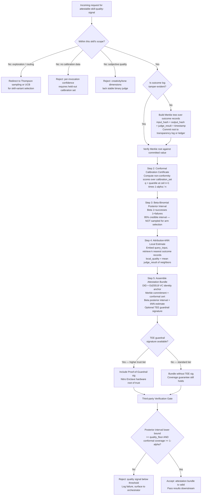

# Diagram 1: flowchart

```mermaid
flowchart TD
  A[Incoming request for attestable-skill-quality-signal] --> B{Within this skill's scope?}
  B -->|No: exploration / routing| C[Redirect to Thompson sampling or UCB\nfor skill-variant selection]
  B -->|No: no calibration data| D[Reject: per-invocation confidence\nrequires held-out calibration set]
  B -->|No: subjective quality| E[Reject: creativity/tone dimensions\nlack stable binary judge]
  B -->|Yes| F{Is outcome log\ntamper-evident?}

  F -->|No| G[Build Merkle tree over outcome records\ninput_hash + output_hash + judge_result + timestamp\nCommit root to transparency log or ledger]
  F -->|Yes| H[Verify Merkle root against committed value]
  G --> H

  H --> I[Step 2: Conformal Calibration Certificate\nCompute non-conformity scores over calibration_set\nq = quantile at ceil n+1 times 1-alpha / n]
  I --> J[Step 3: Beta-Binomial Posterior Interval\nBeta 1+successes 1+failures\n95% credible interval — NOT sampled for arm selection]
  J --> K[Step 4: Attribution-kNN Local Estimate\nEmbed query_input, retrieve k nearest outcome records\nlocal_quality = mean judge_result of neighbors]

  K --> L[Step 5: Assemble Attestation Bundle\nDID + Ed25519 VC identity anchor\nMerkle commitment + conformal cert\nBeta posterior interval + kNN estimate\nOptional TEE guardrail signature]

  L --> M{TEE guardrail\nsignature available?}
  M -->|Yes — higher trust tier| N[Include Proof-of-Guardrail sig\nNitro Enclave hardware root of trust]
  M -->|No — standard tier| O[Bundle without TEE sig\nCoverage guarantee still holds]
  N --> P[Third-party Verification Gate]
  O --> P

  P --> Q{Posterior interval lower bound\n>= quality_floor AND\nconformal coverage >= 1-alpha?}
  Q -->|No| R[Reject: quality signal below threshold\nLog failure, surface to orchestrator]
  Q -->|Yes| S[Accept: attestation bundle is valid\nPass results downstream]
```
