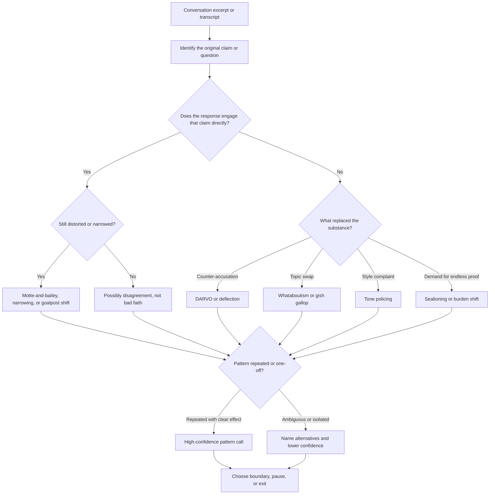

# Bad-Faith Rhetoric Detector

Use this skill to separate genuine disagreement from repeated rhetorical non-engagement. The core job is not to win the argument; it is to identify whether the other party is answering the substance, shifting the frame, or using the conversation itself as leverage.

## When to Use

- Use this when the user says the other person keeps dodging the point, moving goalposts, or making the user defend things they already established.
- Use it when the user wants a pattern read grounded in actual quotes rather than vibes alone.
- Use it when the decision is practical: stay engaged, set a boundary, or exit.

**NOT for:** diagnosing personality disorders, determining legal liability, proving someone is "lying" with certainty, or helping a user weaponize manipulative tactics.

## Decision Points

## L3 Cues

- The strongest cue is not a single tactic name. It is repeated refusal to stay with the same claim long enough to evaluate it.
- Real bad-faith patterns often create asymmetry: the user must answer everything while the other person answers nothing cleanly.
- Tone policing is usually secondary. The decisive question is whether the substantive issue remained unanswered after the style complaint.
- A charitable alternative should survive contact with the quotes. If the alternative requires ignoring the transcript, it is not actually charitable.
- High-confidence calls come from recurrence plus effect: confusion, exhaustion, self-doubt, or perpetual reset of the topic.

## Callsite Decomposition

1. Extract the original question or claim in the user's words.
2. Quote the response segment that allegedly failed to engage it.
3. Name the most likely tactic only after checking whether ordinary disagreement explains it.
4. Add one charitable alternative explanation.
5. State the effect on the conversation: confusion, delay, exhaustion, role reversal, or topic drift.
6. End with a practical next move: continue narrowly, pause, or exit.

## Failure Modes

### Pattern Confirmation Bias

**Cue:** every frustrating disagreement starts looking manipulative.  
**Recovery move:** force a charitable alternative before naming a tactic.

### Therapeutic Overreach

**Cue:** rhetoric analysis slides into diagnosis language such as narcissism or sociopathy.  
**Recovery move:** describe behavior, not personality.

### False Equivalence

**Cue:** the user got an answer they disliked, and that gets mislabeled as evasion.  
**Recovery move:** separate "unwelcome answer" from "no answer."

### Weaponized Analysis

**Cue:** the user wants tactics for manipulating someone else.  
**Recovery move:** refuse tactical coaching and redirect to ethical communication.

### Endless Pattern Cataloging

**Cue:** more and more labels appear, but no decision follows.  
**Recovery move:** ask what the user wants to do with the analysis.

## Anti-Patterns and Shibboleths

### Unwelcome Answer != Bad Faith

- **Novice move:** label any answer you dislike as evasion.
- **Expert move:** separate "I hate the answer" from "the answer did not engage the original claim."

### One Screenshot, Total Diagnosis

- **Novice move:** infer a full manipulation pattern from one clipped exchange.
- **Expert move:** lower confidence sharply unless recurrence, context, and observable effect are present.

### Counter-Manipulation Coaching

- **Novice move:** use the analysis to escalate or mirror the tactic.
- **Expert move:** convert the read into a boundary, narrowing move, or exit option.

## Worked Examples

### Example 1: Workplace Motte-and-Bailey

**User:** "My boss said the department needs major restructuring and some people are not pulling their weight. When I asked who and what changes, he said we all need to step up. Is this bad faith?"

**Read:**

1. Original claim: major restructuring and underperformance.
2. Follow-up response: generic encouragement instead of specifics.
3. Best fit: motte-and-bailey retreat from a concrete claim to a safer platitude.
4. Charitable alternative: the boss may be signaling concern without a finished plan.

**Useful answer:** "This looks like a motte-and-bailey move. The worrying claim disappears when you ask for commitment. Even if the motive is uncertainty rather than manipulation, the effect is the same: you are left reacting to a threat that cannot be examined."

### Example 2: Relationship DARVO Pattern

**User:** "I said I felt hurt that my partner canceled our plans last minute again. They said I was attacking them while they are stressed and that I never support them. Did I do something wrong?"

**Read:**

1. Original concern: repeated cancellation.
2. Response pattern: deny the concern, attack the speaker, then reverse victim/offender roles.
3. Best fit: DARVO.
4. Charitable alternative: defensive overwhelm rather than deliberate manipulation.

**Useful answer:** "The response follows a DARVO pattern because your original concern was not engaged; the conversation was redirected into your alleged mistreatment of them. That does not prove malicious intent, but it does explain why your concern stayed unresolved."

## Fork Guidance

- Stay in-process for a short exchange or one concrete question.
- Use `context: fork` when the transcript is long enough that one branch should do a charitable read and another should do pattern classification.
- If you fork, compare the branches on the same quoted excerpt set. Do not let one branch see a different transcript slice.

## Bash / Runtime Guidance

- Do not add `!` shell preprocessing here. Conversation analysis depends on quoted text, not local shell state.
- If a transcript needs cleanup, do it outside the skill and preserve the original wording for analysis.

## Visual Artifact Guidance

- Prefer a quote table with columns for original claim, observed response, likely tactic, effect, and charitable alternative.
- Use the Mermaid flow only when explaining the decision path to another reviewer or user.
- Avoid turning every conversation into a diagram. The quotes are the primary evidence.

## Reference Index

- Start with `references/INDEX.md` and load only the file that matches the blocking pattern.
- Use `references/patterns/bad-faith-tactics.md` for tactic distinctions.
- Use `references/patterns/lying-by-omission.md` when the issue is selective disclosure.
- Use `references/playbooks/relational-safety-responses.md` when the next move matters more than more labeling.

## Support Files

- `templates/exchange-analysis-sheet.md` for quote capture, tactic comparison, and next-step selection.
- `diagrams/01_flowchart_decision-points.md` for the companion routing diagram.

## Quality Gates

- [ ] The original claim or question is explicitly stated.
- [ ] The analysis cites quotes rather than paraphrase alone.
- [ ] A tactic is named only after checking for ordinary disagreement or defensiveness.
- [ ] A charitable alternative explanation is included.
- [ ] The effect on the conversation is observable, not speculative.
- [ ] The answer ends with a practical boundary or response option.

## NOT-for Boundaries

Do not use this skill for psychiatric diagnosis, legal advice, or proof of deception. Use it for behaviorally grounded discourse analysis and practical next-step judgment only.
