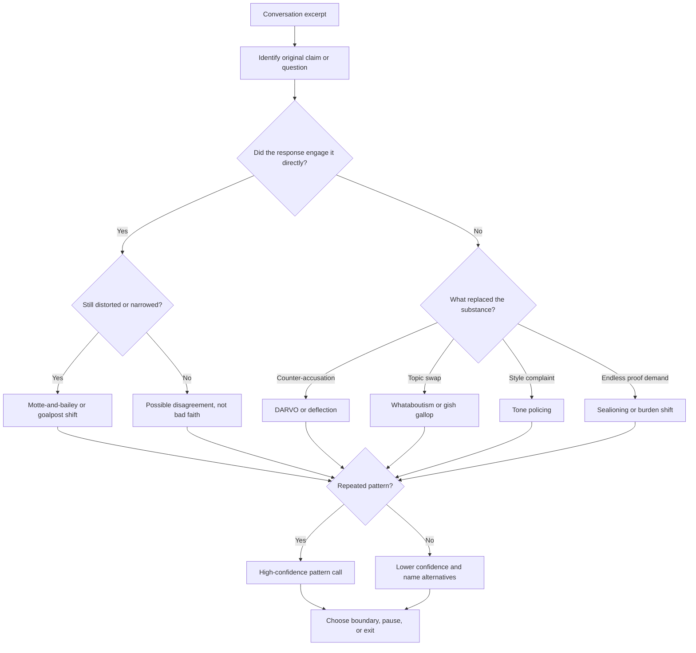

# Bad-Faith Pattern Routing

Use this flow when you need to explain how the analysis moved from quoted text to a tactic read and then to a practical boundary choice.

```mermaid
flowchart TD
  A[Conversation excerpt] --> B[Identify original claim or question]
  B --> C{Did the response engage it directly?}
  C -->|Yes| D{Still distorted or narrowed?}
  C -->|No| E{What replaced the substance?}
  D -->|Yes| F[Motte-and-bailey or goalpost shift]
  D -->|No| G[Possible disagreement, not bad faith]
  E -->|Counter-accusation| H[DARVO or deflection]
  E -->|Topic swap| I[Whataboutism or gish gallop]
  E -->|Style complaint| J[Tone policing]
  E -->|Endless proof demand| K[Sealioning or burden shift]
  F --> L{Repeated pattern?}
  G --> L
  H --> L
  I --> L
  J --> L
  K --> L
  L -->|Yes| M[High-confidence pattern call]
  L -->|No| N[Lower confidence and name alternatives]
  M --> O[Choose boundary, pause, or exit]
  N --> O
```
