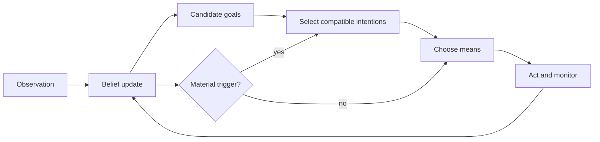

# BDI Agent Architecture

Use this skill to decide **what an individual agent must represent**, and when it should revisit a chosen course of action. Use `bdi-agent-interpreters` when the decision becomes an event loop, plan library, or transition system.

## Decision procedure

1. Name the environment observations and their uncertainty. Store them as beliefs with provenance or confidence where the system needs it.
2. Separate candidate goals from selected intentions. Record the resource or consistency constraints that make a candidate ineligible.
3. Give every intention an achievement condition, an abandonment condition, and a current means. An intention is a commitment to pursue a goal, not merely a preference.
4. Reconsider on relevant changes: a goal is achieved, its preconditions fail, its cost or risk changes materially, or a conflicting obligation appears. Choose periodic checks only where event triggers cannot cover the failure modes.
5. Check that the agent can explain a chosen action from its current beliefs, selected intention, and plan; test recovery when the plan fails.

## Boundaries and cautions

- A fixed workflow may be adequate when the environment and goals are stable; do not add mental-state machinery just for the label.
- Do not claim that BDI's three categories are mathematically necessary for all resource-bounded agents. They are a useful architecture whose value depends on the task.
- Do not assert a universal optimal reconsideration frequency. Measure the environment's change rate and the costs of deliberation and action.
- Joint intentions and norms require additional mechanisms; route to `bdi-organizational-modeling` or `bdi-normative-reasoning`.

## Source bundles

The recovered source bundles, including every original reference, diagram, provenance file, and example, are under `sources/<original-name>/`. Read only the relevant bundle:

- `sources/rao-georgeff-1991-modeling-rational-agents-bdi/` for formal mental-state semantics.
- `sources/rao-georgeff-1995-bdi-agents-from-theory-to-practice/` for theory-to-system design.
- `sources/belief-desire-intention-model-of-agency/` for commitment and reconsideration discussions.
- `sources/the-belief-desire-intention-model-of-age/` for the second recovered copy; compare it before citing claims.
- `sources/bdi-agency-model/` for a broader imported survey.

Treat empirical numbers and cross-architecture equivalences in recovered prose as leads to verify in primary papers, not established findings. The source title and license are preserved with each bundle.
