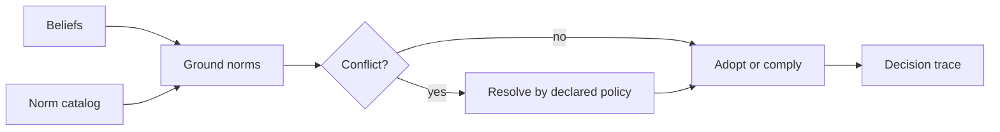

# BDI Normative Reasoning

Use this skill when norms are represented as decision-relevant objects, rather than a fixed `if` statement at an external enforcement boundary.

## Decision procedure

1. Specify each norm's issuer, scope, activation condition, addressee, required or forbidden action, expiry, and enforcement consequence.
2. Ground applicability in current beliefs; distinguish “not observed” from “known false.”
3. Keep norm recognition separate from adoption as a goal or intention. An applicable norm need not be internalized if the design permits refusal.
4. Detect conflicts among norms and with existing intentions. Name the chosen resolution criterion before choosing an action: priority, authority, defeasibility, consequence model, or explicit escalation.
5. Produce a decision trace showing applicable norms, rejected alternatives, and the rule used. Test contradictory norms and changed beliefs.

## Boundaries

- Do not use consequence ranking as a universal conflict resolver. It requires a defensible consequence model and explicit authority to trade off duties.
- External policy enforcement may be simpler and safer than autonomous norm adoption. Choose this architecture only if the agent truly has discretion.
- `bdi-agent-architecture` handles basic goals and commitments; `bdi-agent-interpreters` handles the executable cycle.

## Source bundles

The three imported variants are preserved under `sources/normative-bdi-agent-architecture/`, `sources/normative-bdi-agents/`, and `sources/a-normative-extension-for-the-bdi-agent/`. Compare them before quoting a paper-specific rule; verify claims against the primary publication.
