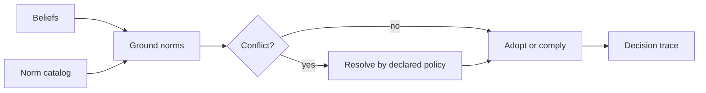

# BDI Normative Reasoning

Use this skill when norms are represented as decision-relevant objects, rather than a fixed `if` statement at an external enforcement boundary.

## Decision procedure

1. Specify each norm's issuer, scope, activation condition, addressee, required or forbidden action, expiry, and enforcement consequence. Keep a recognized Abstract Norm Base (ANB) candidate distinct from a grounded active Norm Instance Base (NIB) instance.
2. Ground applicability in source-tagged current beliefs; distinguish “not observed” from “known false.” Instantiate only after confirming binding, activation, and non-expiry under a declared reconciliation policy.
3. Keep norm recognition separate from adoption as a goal or intention. An applicable norm need not be internalized if the design permits refusal.
4. Detect conflicts among norms and with existing intentions using a joint plan witness. Separate an empty complete plan catalog from incomplete search or unknown effects. Name the chosen resolution criterion: an applicable hard priority, a scoped partial-order comparison, or explicit escalation. Preserve incomparable alternatives.
5. Produce a decision trace showing applicable norms, rejected alternatives, source authority, search coverage, and the rule used. Keep any local desire update separate from authorization to execute an external effect.

## Boundaries

- Do not use consequence ranking as a universal conflict resolver. The cited model can leave consequences incomparable; a tie policy must be separately declared. Verified hard constraints still bound feasible actions.
- External policy enforcement may be simpler and safer than autonomous norm adoption. Choose this architecture only if the agent truly has discretion.
- `bdi-agent-architecture` handles basic goals and commitments; `bdi-agent-interpreters` handles the executable cycle.

## Source-bound checks

- Read `sources/normative-bdi-agent-architecture/references/source-boundary-and-authority-trace.md` for primary-source scope, ANB/NIB distinctions, and independent effect admission.
- Read `sources/normative-bdi-agents/references/source-boundary-and-authority-trace.md` when comparing source variants. The similarly named 2014, 2015, and 2012 works are distinct; do not collapse their results.
- An active NIB instance is a local model state, not a legal, ethical, or execution authority.

## Source bundles

The three imported variants are preserved under `sources/normative-bdi-agent-architecture/`, `sources/normative-bdi-agents/`, and `sources/a-normative-extension-for-the-bdi-agent/`. Compare them before quoting a paper-specific rule; verify claims against the primary publication.
