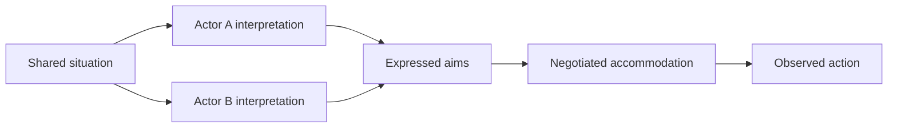

# BDI Organizational Modeling

Use BDI vocabulary here as a **modeling lens for people and institutions**. Do not equate an organization's discourse with an executable agent's belief store.

## Modeling procedure

1. Name the actors and the organizational boundary. Ask whose observations are available and which filters shape what each actor notices.
2. List expressed aims separately from commitments backed by resources or agreed action.
3. Trace a disputed situation through the actors' different interpretations before declaring a single shared problem.
4. Identify accommodations: coordinated actions actors can accept without requiring identical beliefs or motives.
5. State the level of analysis for each claim: person, team, institution, or environment. Avoid silently treating a team as one mind.
6. Record what the model predicts, what it merely reframes, and which observations would falsify the diagnosis.

## Boundaries

- An accommodation is a proposed coordination mechanism, not proof of consensus.
- This skill diagnoses social structure; use `bdi-agent-architecture` for an individual software agent and `bdi-agent-interpreters` for runtime semantics.
- Use `bdi-normative-reasoning` when obligations or prohibitions are explicit and must be resolved by an agent.

## Source bundles

Read `sources/bdi-soft-systems/` for soft-systems framing, and compare `sources/bdi-soft-model-for-organisations/` with `sources/bdi-agents-a-soft-model-for-organisation/` before attributing specific concepts. Every original reference and provenance artifact remains in its source directory. Verify literature claims in the original paper before presenting them as results.
