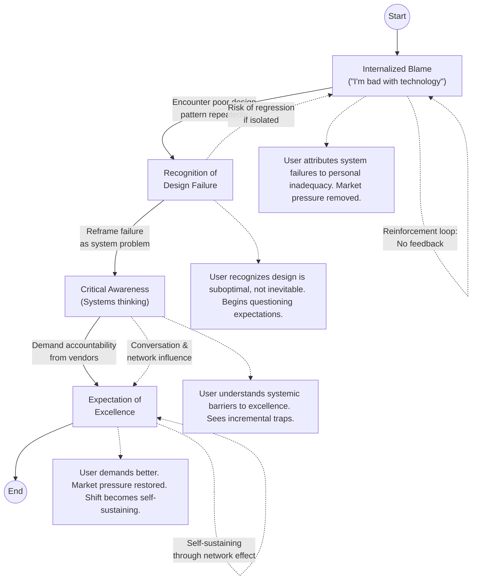

# Cognitive Shift: From Self-Blame to System Accountability

```mermaid
flowchart TD
    Start((Start)) --> InternalizedBlame

    InternalizedBlame["Internalized Blame<br/>(#quot;I'm bad with technology#quot;)"]
    RecognitionFailure["Recognition of<br/>Design Failure"]
    CriticalAwareness["Critical Awareness<br/>(Systems thinking)"]
    ExpectationExcellence["Expectation of<br/>Excellence"]

    InternalizedBlame -->|Encounter poor design<br/>pattern repeatedly| RecognitionFailure
    RecognitionFailure -->|Reframe failure<br/>as system problem| CriticalAwareness
    CriticalAwareness -->|Demand accountability<br/>from vendors| ExpectationExcellence

    ExpectationExcellence --> End((End))

Annotation1["User attributes system failures to personal inadequacy. Market pressure removed."]
InternalizedBlame -.-> Annotation1

Annotation2["User recognizes design is suboptimal, not inevitable. Begins questioning expectations."]
RecognitionFailure -.-> Annotation2

Annotation3["User understands systemic barriers to excellence. Sees incremental traps."]
CriticalAwareness -.-> Annotation3

Annotation4["User demands better. Market pressure restored. Shift becomes self-sustaining."]
ExpectationExcellence -.-> Annotation4

    InternalizedBlame -.->|Reinforcement loop:<br/>No feedback| InternalizedBlame
    ExpectationExcellence -.->|Self-sustaining<br/>through network effect| ExpectationExcellence
    RecognitionFailure -.->|Risk of regression<br/>if isolated| InternalizedBlame
    CriticalAwareness -.->|Conversation &<br/>network influence| ExpectationExcellence
```
