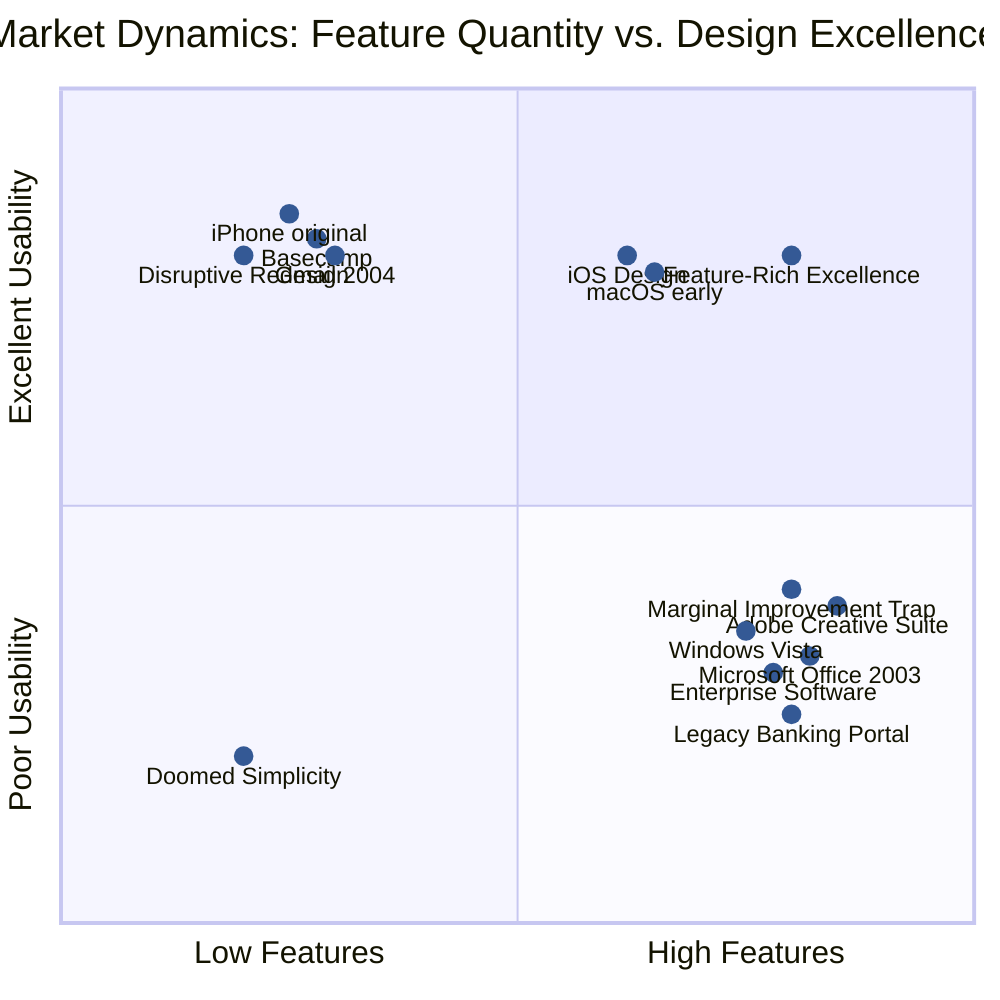

# Market Dynamics: Feature Quantity vs. Design Excellence

```mermaid
quadrantChart
%%{init: {"themeVariables": {"quadrantPointFill": "#345995"}}}%%
    title Market Dynamics: Feature Quantity vs. Design Excellence
    x-axis Low Features --> High Features
    y-axis Poor Usability --> Excellent Usability
    
    %% Quadrant labels
    Doomed Simplicity: [0.2, 0.2]
    Disruptive Redesign: [0.2, 0.8]
    Marginal Improvement Trap: [0.8, 0.4]
    Feature-Rich Excellence: [0.8, 0.8]
    
    %% Current market products (clustered in trap)
    Windows Vista: [0.75, 0.35]
    Microsoft Office 2003: [0.82, 0.32]
    Adobe Creative Suite: [0.85, 0.38]
    Enterprise Software: [0.78, 0.3]
    Legacy Banking Portal: [0.8, 0.25]
    
    %% Disruptive redesigns
    iPhone original: [0.25, 0.85]
    Gmail 2004: [0.3, 0.8]
    Basecamp: [0.28, 0.82]
    
    %% Rare excellence
    macOS early: [0.65, 0.78]
    iOS Design: [0.62, 0.8]
```
