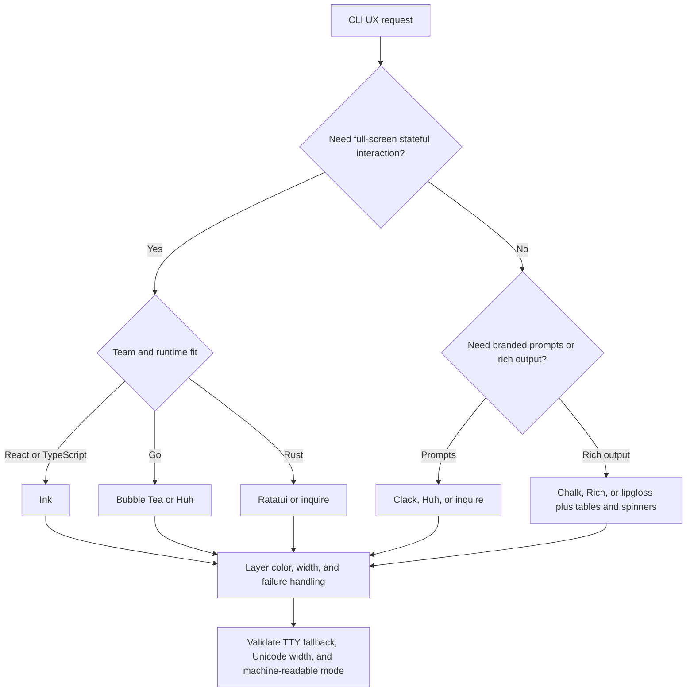

# Beautiful CLI Design

Treat the terminal as a real interface surface: hierarchy, feedback, accessibility, and fallback modes all matter.

## When to Use

- Branded setup flows, login flows, and first-run wizards.
- Rich command output with tables, spinners, status blocks, or markdown rendering.
- Stateful terminal dashboards or TUIs that must feel intentional instead of bolted on.
- Error and remediation flows where the output should guide action instead of dumping stack traces.

## NOT for

- Browser interfaces or responsive web dashboards.
- Desktop GUI windows and native menu-bar apps.
- API response schemas or machine-only output contracts.
- Shell automation logic where human-facing polish is not the bottleneck.

## Decision Points



Use this routing model first:

- Prompt libraries are enough for wizards and first-run experiences.
- Full TUI frameworks are worth it only when the interface has durable state and navigation.
- Every visual choice must survive `NO_COLOR`, narrow widths, non-TTY pipes, and machine-readable flags.

## Visual System Rules

- Use semantic colors, not rainbow sampling. Success, warning, error, and one accent is usually enough.
- Treat width as a first-class constraint. Reflow at 40, 80, and 120 columns.
- Use Unicode-aware width calculation for tables and box drawing.
- Make progress states honest: spinner for unknown duration, bars and ETA only when the denominator is real.
- Turn every error surface into a next-action surface.

## FAILURE MODES

### Anti-Pattern: "Rainbow Vomit"
**Symptom**: Every piece of text has different colors, making nothing stand out
**Detection Rule**: If you count more than five colors in a single screen, you have hit this
**Fix**: Limit to three semantic colors plus one accent. Use grayscale for hierarchy.

### Anti-Pattern: "Invisible in Light Mode"
**Symptom**: The CLI looks good in a dark terminal but becomes unreadable in light themes
**Detection Rule**: Hardcoded dark-theme colors without testing
**Fix**: Use semantic ANSI codes or verify the palette in both dark and light terminal themes.

### Anti-Pattern: "Broken Pipe Panic"
**Symptom**: The CLI crashes or sprays ANSI codes when piped, for example `mycli | head -5`
**Detection Rule**: `isTTY` or equivalent detection is missing from the formatting path
**Fix**: Strip formatting for pipes and keep a `--color=always` override when the user explicitly wants it.

### Anti-Pattern: "Ghost Cursor"
**Symptom**: The terminal cursor disappears after a crash and the user has to recover it manually
**Detection Rule**: Cursor hiding is used without exit handlers for failure and interruption paths
**Fix**: Always restore cursor state before process termination.

### Anti-Pattern: "Asian Character Explosion"
**Symptom**: Tables and boxes misalign when users have CJK names or emoji in data
**Detection Rule**: Layout math uses string length instead of display width
**Fix**: Use Unicode-aware width libraries for every alignment calculation.

### Anti-Pattern: "Pretty but Script-Hostile"
**Symptom**: The human output looks great, but `--json`, pipes, or CI logs become unusable
**Detection Rule**: The command cannot cleanly switch between human mode and machine mode
**Fix**: Keep a machine-readable output path that bypasses decoration entirely.

## WORKED EXAMPLES

### Example 1: Setup Wizard Enhancement

**Before**: Basic prompts, no branding, inconsistent styling

```bash
? What's your project name? my-app
? Choose framework: React
Installing dependencies...
Done.
```

**After**: Branded setup flow with consistent framing

```bash
┌  create-jury_rig-app
│
◇  Project name?
│  my-app
│
◇  Framework?
│  ● React (recommended)
│    Vue
│    Svelte
│
◆  Installing dependencies...
│
├  Next steps ──────────────────╮
│  cd my-app                    │
│  npm run dev                  │
├───────────────────────────────╯
│
└  You're all set!
```

Why this works:

- The command now has a recognizable visual language.
- The next action is visible at the moment the task completes.
- The user does not need to infer state from raw text.

### Example 2: Build Pipeline Dashboard

**Before**: Plain text logs streaming past

```bash
Running lint...
Lint completed
Running build...
Build completed
Running tests...
Tests completed
```

**After**: Live updating dashboard with parallel status

```bash
╭─ Build Pipeline ─────────────────────────────────────╮
│  Lint        ✓ done    0.8s                         │
│  Build       ━━━━━━━━━━━━━━━━━━━━━━━━━━━━  done  2.1s │
│  Test suite  ━━━━━━━━━━━━━━━━╸────────────  64%  1.2s │
│  Type check  ⠋ running...                           │
│                                                     │
│  Elapsed: 2.3s    ETA: 1.4s                        │
╰─────────────────────────────────────────────────────╯
```

Decision rationale:

- Ink is justified because the interface has durable, updating state.
- Parallel tasks are readable without drowning the user in logs.
- The dashboard still needs a non-TTY fallback for pipes and CI.

### Example 3: Error Message Transformation

**Before**: Cryptic technical error

```bash
Error: ENOENT: no such file or directory, open 'jury_rig.config.ts'
    at Object.openSync (fs.js:498:3)
```

**After**: Helpful, actionable error with context

```bash
╭─ Configuration Error ────────────────────────────────╮
│                                                      │
│  ✗ Could not find configuration file                 │
│                                                      │
│    Looked in:                                        │
│    • ./jury_rig.config.ts                             │
│    • ./.skill-runtime-archive/config.ts                            │
│    • ~/.skill-runtime-archive/config.ts                            │
│                                                      │
│    To fix: Run wg init to create a configuration     │
│                                                      │
╰──────────────────────────────────────────────────────╯
```

What the expert catches:

- Users need remediation, not just failure facts.
- Lookup context belongs in the message because it shortens the support loop.
- Styled errors should still degrade to plain text cleanly.

## Fork Guidance

Fork when the problem has distinct lanes:

- Visual system lane: hierarchy, symbols, copy tone, spacing, and box styles.
- Runtime compatibility lane: TTY detection, color fallback, width handling, cursor cleanup, and machine-readable modes.
- Interaction lane: prompts, state machines, dashboards, and redraw behavior.

Keep final decisions in the parent lane so one actor owns the overall terminal language.

## QUALITY GATES

- [ ] **Terminal compatibility tested**: Works in macOS Terminal, iTerm2, VS Code terminal, and basic xterm
- [ ] **Color degradation verified**: `NO_COLOR=1`, `TERM=dumb`, and pipe output (`| cat`) all produce clean text
- [ ] **Width responsiveness confirmed**: Readable at 40, 80, and 120 column widths
- [ ] **Cursor cleanup implemented**: SIGINT and SIGTERM handlers restore hidden cursor on all exit paths
- [ ] **Unicode safety validated**: CJK characters and emoji do not break table alignment or box drawing
- [ ] **Performance benchmarked**: Progress updates are capped and redraw loops do not saturate the terminal
- [ ] **Accessibility compliant**: Semantic color usage is informative, not decorative
- [ ] **Machine-readable output**: `--json` or `--format=json` bypasses all decoration for scripts
- [ ] **Consistent visual language**: Same symbols, colors, and box styles throughout the app
- [ ] **Error messages actionable**: Every error includes a specific next step or fix suggestion

## Output Contract

A CLI/TUI design that clears this skill's bar carries:

- `visualSystem`: semantic colors (success/warning/error/accent), consistent symbols and box styles, no rainbow vomit.
- `runtimeCompatibility`: `NO_COLOR`/`TERM=dumb` honored, pipe/non-TTY output clean, exit codes meaningful, errors on stderr.
- `layout`: Unicode-width-aware column alignment, reflow at 40/80/120 columns.
- `feedback`: honest progress (spinner for unknown duration, bar+ETA only with a real denominator), quiet by default, `--json`/`--format=json` escape hatch.

Use `scripts/cli_design_audit.mjs` to audit a CLI design spec JSON and return `{ pass, score, findings, recommendations }`; see `schemas/cli-spec.schema.json` for the input shape and `examples/sample-input.json` for a passing spec.

## Reference Map

- `diagrams/01_flowchart_decision-points.md` — companion routing diagram for scope checks and first-pass implementation choice.
- `references/00-charmbracelet-ecosystem-overview.md` — fast orientation for Bubble Tea, lipgloss, gum, and adjacent tooling.
- `references/02-ink-react-for-cli.md` and `references/03-inkjs-ui-components.md` — React-flavored terminal UI guidance.
- `references/05-lipgloss-go-v2.md` and `references/10-huh-terminal-forms.md` — polished Go output and prompt surfaces.
- `references/09-log-structured-logging.md` — how to coexist with structured logs and machine-facing consumers.
- `schemas/cli-spec.schema.json` — validate a CLI design spec JSON before auditing it.
- `examples/sample-input.json` — a passing CLI design spec, for calibration.
- `scripts/cli_design_audit.mjs` — deterministic scoring of a CLI design spec against this skill's Quality Gates.
- `templates/output-template.md` — reusable structure for writing up a CLI/TUI design deliverable.
- `agents/openai.yaml` — subagent descriptor for delegated CLI/TUI design or audit.
- `README.md` — quick start for using this skill and its auditor.

<!-- BEGIN BUNDLE INDEX (auto: index_references.py) -->

## Skill Bundle Index

*Every file in this skill, and when to open it. Auto-generated; run `scripts/index_references.py --fix`.*

**root**
- [`CHANGELOG.md`](CHANGELOG.md) — Beautiful Cli Design — Changelog — - Upgraded to the agentic-family standard: `provenance` moved to block-style `kind: first-party, owners: [port-daddy]` (prior recovery prove
- [`README.md`](README.md) — Beautiful CLI Design — Treat the terminal as a real interface surface: hierarchy, feedback, accessibility, and fallback modes all matter — for branded setup flows,
- [`affordance-scorecard.json`](affordance-scorecard.json) — affordance scorecard (data/schema)

**`agents/`**
- [`agents/openai.yaml`](agents/openai.yaml) — openai (data/schema)

**`diagrams/`**
- [`diagrams/01_flowchart_decision-points.md`](diagrams/01_flowchart_decision-points.md) — Diagram 1: flowchart
- [`diagrams/INDEX.md`](diagrams/INDEX.md) — Diagram Index — | File | Type | | |---|---|---| | `diagrams/01_flowchart_decision-points.md` | `flowchart` | companion for inline SKILL.md diagram |

**`examples/`**
- [`examples/INDEX.md`](examples/INDEX.md) — Examples Index — | File | When to load | |---|---| | `sample-input.json` | A passing `cli-spec.schema.json` input — use as a starting point or to calibrate `
- [`examples/expected-output.md`](examples/expected-output.md) — Example Output: Beautiful CLI Design — Scenario: a legacy deploy CLI paints every status line in red/green/yellow with no fallback symbol, ignores `NO_COLOR`, and writes its error
- [`examples/sample-input.json`](examples/sample-input.json) — sample input (data/schema)

**`references/`**
- [`references/00-charmbracelet-ecosystem-overview.md`](references/00-charmbracelet-ecosystem-overview.md) — Charmbracelet Ecosystem -- Complete Map for TypeScript/Node.js Developers — Charmbracelet is a company building beautiful terminal tools in Go.
- [`references/01-charmland-lipgloss-js.md`](references/01-charmland-lipgloss-js.md) — @charmland/lipgloss -- Official JS Port of Lip Gloss — **Package**: `@charmland/lipgloss` (npm) **Version**: 2.0.0-beta.3 (experimental) **License**: MIT **Size**: 1.12 MB (includes native bindin
- [`references/02-ink-react-for-cli.md`](references/02-ink-react-for-cli.md) — Ink -- React for CLIs — **Package**: `ink` (npm) **Current Version**: 5.x (requires Node.js 18+) **License**: MIT **GitHub**: https://github.com/vadimdemedes/ink **
- [`references/03-inkjs-ui-components.md`](references/03-inkjs-ui-components.md) — @inkjs/ui -- Pre-built Ink Components — **Package**: `@inkjs/ui` (npm) **Version**: 2.0.0 (requires Ink 5, Node.js 18+) **License**: MIT **GitHub**: https://github.com/vadimdemedes
- [`references/04-bubbletea-elm-architecture.md`](references/04-bubbletea-elm-architecture.md) — Bubble Tea -- The Elm Architecture for Terminal Apps — **Package**: `charm.land/bubbletea/v2` (Go) **Stars**: 30k+ (one of the most popular Go TUI frameworks) **License**: MIT **GitHub**: https:/
- [`references/05-lipgloss-go-v2.md`](references/05-lipgloss-go-v2.md) — Lip Gloss v2 -- Go Styling Library (Complete Reference) — **Package**: `charm.land/lipgloss/v2` (Go) **Stars**: 10k+ **License**: MIT **GitHub**: https://github.com/charmbracelet/lipgloss This is th
- [`references/06-glamour-markdown-rendering.md`](references/06-glamour-markdown-rendering.md) — Glamour -- Markdown Rendering in Terminal — **Package**: `charm.land/glamour/v2` (Go) **Stars**: 3.4k **License**: MIT **GitHub**: https://github.com/charmbracelet/glamour **Latest**: 
- [`references/07-vhs-tape-reference.md`](references/07-vhs-tape-reference.md) — VHS -- Terminal GIF Recording as Code — **Package**: `vhs` (CLI tool, Go binary) **Stars**: 15k+ **License**: MIT **GitHub**: https://github.com/charmbracelet/vhs **Requires**: `tt
- [`references/08-gum-shell-prompts.md`](references/08-gum-shell-prompts.md) — Gum -- Interactive Shell Prompts from Any Language — **Package**: `gum` (CLI tool, Go binary) **Stars**: 18k+ **License**: MIT **GitHub**: https://github.com/charmbracelet/gum Gum is the fastes
- [`references/09-log-structured-logging.md`](references/09-log-structured-logging.md) — Charm Log -- Beautiful Structured Logging — **Package**: `github.com/charmbracelet/log` (Go) **Stars**: 3.2k **License**: MIT **GitHub**: https://github.com/charmbracelet/log Minimal, 
- [`references/10-huh-terminal-forms.md`](references/10-huh-terminal-forms.md) — Huh? -- Terminal Forms Library — **Package**: `charm.land/huh/v2` (Go) **Stars**: 6.7k **License**: MIT **GitHub**: https://github.com/charmbracelet/huh **Inspired by**: Ale
- [`references/INDEX.md`](references/INDEX.md) — Reference Index — Load only the file that matches the current blocking question.

**`schemas/`**
- [`schemas/cli-spec.schema.json`](schemas/cli-spec.schema.json) — cli spec.schema (data/schema)

**`scripts/`**
- [`scripts/cli_design_audit.mjs`](scripts/cli_design_audit.mjs)

**`templates/`**
- [`templates/output-template.md`](templates/output-template.md) — CLI/TUI Design Output Template — Fill in every section before shipping.

<!-- END BUNDLE INDEX -->
