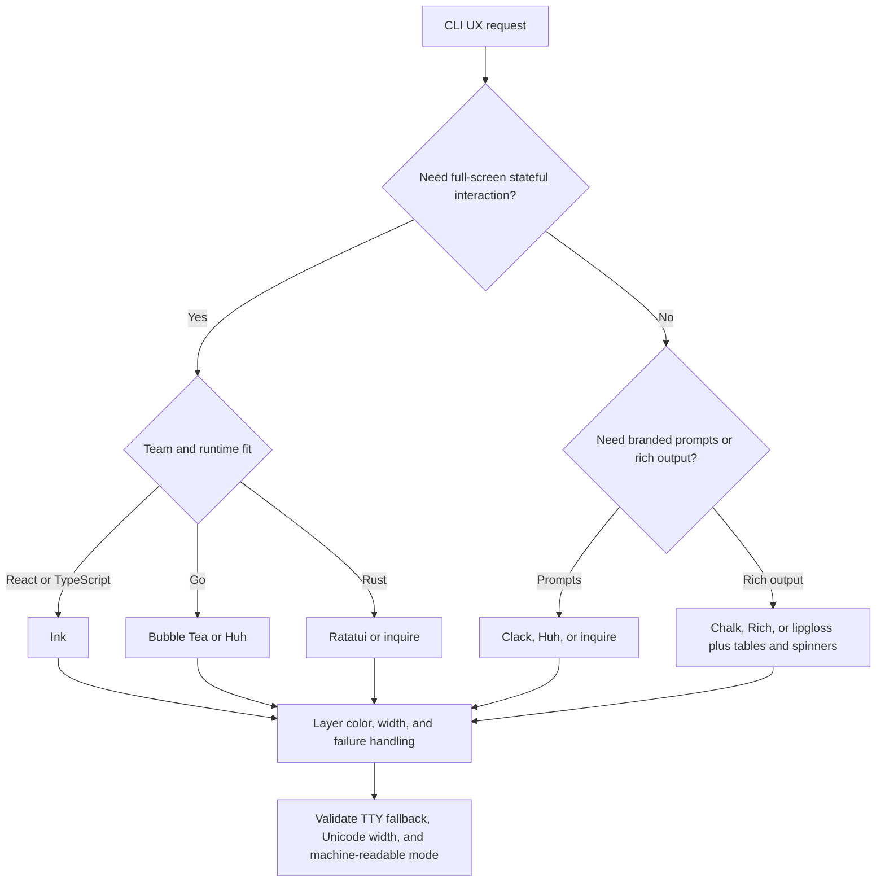

# Beautiful CLI Design

Treat the terminal as a real interface surface: hierarchy, feedback, accessibility, and fallback modes all matter.

## When to Use

- Branded setup flows, login flows, and first-run wizards.
- Rich command output with tables, spinners, status blocks, or markdown rendering.
- Stateful terminal dashboards or TUIs that must feel intentional instead of bolted on.
- Error and remediation flows where the output should guide action instead of dumping stack traces.

## NOT for

- Browser interfaces or responsive web dashboards.
- Desktop GUI windows and native menu-bar apps.
- API response schemas or machine-only output contracts.
- Shell automation logic where human-facing polish is not the bottleneck.

## Decision Points



Use this routing model first:

- Prompt libraries are enough for wizards and first-run experiences.
- Full TUI frameworks are worth it only when the interface has durable state and navigation.
- Every visual choice must survive `NO_COLOR`, narrow widths, non-TTY pipes, and machine-readable flags.

## Visual System Rules

- Use semantic colors, not rainbow sampling. Success, warning, error, and one accent is usually enough.
- Treat width as a first-class constraint. Reflow at 40, 80, and 120 columns.
- Use Unicode-aware width calculation for tables and box drawing.
- Make progress states honest: spinner for unknown duration, bars and ETA only when the denominator is real.
- Turn every error surface into a next-action surface.

## FAILURE MODES

### Anti-Pattern: "Rainbow Vomit"
**Symptom**: Every piece of text has different colors, making nothing stand out
**Detection Rule**: If you count more than five colors in a single screen, you have hit this
**Fix**: Limit to three semantic colors plus one accent. Use grayscale for hierarchy.

### Anti-Pattern: "Invisible in Light Mode"
**Symptom**: The CLI looks good in a dark terminal but becomes unreadable in light themes
**Detection Rule**: Hardcoded dark-theme colors without testing
**Fix**: Use semantic ANSI codes or verify the palette in both dark and light terminal themes.

### Anti-Pattern: "Broken Pipe Panic"
**Symptom**: The CLI crashes or sprays ANSI codes when piped, for example `mycli | head -5`
**Detection Rule**: `isTTY` or equivalent detection is missing from the formatting path
**Fix**: Strip formatting for pipes and keep a `--color=always` override when the user explicitly wants it.

### Anti-Pattern: "Ghost Cursor"
**Symptom**: The terminal cursor disappears after a crash and the user has to recover it manually
**Detection Rule**: Cursor hiding is used without exit handlers for failure and interruption paths
**Fix**: Always restore cursor state before process termination.

### Anti-Pattern: "Asian Character Explosion"
**Symptom**: Tables and boxes misalign when users have CJK names or emoji in data
**Detection Rule**: Layout math uses string length instead of display width
**Fix**: Use Unicode-aware width libraries for every alignment calculation.

### Anti-Pattern: "Pretty but Script-Hostile"
**Symptom**: The human output looks great, but `--json`, pipes, or CI logs become unusable
**Detection Rule**: The command cannot cleanly switch between human mode and machine mode
**Fix**: Keep a machine-readable output path that bypasses decoration entirely.

## WORKED EXAMPLES

### Example 1: Setup Wizard Enhancement

**Before**: Basic prompts, no branding, inconsistent styling

```bash
? What's your project name? my-app
? Choose framework: React
Installing dependencies...
Done.
```

**After**: Branded setup flow with consistent framing

```bash
┌  create-windags-app
│
◇  Project name?
│  my-app
│
◇  Framework?
│  ● React (recommended)
│    Vue
│    Svelte
│
◆  Installing dependencies...
│
├  Next steps ──────────────────╮
│  cd my-app                    │
│  npm run dev                  │
├───────────────────────────────╯
│
└  You're all set!
```

Why this works:

- The command now has a recognizable visual language.
- The next action is visible at the moment the task completes.
- The user does not need to infer state from raw text.

### Example 2: Build Pipeline Dashboard

**Before**: Plain text logs streaming past

```bash
Running lint...
Lint completed
Running build...
Build completed
Running tests...
Tests completed
```

**After**: Live updating dashboard with parallel status

```bash
╭─ Build Pipeline ─────────────────────────────────────╮
│  Lint        ✓ done    0.8s                         │
│  Build       ━━━━━━━━━━━━━━━━━━━━━━━━━━━━  done  2.1s │
│  Test suite  ━━━━━━━━━━━━━━━━╸────────────  64%  1.2s │
│  Type check  ⠋ running...                           │
│                                                     │
│  Elapsed: 2.3s    ETA: 1.4s                        │
╰─────────────────────────────────────────────────────╯
```

Decision rationale:

- Ink is justified because the interface has durable, updating state.
- Parallel tasks are readable without drowning the user in logs.
- The dashboard still needs a non-TTY fallback for pipes and CI.

### Example 3: Error Message Transformation

**Before**: Cryptic technical error

```bash
Error: ENOENT: no such file or directory, open 'windags.config.ts'
    at Object.openSync (fs.js:498:3)
```

**After**: Helpful, actionable error with context

```bash
╭─ Configuration Error ────────────────────────────────╮
│                                                      │
│  ✗ Could not find configuration file                 │
│                                                      │
│    Looked in:                                        │
│    • ./windags.config.ts                             │
│    • ./.windags/config.ts                            │
│    • ~/.windags/config.ts                            │
│                                                      │
│    To fix: Run wg init to create a configuration     │
│                                                      │
╰──────────────────────────────────────────────────────╯
```

What the expert catches:

- Users need remediation, not just failure facts.
- Lookup context belongs in the message because it shortens the support loop.
- Styled errors should still degrade to plain text cleanly.

## Fork Guidance

Fork when the problem has distinct lanes:

- Visual system lane: hierarchy, symbols, copy tone, spacing, and box styles.
- Runtime compatibility lane: TTY detection, color fallback, width handling, cursor cleanup, and machine-readable modes.
- Interaction lane: prompts, state machines, dashboards, and redraw behavior.

Keep final decisions in the parent lane so one actor owns the overall terminal language.

## QUALITY GATES

- [ ] **Terminal compatibility tested**: Works in macOS Terminal, iTerm2, VS Code terminal, and basic xterm
- [ ] **Color degradation verified**: `NO_COLOR=1`, `TERM=dumb`, and pipe output (`| cat`) all produce clean text
- [ ] **Width responsiveness confirmed**: Readable at 40, 80, and 120 column widths
- [ ] **Cursor cleanup implemented**: SIGINT and SIGTERM handlers restore hidden cursor on all exit paths
- [ ] **Unicode safety validated**: CJK characters and emoji do not break table alignment or box drawing
- [ ] **Performance benchmarked**: Progress updates are capped and redraw loops do not saturate the terminal
- [ ] **Accessibility compliant**: Semantic color usage is informative, not decorative
- [ ] **Machine-readable output**: `--json` or `--format=json` bypasses all decoration for scripts
- [ ] **Consistent visual language**: Same symbols, colors, and box styles throughout the app
- [ ] **Error messages actionable**: Every error includes a specific next step or fix suggestion

## Reference Map

- `diagrams/01_flowchart_decision-points.md` — companion routing diagram for scope checks and first-pass implementation choice.
- `references/00-charmbracelet-ecosystem-overview.md` — fast orientation for Bubble Tea, lipgloss, gum, and adjacent tooling.
- `references/02-ink-react-for-cli.md` and `references/03-inkjs-ui-components.md` — React-flavored terminal UI guidance.
- `references/05-lipgloss-go-v2.md` and `references/10-huh-terminal-forms.md` — polished Go output and prompt surfaces.
- `references/09-log-structured-logging.md` — how to coexist with structured logs and machine-facing consumers.
