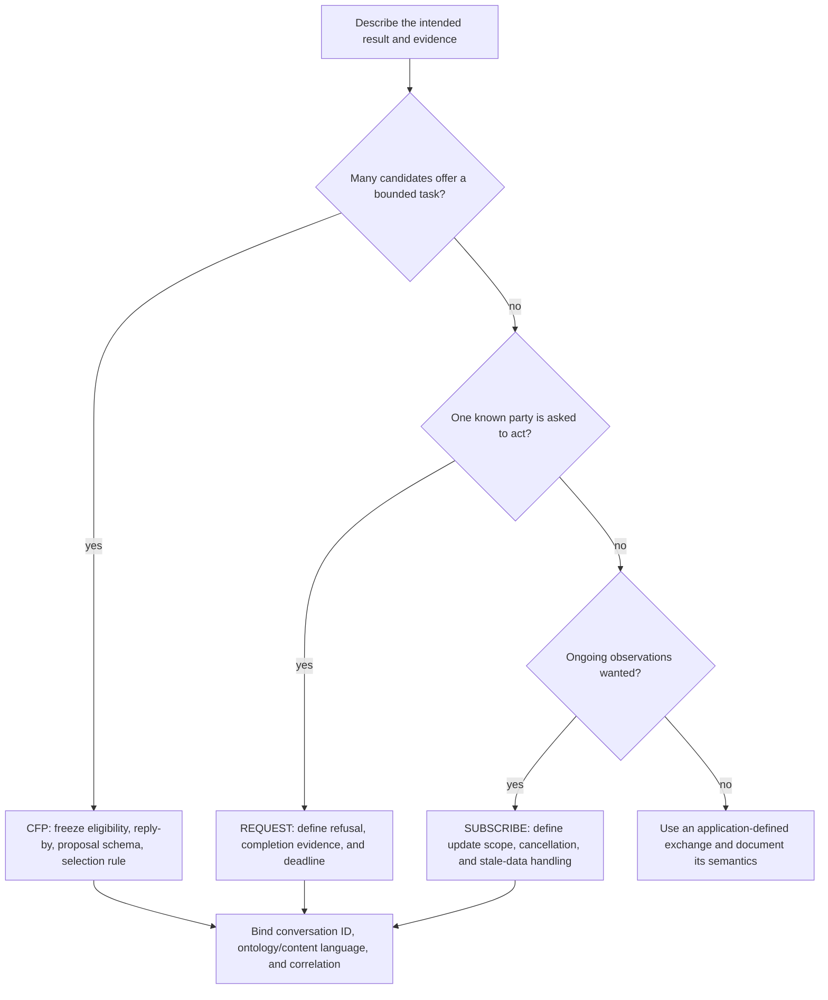
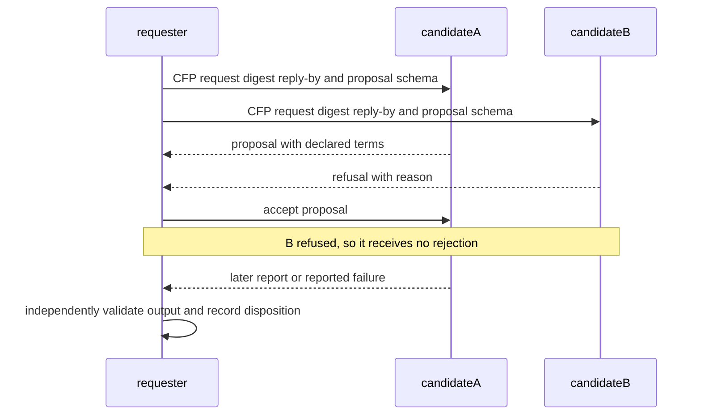

# Developing bounded FIPA-style conversations with JADE

## Source boundary

Bellifemine, Caire, and Greenwood’s *Developing Multi-Agent Systems with JADE* (Wiley, 2007; DOI `10.1002/9780470058411`) is the topic source. The accessible Wiley record establishes bibliographic identity; the book body was not accessed for this draft. Current implementation guidance is from official JADE 4.6.0 API documentation and the official Programmer’s and LEAP User Guides, accessed 2026-09-24. Treat every deployment timeout, retry, score, persistence choice, and external effect as an application policy, not as a property supplied by FIPA or JADE.

## Choose a conversation before choosing a class



A performative classifies a message in a conversation. It does not authenticate a sender, prove a proposition, transfer a capability, or make an external action happen. Admit identity, validate content, and authorize effects independently.

## A worked local policy: selecting a document converter

The following is an **application policy**, not a FIPA or JADE default. A requester sends a CFP with immutable `conversationId`, input digest, allowed output format, reply-by time, and evaluation fields. It records every `PROPOSE` and `REFUSE` received before the reply-by time, selects at most one proposal with a declared local comparator, sends `ACCEPT-PROPOSAL` to that proposal and `REJECT-PROPOSAL` to the other recorded proposals. The selected party later emits either `INFORM` containing an output reference or `FAILURE` containing an attempted-stage record. The requester checks the output independently before using it.



A Java-like sketch preserves the source bundle’s separation between proposal collection, local evaluation, and completion. It is deliberately not a copy-paste release contract; verify constructors, callbacks, and templates against the selected JADE release.

```java
// Illustrative Java-like behavior sketch; local policy owns time and ranking.
void onCfpClosed(List<ACLMessage> replies, String conversationId) {
  List<ACLMessage> proposals = replies.stream()
      .filter(m -> m.getPerformative() == ACLMessage.PROPOSE)
      .filter(m -> conversationId.equals(m.getConversationId()))
      .toList();
  Optional<ACLMessage> chosen = chooseUnderLocalPolicy(proposals);
  for (ACLMessage p : proposals) send(replyTo(p, p == chosen.orElse(null)
      ? ACLMessage.ACCEPT_PROPOSAL : ACLMessage.REJECT_PROPOSAL));
  if (chosen.isEmpty()) recordNoSelection(conversationId, replies);
}
```

## Content and behavior boundaries

Use an ontology/content-language agreement when independently built parties must share a meaning for fields such as `inputDigest`, `format`, or `declaredTerms`. A matching JSON field name or a successful Java decode is only syntactic interoperability. Version each schema, reject messages outside the agreed version, and retain the original bytes/digest so the application can explain what it accepted.

JADE behavior composition remains useful as a local implementation technique: a short setup behavior may register a service description; a conversation behavior may wait for matching messages; a final behavior may record a disposition. Do not infer that a Directory Facilitator result proves suitability, availability, authorization, or delivery. It is discovery input.

Within one agent, JADE schedules ready behaviours cooperatively and non-preemptively: `action()` returns to yield, and a waiting behaviour calls `block()` then returns. Persist the phase and correlation data in fields or a `DataStore`; a Java call stack is not preserved across scheduler turns. Use `SequentialBehaviour` for ordered local steps, `ParallelBehaviour` with `WHEN_ALL` or `WHEN_ANY` only for completion semantics, and `FSMBehaviour` when refusal, no-selection, report, and validation need explicit transitions. None turns remote work into CPU-parallel work.

For a dynamic candidate list, `DFService.search`, `register`, `modify`, and `deregister` are convenient but block the caller until completion or exception. Keep that work out of a latency-sensitive behaviour, or use the asynchronous DF request/subscription path (`AchieveREInitiator` or `SubscriptionInitiator`) with a documented update policy. A `MessageTemplate` selects queued ACL messages by header predicates; include `conversation-id`, protocol, performative, and a `reply-with`/`in-reply-to` pair as appropriate, then validate sender role and content separately.

## Failure dispositions

| Observation | Conversation disposition | What remains unproved |
| --- | --- | --- |
| `REFUSE` before selection | Candidate declined this request | Cause, future availability, and truth of a supplied reason |
| no response by the declared reply-by | Reply missing for this local window | Network state or remote execution state |
| `FAILURE` after acceptance | Candidate reports an unsuccessful attempt | The report’s accuracy and any external rollback |
| `INFORM` with output reference | Candidate reports completion | Output integrity, fitness, and any downstream effect |

Do not label an absent response “Byzantine,” choose arbitrary global thresholds, promise persistent delivery, or automatically blacklist/retry. Those are separate threat-model and operations decisions.

## Quality gates

- [ ] The chosen protocol has a written message grammar, correlation identifier, and local terminal condition.
- [ ] CFP policy freezes who may be considered, reply-by interpretation, proposal fields, and selection comparator before proposals are evaluated.
- [ ] Request, refusal, missing-response, reported failure, and reported completion have distinct recorded dispositions.
- [ ] Content validation and independently authorized external effects occur outside performative handling.
- [ ] Any JADE API use is checked against a named release’s official documentation.
- [ ] Time, retries, caches, queueing, and discovery behavior are measured local policies with explicit assumptions.

## Read next

- [Conversation contract and JADE mapping](references/conversation-contract-and-jade-mapping.md)
- [Behavior composition and message correlation](references/behavior-composition-and-correlation.md)
- [Source access and implementation boundary](references/source-access-and-implementation-boundary.md)
- [CFP lifecycle diagram](diagrams/01_cfp-lifecycle.md)
- [Implementation boundary diagram](diagrams/02_implementation-boundary.md)

## Bundle navigation

[diagrams index](diagrams/INDEX.md).
