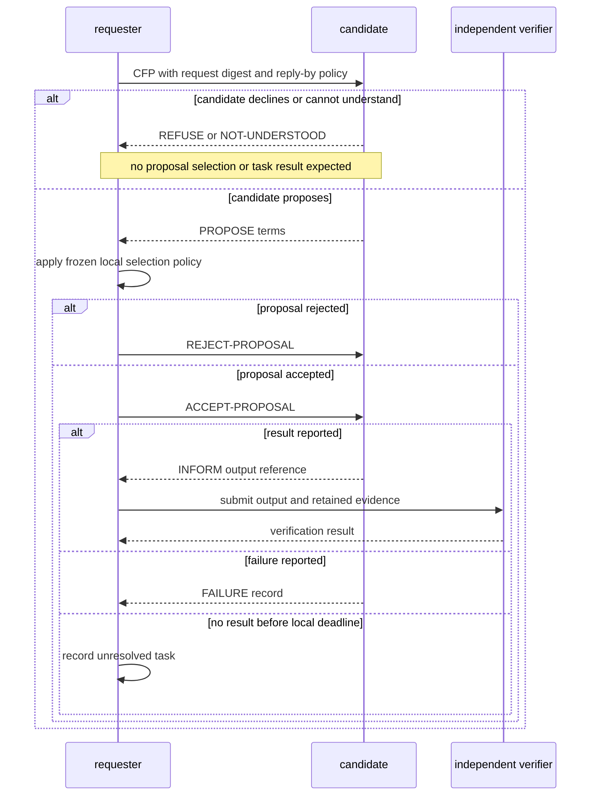

# CFP lifecycle and evidence boundary

This single-candidate view distinguishes refusal from a rejected proposal and does not route either through execution. The application adds evidence verification, request digests and result deadlines. A deadline does not undo an external action. The official [JADE ContractNetInitiator API mirror, labelled v4.5.0](https://jade-project.gitlab.io/API/jade/proto/ContractNetInitiator.html) describes the response, acceptance and result-notification callbacks; root inspected that body on 2026-09-24. The v4.6 URL timed out during this additional check, so this citation is explicitly versioned separately. Messaging alone supplies no external-effect proof.
