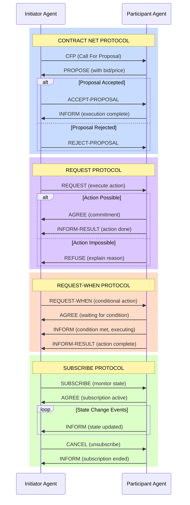

# FIPA Protocol Interaction Patterns

```mermaid
sequenceDiagram
    participant Initiator as Initiator Agent
    participant Peer as Participant Agent

    rect rgb(200, 220, 255)
    Note over Initiator,Peer: CONTRACT NET PROTOCOL
    Initiator->>Peer: CFP (Call For Proposal)
    Peer->>Initiator: PROPOSE (with bid/price)
    alt Proposal Accepted
        Initiator->>Peer: ACCEPT-PROPOSAL
        Peer->>Initiator: INFORM (execution complete)
    else Proposal Rejected
        Initiator->>Peer: REJECT-PROPOSAL
    end
    end

    rect rgb(220, 200, 255)
    Note over Initiator,Peer: REQUEST PROTOCOL
    Initiator->>Peer: REQUEST (execute action)
    alt Action Possible
        Peer->>Initiator: AGREE (commitment)
        Peer->>Initiator: INFORM-RESULT (action done)
    else Action Impossible
        Peer->>Initiator: REFUSE (explain reason)
    end
    end

    rect rgb(255, 220, 200)
    Note over Initiator,Peer: REQUEST-WHEN PROTOCOL
    Initiator->>Peer: REQUEST-WHEN (conditional action)
    Peer->>Initiator: AGREE (waiting for condition)
    Peer->>Initiator: INFORM (condition met, executing)
    Peer->>Initiator: INFORM-RESULT (action complete)
    end

    rect rgb(220, 255, 200)
    Note over Initiator,Peer: SUBSCRIBE PROTOCOL
    Initiator->>Peer: SUBSCRIBE (monitor state)
    Peer->>Initiator: AGREE (subscription active)
    loop State Change Events
        Peer->>Initiator: INFORM (state updated)
    end
    Initiator->>Peer: CANCEL (unsubscribe)
    Peer->>Initiator: INFORM (subscription ended)
    end
```
