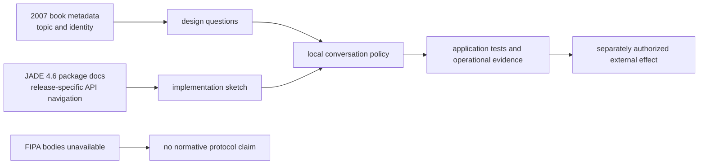

# Source and implementation boundary

```mermaid
flowchart LR
  B[2007 book metadata<br/>topic and identity] --> D[design questions]
  A[JADE 4.6 package docs<br/>release-specific API navigation] --> I[implementation sketch]
  F[FIPA bodies unavailable] --> G[no normative protocol claim]
  D --> P[local conversation policy]
  I --> P
  P --> T[application tests and operational evidence]
  T --> E[separately authorized external effect]
```
