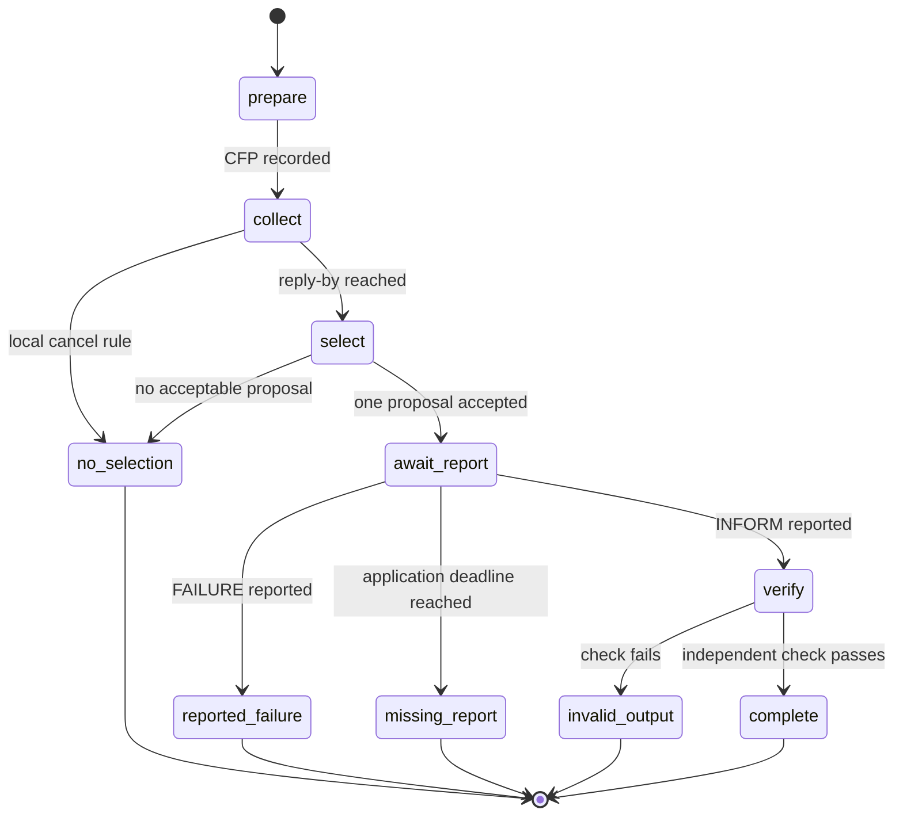

# Behavior composition and message correlation

## Local decomposition method

Retain the source bundle’s useful decomposition: setup, conversation collection, selection, execution-report handling, and cleanup are separate states. A sequential composition is appropriate only when the application has decided that each preceding state completed; an FSM makes an explicit no-selection or reported-failure transition visible. A parallel collection is a scheduling choice, not proof that all remote work runs concurrently.

Keep the per-conversation data store small and explicit: message IDs, immutable request digest, expected participants, local reply-by value, recorded replies, policy version, and disposition. A behavior must not reuse a reply just because a sender or topic looks familiar.

## Edge cases

- A late proposal may be retained for audit but is not silently included after the frozen reply-by interpretation.
- Duplicate payload bytes may be deduplicated only after the application records that rule; same sender and same text do not establish the same delivery event.
- A cancellation request changes this conversation’s local state only if the application admits it. It does not demonstrate that a remote operation stopped.
- A cached discovery result is staleable metadata. Revalidate the result where its use would matter.
