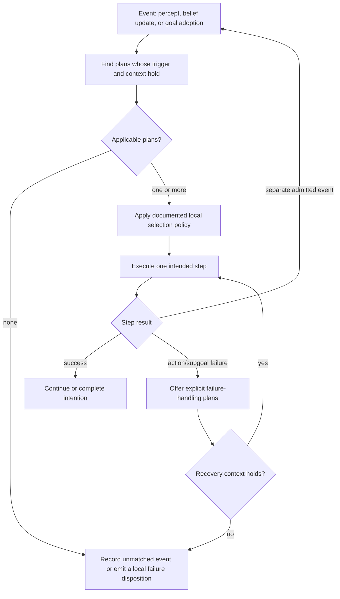
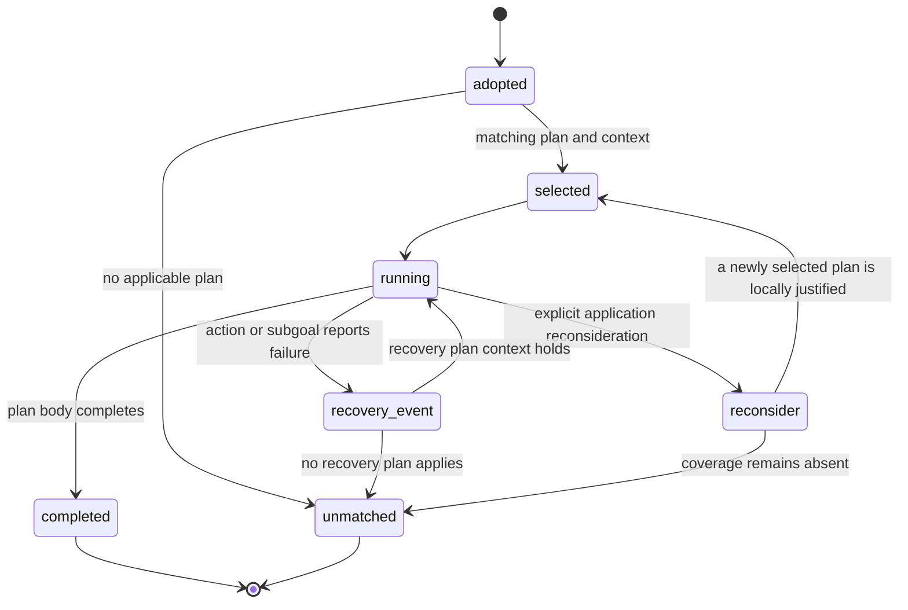

# Programming BDI plans with Jason and AgentSpeak

## Source boundary

Bordini, Hübner, and Wooldridge, *Programming Multi-Agent Systems in AgentSpeak using Jason* (Wiley, 2007; DOI `10.1002/9780470061848`) supplies the historical topic. The accessible Wiley record is bibliographic metadata only; the book body was not accessed. Current implementation guidance is from the author-maintained Jason tutorial, FAQ, technical guides, and 3.3.0 API, accessed 2026-09-24. It supports the cycle and language rules stated below, not a transport guarantee or a claim about a local runtime. Verify executable syntax and semantics against the pinned Jason release you use.

## Plan-library decision



Do not make plan selection look deterministic unless the selected runtime and local policy define the order. “Most specific,” “highest success rate,” “lowest cost,” and fixed numeric branch/retry/depth thresholds are policies that require a measured local rationale. An unmatched event is evidence of missing/unsatisfied plan coverage, not permission for a broad catch-all plan to hide it.

## Worked local example: route a sealed package within a model workspace

The domain is constructed and non-clinical. `route_known` and `route_blocked` are local beliefs; an integration must define their provenance and freshness. The snippets show the retained context-sensitive, subgoal, and recovery pattern. They are illustrative AgentSpeak-style fragments and were not run against a Jason interpreter in this offline bundle.

```agentspeak
+!deliver(Package, Destination) : route_known(Destination) & not route_blocked(Destination) <-
    !move_to(Destination);
    !record_arrival(Package, Destination).

+!deliver(Package, Destination) : route_blocked(Destination) <-
    !request_route_review(Package, Destination).

-!move_to(Destination) : route_blocked(Destination) <-
    !request_route_review(package_underway, Destination).
```

A fresh `+route_blocked(zone_3)` can cause another event cycle; it does not retroactively prove that the original move failed or automatically cancel a remote action. The recovery plan executes only if its context holds. If no route-review plan applies, record the unmatched failure for review rather than recursively re-adopting the same goal.



The state view includes an application-defined reconsideration step; a new belief event alone does not replace the executing plan.

## Practical plan-library method

1. Write each trigger and its context in a coverage table; list the evidence source that can establish each context belief.
2. Keep normal and recovery plans distinguishable. A recovery plan must state what failure event it addresses and what it requires before acting.
3. Decide whether multiple applicable plans are intentional. If they are, publish the local selection rule and test ties/unknown estimates. If they are not, refine contexts or flag ambiguity.
4. Put cycle prevention in local state, not an unexplained universal depth limit. A useful local guard can retain `(goal, arguments, evidenceVersion)` and escalate on repeated unchanged evidence.
5. Treat `.send`-style communication as an assertion exchange. A received message does not grant an action authority or make its content a true belief without an admission policy.

The operational cycle is: select an event, find relevant plans, test plan contexts against the current belief base, select an option, then execute one topmost body element of a selected intention. Default intention interleaving is round-robin, but it is customizable and a long Java/internal action can still occupy the cycle. A belief update creates an event; it does not silently rewrite a running plan. Put any stale-assumption check in the body or a failure/recovery plan.

Use `!g` when the caller must suspend until the achievement subgoal completes. Use `!!g` only when a distinct intention is intended and the caller may continue. `|&|` waits for both branches; `|||` continues after the first branch and drops the other. `atomic` prevents other intentions from running, so reserve it for short local critical regions. A failed `+!g` can generate `-!g` in the same intention; a matching recovery plan can inspect failure information and compensate. It never rolls back a prior external effect automatically.

## Failure modes

| Observation | Correct local response |
| --- | --- |
| Context not established | Preserve the event as unmatched or request bounded evidence; do not use `true` as a universal fallback. |
| Action reports failure | Produce a failure event and try only a recovery plan whose context holds. |
| Repeated attempt with unchanged evidence | Record a cycle candidate and apply a stated local stop/escalation rule. |
| Conflicting observations | Retain provenance and invoke an explicitly defined belief-management policy; Jason syntax alone does not resolve conflict. |
| Missing reply | Record a local timeout outcome; it does not prove remote state. |

## Quality gates

- [ ] Each used goal/event has an explicit coverage table, including unmatched and recovery cases.
- [ ] Selection ordering, if needed, is a local policy with tie and unknown-value behavior.
- [ ] Context beliefs state their evidence/freshness assumptions.
- [ ] Recovery plans are context-guarded and cannot silently create an infinite re-adoption loop.
- [ ] Communication and external effects have separate admission/authorization checks.
- [ ] Any executable Jason claim cites the pinned release and a run result.

## Read next

- [Plan selection and coverage](references/context-driven-plan-selection.md)
- [Goal/subgoal and cycle controls](references/goal-subgoal-decomposition.md)
- [Failure and recovery](references/graceful-failure-and-recovery.md)
- [Source access and Jason boundary](references/source-access-and-jason-boundary.md)
- [Reasoning-cycle diagram](diagrams/01_reasoning-cycle.md)
- [Failure-state diagram](diagrams/02_failure-state.md)
- [Intention operators and failure boundaries](diagrams/03_intention-operators.md)

## Bundle navigation

[diagrams index](diagrams/INDEX.md).
