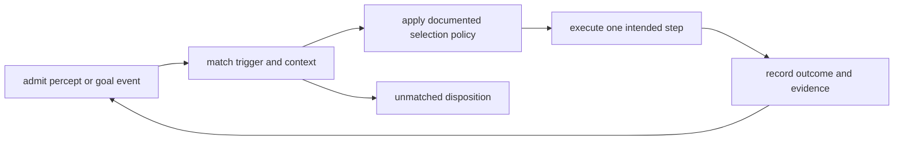

# Local reasoning-cycle contract

```mermaid
flowchart LR
  P[admit percept or goal event] --> M[match trigger and context]
  M --> S[apply documented selection policy]
  S --> I[execute one intended step]
  I --> O[record outcome and evidence]
  O --> P
  M --> U[unmatched disposition]
```
