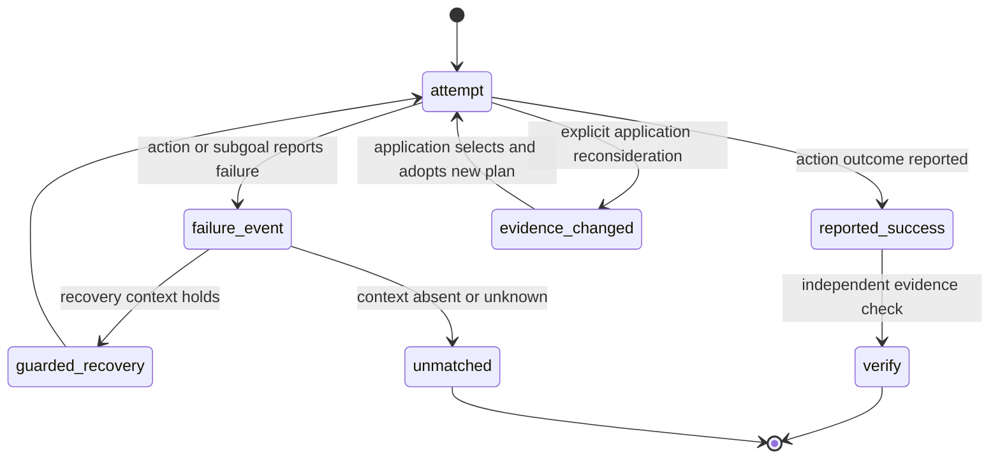

# Failure and recovery boundary

This is an application recovery policy, not the interpreter transition system. A new belief does not automatically replace an executing intention. Reconsideration requires explicit application logic. Verification can fail; its separate disposition must be retained rather than inferred from a reported action success.
