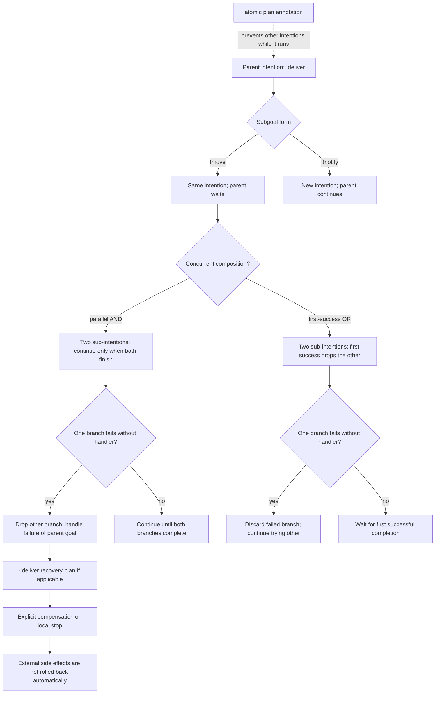

# Intention operators and failure boundaries

The `!a |&| !b` operator corresponds to parallel AND; `!a ||| !b` corresponds to first-success OR. The comparison reflects Jason’s documented concurrency rules. `atomic` also propagates to subgoals and therefore trades responsiveness for a short local critical region; it is not a transaction or rollback mechanism.

A handled branch failure can continue through its recovery plan. If neither XOR branch can finish, the enclosing goal cannot be counted as achieved. The arrows summarize outcomes, not a guarantee that an unfinished branch will terminate.
