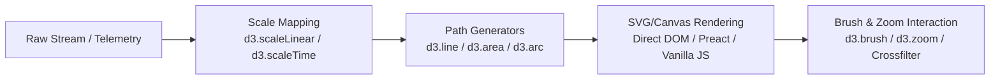

# Bostockesque Data Visualization: The Epistemic Craft

> *"Visualizations are not decorations. They are thinking tools designed to reveal structural invariants that prose cannot articulate."* — Inspired by Mike Bostock

## Core Philosophy

1. **Direct Manipulation of the Visual Channel**: Position, length, area, angle, hue, and saturation must map strictly to coordinate invariants. Never use decorative 3D bevels, arbitrary rainbow gradients, or drop shadows.
2. **The Data Join & Declarative Updates**: Treat incoming states as streaming keys `(enter, update, exit)`. Every visual element maintains physical continuity through interpolators and tweening.
3. **Small Multiples Over Spaghetti Spaghetti**: When comparing $N$ agents or time slices, do not pile 10 overlapping lines on a single axis. Facet into synchronized, micro-scaled spark-matrices with shared scales.
4. **Epistemic Density with Zoom**: Provide high overview density (macro topology) with instant micro-inspection (hover cards, brush-and-link filtering, exact mathematical coordinates).

---

## The Bostock Pipeline: From Vector Stalks to Reactive SVG



### 1. The Canonical Margin Convention
Every chart must strictly adhere to the margin convention to prevent text clipping and coordinate distortion:
```javascript
const margin = { top: 20, right: 30, bottom: 40, left: 50 };
const width = outerWidth - margin.left - margin.right;
const height = outerHeight - margin.top - margin.bottom;

const svg = d3.create("svg")
    .attr("viewBox", [0, 0, outerWidth, outerHeight])
    .attr("style", "max-width: 100%; height: auto; font: 12px sans-serif;");

const g = svg.append("g")
    .attr("transform", `translate(${margin.left},${margin.top})`);
```

### 2. High-Density Multi-Series Residual Chart
For rendering real-time multi-agent residuals $r(t) = \|\Pi_K g_K(t)\|_2$:
```javascript
// Scale definitions
const x = d3.scaleTime()
    .domain(d3.extent(data, d => d.timestamp))
    .range([0, width]);

const y = d3.scaleLinear()
    .domain([0, d3.max(data, d => d.residual) * 1.1])
    .nice()
    .range([height, 0]);

// Area and line generators
const area = d3.area()
    .curve(d3.curveMonotoneX)
    .x(d => x(d.timestamp))
    .y0(y(0))
    .y1(d => y(d.residual));

const line = d3.line()
    .curve(d3.curveMonotoneX)
    .x(d => x(d.timestamp))
    .y(d => y(d.residual));

// Append filled translucent gradient under curve
g.append("path")
    .datum(data)
    .attr("fill", "rgba(220, 38, 38, 0.15)")
    .attr("d", area);

// Append precision 1.5px stroke
g.append("path")
    .datum(data)
    .attr("fill", "none")
    .attr("stroke", "#dc2626")
    .attr("stroke-width", 1.5)
    .attr("d", line);
```

---

## Anti-Patterns

| Anti-Pattern | Why It Fails | Bostockesque Fix |
|---|---|---|
| **Rainbow Color Palettes (`jet` / `rainbow`)** | Perceptually non-uniform; creates false gradients and cognitive illusions. | Use monotonic perceptual ramps: `d3.interpolateViridis` or tailored Swiss monochromatic palettes with accent hues for anomalies. |
| **Pies and Donuts for $> 3$ Slices** | Humans are terrible at judging 2D angles and arc lengths. | Use ranked horizontal bar charts or dot plots sorted by value. |
| **Hidden Zero Baselines on Bar Charts** | Distorts ratios and misleads the reader. | Always include 0 on length-encoded marks; use broken axes or line charts for deviation. |
| **Unlinked Multi-Chart Dashboards** | Forces the user to mentally join disparate panels. | Wire brush-and-link: brushing a time window in the overview automatically updates the detail matrices. |

---

## Deliverables Checklist

When building a Bostockesque visualization:
- [ ] Responsive `viewBox` with clean scaling on mobile/desktop.
- [ ] Explicit SVG title, descriptions, and semantic labels (`aria-label`, `<title>`).
- [ ] Dynamic tooltip tracking mouse position with inverse bisector lookup (`d3.bisector`).
- [ ] Smooth 200ms transitions on enter/update/exit cycles without flickering.
- [ ] Zero reliance on bloated charting wrappers when a 50-line vanilla SVG script is cleaner and faster.
