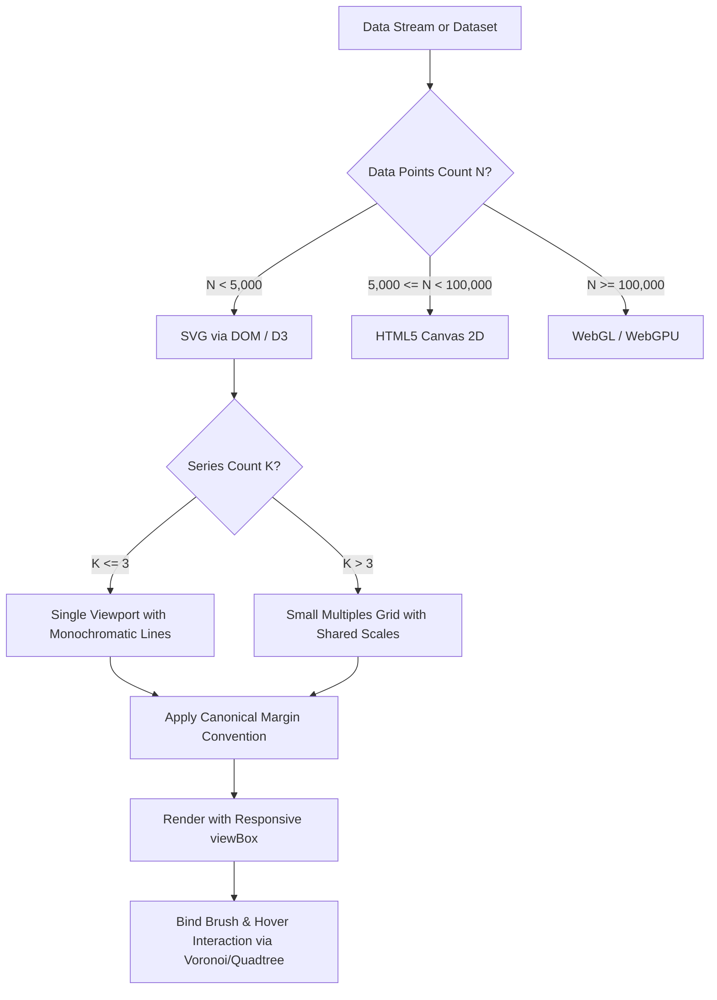

# Bostockesque Data Visualization: Epistemic Graphic Design

Visualizations are visual proofs and thinking engines, not marketing decorations. Every geometric mark, line segment, hue, and spatial coordinate must correspond to a verifiable invariant in the underlying data.

## Philosophy

**Great graphics are progressive disclosure machines grounded in perceptual psychophysics.** They adhere to William Playfair, Jacques Bertin, John Tukey, and Edward Tufte's foundational truth: *the visual representation must maximize the data-ink ratio while preserving structural integrity*. Following Mike Bostock's D3.js and Observable architecture, graphics separate data transformations from visual representations, employ canonical coordinate systems, and update reactively with zero DOM thrashing.

```
Three-Layer Architecture:
Layer 1: Metadata & Frontmatter (Instant activation & capability matching)
Layer 2: Lean SKILL.md (Decision trees, failure modes, shibboleths, quality gates)
Layer 3: Progressive References (Lazy-loaded streaming algorithms & perceptual rules)
```

## Decision Points

### Action Branch Selection

```
Query analysis:
├─ Contains "stream" OR "real-time" OR "telemetry" → STREAMING path
├─ Contains "facet" OR "multi-series" OR "compare" → SMALL-MULTIPLES path
├─ Contains "brush" OR "zoom" OR "link" OR "hover" → INTERACTION path
├─ Contains "simplicial" OR "topology" OR "network" → TOPOLOGICAL path
└─ General or static chart request → ENCODING path
```

### Technology Selection Tree

```
Element count & update frequency:
├─ Total marks N < 5,000 & interactive DOM needed → Pure SVG (D3 Selection)
├─ 5,000 <= N < 100,000 OR update rate >= 30fps → HTML5 Canvas 2D
├─ N >= 100,000 OR dense particle vector fields → WebGL / WebGPU
└─ High element count with SVG axis/labels → Hybrid (Canvas data layer + SVG overlay)
```

### Perceptual Encoding Hierarchy (Cleveland & McGill)

```
Visual channel priority:
├─ Quantitative Data:
│  ├─ 1. Position along a common scale (Scatter, dot plot, aligned bar)
│  ├─ 2. Position along non-aligned scales (Small multiples)
│  ├─ 3. Length (Bar chart with zero baseline)
│  ├─ 4. Direction / Slope (Line chart, sparkline)
│  ├─ 5. Angle (Use sparingly; avoid pie charts)
│  ├─ 6. Area (Bubble chart; scale radius by sqrt(value))
│  └─ 7. Color luminance / saturation (Sequential heatmaps)
└─ Nominal / Categorical Data:
   ├─ 1. Spatial grouping / Faceting
   ├─ 2. Distinct hue (Max 5-7 perceptually distinguishable categories)
   └─ 3. Symbol / Shape (Secondary cue only)
```

### Visual Workflow Architecture



## Failure Modes

### DOM Node Thrashing
- **Detection**: Framerate drops below 30fps; browser devtools show massive Garbage Collection pauses during telemetry ingestion.
- **Symptoms**: High CPU usage, unresponsive UI, micro-stutters during zoom/pan.
- **Fix**: Replace full SVG recreation (`svg.selectAll('*').remove()`) with idiomatic D3 data joins (`selection.join(enter, update, exit)`) or migrate the data layer to HTML5 Canvas.
- **Timeline**: Chronic issue since early D3 v3 days (2012); solved in D3 v5+ by `selection.join()`.

### Rainbow Palette Banding
- **Detection**: Grayscale conversion reveals false contrast edges; color ramp contains `jet`, `rainbow`, or uncalibrated RGB interpolations.
- **Symptoms**: Viewers perceive sharp boundaries where data is continuously smooth; colorblind users cannot interpret rankings.
- **Fix**: Use monotonic luminance colormaps (`d3.interpolateViridis`, `d3.interpolateCividis`, or Swiss neutral grays with single-accent alert hues).
- **Timeline**: Formalized by Borland & Taylor (2007) and made standard by viridis in 2015.

### Spaghetti Series Occlusion
- **Detection**: Single coordinate frame contains $>5$ intersecting colored line series.
- **Symptoms**: Lines obscure each other, legends require constant eye scanning, trends are impossible to isolate.
- **Fix**: Decompose into a small-multiples grid with synchronized X and Y axes, displaying the target series in foreground and a muted aggregate swarm in the background.
- **Timeline**: Championed by Edward Tufte (1983) and formalized by Mike Bostock in Observable (2018).

### Viewport Margin Clipping
- **Detection**: Axis tick numbers, labels, or edge data points are chopped off by SVG container bounds.
- **Symptoms**: Unreadable axis values, broken layout on mobile or varying container widths.
- **Fix**: Enforce the Canonical Margin Convention with outer dimensions, inner margins, and responsive SVG `viewBox`.
- **Timeline**: Standardized by Mike Bostock in 2012 (`margin = {top, right, bottom, left}`).

### Unbounded Memory Growth in Streaming
- **Detection**: Memory footprint grows linearly over time; browser tab crashes after hours of telemetry monitoring.
- **Symptoms**: Gradual slowdown, page freezing, OOM crash in long-running dashboards.
- **Fix**: Implement a fixed-capacity circular ring buffer (`Float64Array` or bounded array splice) that retains only the active temporal window.
- **Timeline**: Core requirement for 24/7 industrial and agentic monitoring dashboards.

## Shibboleths / Anti-Patterns

### Rainbow Palette Fallacy
- **Novice**: Uses `rainbow` or `jet` color maps thinking multi-colored graphics look more "scientific" and vibrant.
- **Expert**: Rainbow palettes have non-monotonic luminance gradients that create false edges, band artifacts, and optical illusions. Uses monotonic luminance scales (Viridis, Cividis) where equal data differences map to equal perceptual differences across all viewers.
- **Timeline**: Established by Borland & Taylor (2007) and adopted across ACM/IEEE visualization standards.

### Spaghetti Chart Collapse
- **Novice**: Plots 15 overlapping colored lines on a single 400px chart and attaches an enormous legend.
- **Expert**: Facets into an array of synchronized small multiples with shared X/Y scales and a faint background swarm baseline, eliminating cognitive legend-lookup overhead.
- **Timeline**: Championed by Edward Tufte (1983) and formalized in D3 small multiples by Mike Bostock (2012).

### Truncated Bar Chart Baseline
- **Novice**: Truncates the zero baseline of a bar chart to exaggerate small percentage differences.
- **Expert**: Bar lengths encode quantity by area and length; truncating the baseline distorts the physical ratio. Uses point plots or dot charts for interval data, and strictly reserves zero-anchored bars for ratio data.
- **Timeline**: Foundational visual ethics codified by Darrell Huff (1954) and Tufte (1983).

### Imperative Mutation vs Declarative Join
- **Novice**: Clears container with `element.innerHTML = ''` on every update and redraws everything from scratch.
- **Expert**: Leverages D3's declarative `selection.join(enter => ..., update => ..., exit => ...)` to morph existing DOM nodes with smooth tweening transitions, preserving state and performance.
- **Timeline**: Introduced in D3 v5 (2018) to replace the error-prone enter/update/exit pattern.

## Worked Examples

### Example 1: Real-time Multi-Agent Telemetry Stream

**User request**: "Build a live streaming dashboard showing completion residual $r(t)$ for 5 agents updating at 10Hz."

**Step 1 - Determine Architecture**:
- 10Hz update rate over 10 minutes = 6,000 points.
- Element count fits Canvas or optimized SVG. Choose SVG with Canonical Margin Convention for sharp crisp vectors and easy styling.
- Buffer: Fixed capacity ring buffer of 300 samples (30 seconds window).

**Step 2 - Apply Canonical Margin Convention**:
```javascript
const margin = { top: 20, right: 30, bottom: 40, left: 50 };
const width = outerWidth - margin.left - margin.right;
const height = outerHeight - margin.top - margin.bottom;

const svg = d3.create("svg")
  .attr("viewBox", [0, 0, outerWidth, outerHeight])
  .attr("style", "max-width: 100%; height: auto; font: 12px sans-serif;");

const g = svg.append("g")
  .attr("transform", `translate(${margin.left},${margin.top})`);
```

**Step 3 - Define Resilient Scales & Path Generator**:
```javascript
const x = d3.scaleTime().domain(d3.extent(buffer, d => d.timestamp)).range([0, width]);
const y = d3.scaleLinear().domain([0, d3.max(buffer, d => d.residual) * 1.15]).range([height, 0]);

const line = d3.line()
  .defined(d => !isNaN(d.residual))
  .x(d => x(d.timestamp))
  .y(d => y(d.residual))
  .curve(d3.curveMonotoneX);
```

**Step 4 - Update via Keyed Join**:
Update the path `d` attribute smoothly without replacing the DOM hierarchy. Attach a subtle threshold guide line at $r_{\text{crit}} = 1.0$.

- **What novice would miss**: Recreating the entire SVG on every tick, causing memory leak and blinking UI; omitting `curveMonotoneX`, producing harsh jagged spikes.
- **What expert catches**: Ring buffer memory stability, responsive `viewBox`, monotonic scale clamping, and subtle opacity fill below the residual line.

### Example 2: Small Multiples Faceted Residuals

**User request**: "Compare the convergence trajectories of 8 different swarm topologies over 100 epochs."

**Step 1 - Decomposition**:
Avoid the spaghetti plot trap. Compute global domain across all 8 topologies: $x \in [0, 100]$, $y \in [0, \max(r)]$.

**Step 2 - Grid Dimensioning**:
Create a 4x2 small multiples grid. Each cell gets identical inner dimensions (width: 180, height: 120) and identical scale domains so visual slopes are directly comparable.

**Step 3 - Visual Layering**:
- Background layer in every cell: Render all 8 runs in ultra-light muted gray (`#e5e7eb`, opacity 0.35) as context.
- Foreground layer in each cell: Render the specific topology in crisp dark indigo (`#1e1b4b`, stroke width 2).

**Step 4 - Direct Labeling**:
Title each small multiple cell directly with its topology name and final residual $r(100)$, eliminating external legend lookups.

- **What novice would miss**: Different Y-axis scales per subplot (making calm runs look volatile and volatile runs look calm); external legend requiring 8 color lookups.
- **What expert catches**: Common unified scales across all subplots, background contextual swarm silhouette, zero-overhead direct labeling.

### Example 3: Linked Quadtree Brush on Simplicial Complex & Time-Series

**User request**: "Build an interactive complex viewer where dragging a brush on the timeline highlights the active AST locks on the topological network."

**Step 1 - Data Coordination**:
Expose a shared reactive state `selectedInterval = [t0, t1]`.

**Step 2 - Timeline Brush**:
```javascript
const brush = d3.brushX()
  .extent([[0, 0], [width, height]])
  .on("brush end", ({ selection }) => {
    if (!selection) return;
    const [t0, t1] = selection.map(xScale.invert);
    dispatch.call("timeChange", null, { t0, t1 });
  });
```

**Step 3 - Network Highlighting**:
Simplicial complex nodes have AST lock intervals. Listen to `timeChange`:
```javascript
dispatch.on("timeChange", ({ t0, t1 }) => {
  nodes.classed("active-lock", d => d.lockStart <= t1 && d.lockEnd >= t0);
  edges.classed("contested", d => d.hasContention(t0, t1));
});
```

- **What novice would miss**: Quadratic DOM lookups on every mousemove event without debounce or quadtree indexing.
- **What expert catches**: Decoupled event dispatcher (`d3.dispatch`), CSS class toggle rather than inline attribute manipulation, and crisp visual feedback.

## Quality Gates

- [ ] `SKILL.md` exists and is under 500 lines.
- [ ] Frontmatter contains required `name` and `description` fields adhering to `[What][When to use] NOT [Exclusions]`.
- [ ] At least 3 temporal anti-patterns using Novice/Expert/Timeline template.
- [ ] All file references in `SKILL.md` actually exist on disk in the skill directory.
- [ ] Visual workflow diagram uses valid Mermaid syntax.
- [ ] Canonical Margin Convention strictly adhered to in all SVG examples.
- [ ] Color scales avoid rainbow/jet and enforce monotonic luminance (Viridis/Cividis or Swiss neutral).
- [ ] 5 positive trigger test queries pass.
- [ ] 5 negative trigger test queries pass.

### Activation Test Suite

**Positive Queries (Must Activate)**:
1. "Design an interactive D3 SVG streaming chart for our agent telemetry."
2. "Build a small multiples grid to compare multi-agent swarm convergence metrics."
3. "Create a high-density Bostock-style data visualization for topological residuals."
4. "How do I implement a brush-and-link interactive chart with D3 margin conventions?"
5. "Visualize a 2D simplicial complex with reactive AST lock states in SVG/Canvas."

**Negative Queries (Must NOT Activate)**:
1. "How do I format an Excel spreadsheet bar chart?" (Use standard office tools)
2. "Build a standard React Admin dashboard using Material UI template." (Use `admin-dashboard`)
3. "Write an automated Playwright test for user login." (Use `playwright-e2e-tester`)
4. "Rent an A100 GPU cluster on Vast.ai." (Use `vast-ai-gpu-clusters`)
5. "Solve the simplicial boundary matrix in Python." (Use `algebraic-topology-for-agents`)

## References & Progressive Disclosure

Read these reference files only when the specific domain context demands deep technical execution:

| File | Load When | Why |
|---|---|---|
| `references/d3-streaming-recipes.md` | Handling live streams, animations, or sliding windows | Provides `selection.join()`, circular ring buffers, and smooth transitions |
| `references/epistemic-design-rules.md` | Choosing visual encodings, layout, or color maps | Cleveland-McGill perceptual accuracy rankings and small-multiples guidelines |

## NOT-FOR Boundaries

**This skill should NOT be used for**:
- Generic enterprise BI dashboards or off-the-shelf template clones (e.g. standard Metabase/Tableau/AdminLTE).
- Low-effort black-box wrapper libraries (e.g., vanilla Chart.js, highcharts) when precision mathematical control is needed.
- Static spreadsheet charts or PowerPoint graphic styling.
- Purely non-visual backend data pipelines without rendering requirements.

**Delegate to these skills instead**:
- For high-performance WebGL/WebGPU shaders & large particle meshes → `data-viz-2025`
- For commercial pitch deck framing & motion narrative → `data-viz-commercials`
- For algebraic topology derivations & boundary operator solves → `algebraic-topology-for-agents`
- For full-stack application data dashboard scaffolding → `building-data-apps`
