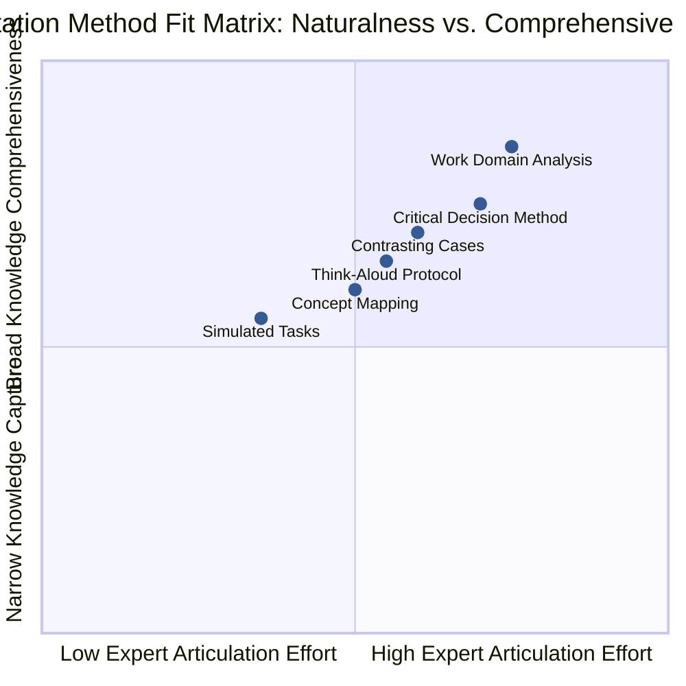

# Elicitation Method Fit Matrix: Naturalness vs. Comprehensiveness

```mermaid
quadrantChart
%%{init: {"themeVariables": {"quadrantPointFill": "#345995"}}}%%
    title Elicitation Method Fit Matrix: Naturalness vs. Comprehensiveness
    x-axis Low Expert Articulation Effort --> High Expert Articulation Effort
    y-axis Narrow Knowledge Capture --> Broad Knowledge Comprehensiveness
    
    Simulated Tasks: [0.35, 0.55]
    Think-Aloud Protocol: [0.55, 0.65]
    Contrasting Cases: [0.6, 0.7]
    Critical Decision Method: [0.7, 0.75]
    Concept Mapping: [0.5, 0.6]
    Work Domain Analysis: [0.75, 0.85]
```
