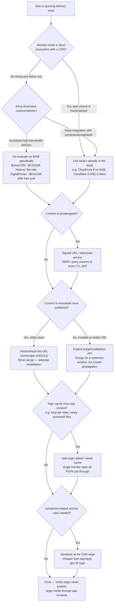

# CDN Setup and Delivery

Decide how a CDN sits in front of an application's assets, API responses, and files — which provider, how private content is gated, how caches get invalidated, and how geo-restriction is enforced — before wiring up any single vendor's dashboard.

## When to Use

✅ **Use for**:
- Choosing a CDN provider for a new project, or re-evaluating one at a new traffic/bandwidth tier
- Designing signed URL / tokenized access so a CDN can serve private files without proxying every request through the app server
- Deciding between versioned-URL caching and explicit purge APIs for a class of content
- Diagnosing an origin that's overloaded by cache misses on long-tail content (origin shield candidate)
- Adding country-level access restriction to a service for legal/licensing reasons
- Spotting an anti-pattern where large files are proxied through app-server compute instead of CDN-served

❌ **NOT for**:
- Writing the actual `Cache-Control`, `Vary`, or `stale-while-revalidate` header values — use `cdn-cache-control-headers`
- Configuring a specific Cloudflare product (Workers, R2, WAF rules) once Cloudflare is the chosen provider — use `cloudflare`
- Video transcoding, bitrate ladders, or HLS/DASH manifest packaging — use `managed-video-streaming-pipeline`
- General web performance tuning unrelated to a CDN layer (bundle size, render blocking, etc.)

## Core Process



## Provider Selection

The decision is not "which CDN is best" — it's "what does $/GB do to this specific traffic shape."

| Tier | Examples | $/GB (order of magnitude) | Wins when |
|------|----------|---------------------------|-----------|
| Hyperscaler | CloudFront, Cloudflare | ~$0.085/GB on-demand (CloudFront) | Already inside that cloud's ecosystem; need tight IAM/compute/storage integration; low/prototype volume where egress is a rounding error |
| Specialist / budget | BunnyCDN, Hetzner, DigitalOcean | ~$0.01/GB (Bunny, DO after free pool), flat-rate dedicated bandwidth (Hetzner) | Delivered bandwidth is the dominant cost driver; tooling maturity is a smaller concern than the bill |

**Heuristic**: at prototype/low-volume scale, egress pricing differences are noise — pick whatever is already wired into your stack (fewer integration points, faster to ship). Once delivery volume is real (sustained GB/TB per month), re-run the decision on unit economics alone, because an 8x per-GB delta compounds into a material line item fast. Don't let "we already know this dashboard" carry the decision past the point where it's costing real money — re-evaluate at each order-of-magnitude traffic jump.

See `references/provider-selection.md` for the fuller comparison table, egress-cost worked examples, and tooling-maturity tradeoffs.

## Signed URLs / Tokenized Access

The standard pattern for serving "private" content through a CDN without routing every request through the origin app server:

1. App server generates a short-TTL signed URL (HMAC-signed query params) or a scoped JWT at request time, tied to a specific object/path.
2. The CDN edge validates the signature/token locally and serves the object on a cache hit — no per-request round-trip to the origin.
3. TTL should be as short as the UX tolerates (minutes, not days) — a leaked signed URL is valid until expiry regardless of later access-control changes.

This is what makes "gate access, but still get edge caching" possible — routing every private-file request through the app server defeats the point of having a CDN at all. See `references/signed-url-patterns.md` for HMAC and JWT generation sketches and per-provider signing mechanisms.

## Cache Invalidation Strategy

Prefer **versioned/content-hashed URLs** (`/assets/app.a1b2c3.js`) over explicit purge calls for anything immutable once published. A new hash is a new URL — there is nothing to invalidate, and the cache-invalidation-is-hard problem disappears entirely for that class of content.

Reserve explicit purge/invalidation APIs for genuinely mutable content at a stable URL (a user's profile photo, a CMS-edited page). Know going in: **purge propagation across edge POPs is not instantaneous.** Design for a brief staleness window after a purge call returns success — do not build logic that assumes the purge is globally synchronous the moment the API responds.

See `references/invalidation-and-shielding.md` for purge-API patterns per provider and origin shield configuration.

## Origin Shield / Tiered Caching

For content with a high cache-miss rate — long-tail video, rarely-requested files, anything where most edge POPs will individually miss — put a single mid-tier cache layer (an origin shield) between the edge network and the origin. All edge POPs pull through that one shield location on a miss, instead of each POP independently hammering the origin. This turns N independent origin hits (one per POP) into effectively one, and is a config flag on most CDNs, not custom infrastructure.

## Geo-Restriction

Country-level geoblocking at the CDN edge is a standard, cheap feature on most CDNs. When a jurisdiction has a legal content-access requirement, block it at the edge — before the request reaches the app — rather than building geo-IP lookup logic into the application. This is architecturally cheap precisely because the CDN already knows the requester's country from its edge network; duplicating that logic in-app is redundant work with a worse cost/latency profile.

## Anti-Patterns

### Anti-Pattern: Proxying Large Files Through the App Server

**Novice**: "We'll just have our API endpoint stream the file from storage and pipe it to the client — simpler than dealing with CDN configuration."

**Expert**: This routes every byte of bandwidth-heavy traffic through app-server compute that exists to run business logic, not move bytes. It burns app-server CPU/memory/connection-pool capacity on pure I/O work, caps throughput at the app tier's scaling limits instead of the CDN's, and pays compute-tier pricing for what should be a flat per-GB delivery cost. The fix is to redirect (302) to a CDN-served URL — signed if the content is private — and let the CDN absorb the bandwidth. If the app server is in the request path for every download of a large file, that's the signal this anti-pattern is present.

**Detection**: Grep application route handlers for streaming/piping binary file content directly to the HTTP response, especially paired with cloud storage SDK calls (S3 `GetObject`, GCS `download`) inside a request handler rather than a redirect to a signed CDN URL.

### Anti-Pattern: Assuming Purge Is Synchronous and Global

**Novice**: "We called the purge API and got a 200, so the old version is gone everywhere now — we can immediately republish and rely on the new content being live."

**Expert**: Purge/invalidation APIs return success when the purge request has been *accepted*, not when it has *propagated* to every edge POP. Different providers advertise different propagation targets (seconds to low tens of seconds is typical for major CDNs), but treating the API response as an instantaneous global guarantee causes race conditions: a user in one region gets stale content seconds after a "successful" purge while another region already sees the new version. The expert fix is architectural, not operational — prefer versioned URLs so there's nothing to propagate, and where purge is unavoidable (mutable content at a stable URL), design the surrounding UX/logic to tolerate a brief staleness window rather than asserting synchronicity.

**Timeline**: This has been true since CDN purge APIs existed and has not changed with provider maturity — even "fast purge" tiers marketed by vendors are still asynchronous propagation with a lower bound, not instant consistency.

## Quality Checklist

```
□ Provider choice is justified by $/GB at the actual (or projected) traffic tier, not just "what we already use"
□ Private/gated content uses signed URLs or tokenized access — not app-server proxying
□ Immutable static assets use versioned/content-hashed URLs, not purge-on-deploy
□ Mutable content at stable URLs has an explicit purge strategy AND tolerates a staleness window
□ High-miss-rate content (long-tail media) has an origin shield or equivalent tiered cache configured
□ Jurisdiction-restricted content is geoblocked at the CDN edge, not via app-layer geo-IP logic
□ No route handler streams large files through app-server compute instead of redirecting to the CDN
```

## References

Consult these for deep dives — they are NOT loaded by default:

| File | Consult When |
|------|-------------|
| `references/provider-selection.md` | Comparing hyperscaler vs. specialist CDN economics in detail, or building a cost model for a specific traffic projection |
| `references/signed-url-patterns.md` | Implementing HMAC-signed query params or JWT-based tokenized access for a specific CDN |
| `references/invalidation-and-shielding.md` | Designing a purge strategy, versioned-URL rollout, or configuring origin shield for a specific provider |

<!-- BEGIN BUNDLE INDEX (auto: index_references.py) -->

## Skill Bundle Index

*Every file in this skill, and when to open it. Auto-generated by skill-architect's index-references tool.*

**root**
- [`CHANGELOG.md`](CHANGELOG.md) — CDN Setup and Delivery — Changelog — - Core decision tree covering provider selection ($/GB heuristic), signed URL / tokenized access, cache invalidation strategy, origin shield
- [`README.md`](README.md) — CDN Setup and Delivery — Architecture-level decisions for putting a CDN in front of a web application's static assets, API responses, and file/media delivery: provid

**`references/`**
- [`references/invalidation-and-shielding.md`](references/invalidation-and-shielding.md) — Cache Invalidation and Origin Shield — Deep Dive — Read this when designing a purge strategy, planning a versioned-URL rollout, or configuring origin shield for a specific provider.
- [`references/provider-selection.md`](references/provider-selection.md) — CDN Provider Selection — Deep Dive — Read this when comparing hyperscaler vs.
- [`references/signed-url-patterns.md`](references/signed-url-patterns.md) — Signed URL / Tokenized Access — Implementation Patterns — Read this when implementing HMAC-signed query params or JWT-based tokenized access for a specific CDN, or explaining the mechanism to someon

<!-- END BUNDLE INDEX -->
