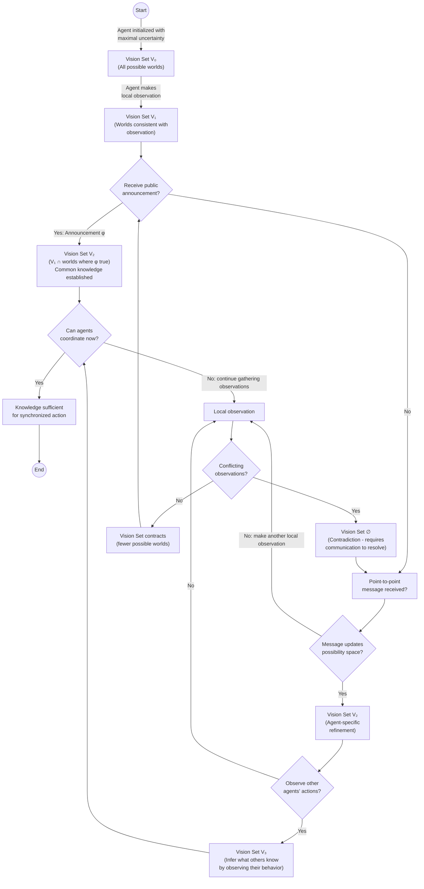

# Agent Knowledge State Evolution: Vision Set Transitions

```mermaid
flowchart TD
    Start((Start)) -->|Agent initialized with<br/>maximal uncertainty| InitialVision

    InitialVision["Vision Set V₀<br/>(All possible worlds)"]

    InitialVision -->|Agent makes<br/>local observation| ObserveLocal

    ObserveLocal["Vision Set V₁<br/>(Worlds consistent with<br/>observation)"]

    ObserveLocal --> Decision1{"Receive public<br/>announcement?"}

    Decision1 -->|Yes: Announcement φ| PublicAnnounce
    PublicAnnounce["Vision Set V₂<br/>(V₁ ∩ worlds where φ true)<br/>Common knowledge established"]

    Decision1 -->|No| LocalComm["Point-to-point<br/>message received?"]

    LocalComm --> Decision2{"Message updates<br/>possibility space?"}

    Decision2 -->|Yes| PrivateUpdate["Vision Set V₂<br/>(Agent-specific<br/>refinement)"]

    Decision2 -->|No: make another local observation| Observe2["Local observation"]

    PublicAnnounce --> Decision3{"Can agents<br/>coordinate now?"}

    Decision3 -->|Yes| Coordinated["Knowledge sufficient<br/>for synchronized action"]
    Coordinated --> End((End))

    Decision3 -->|No: continue gathering observations| Observe2

    PrivateUpdate --> Decision4{"Observe other<br/>agents' actions?"}

    Decision4 -->|Yes| InferKnowledge["Vision Set V₃<br/>(Infer what others know<br/>by observing their behavior)"]

    Decision4 -->|No| Observe2

    InferKnowledge --> Decision3

    Observe2 --> Decision5{"Conflicting<br/>observations?"}

    Decision5 -->|Yes| Inconsistent["Vision Set ∅<br/>(Contradiction - requires<br/>communication to resolve)"]

    Decision5 -->|No| RefineVision["Vision Set contracts<br/>(fewer possible worlds)"]

    Inconsistent --> LocalComm
    RefineVision --> Decision1
```
