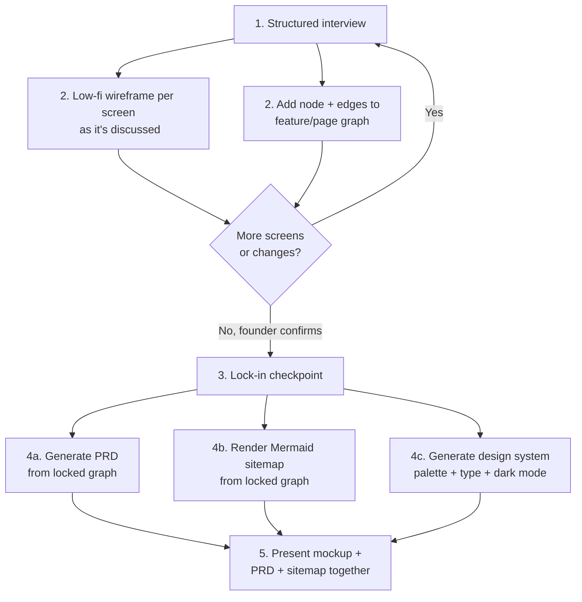

# Chatbot Web App Designer

Turns a founder's vague idea into a locked PRD, a visual sitemap, and a mocked-up, branded design system — by interviewing them, sketching as you go, and building a real feature graph instead of a flat bullet list. Designed to be operated either as a live chatbot (see `references/chatbot-implementation-stack.md` for the Cloudflare Think-harness build) or manually by an agent working directly with a founder.

## When to Use

✅ **Use for**:
- Running a founder-interview-to-PRD discovery loop for a new product/feature
- Building a product-discovery chatbot that sketches wireframes and a feature graph live in conversation
- Generating a Mermaid sitemap and PRD from a locked set of pages/features
- Deciding the handoff order into design-system skills once scope is locked

❌ **NOT for**:
- Writing the actual application code once the PRD is locked (use the relevant implementation skills)
- A founder who already has a written, locked spec — skip straight to design-system/build skills
- Generating a final polished mockup before the node-graph is locked — see the "lock-in before design" anti-pattern below

---

## Core Process

### Step 1: Structured interview
Don't ask "what do you want to build" and improvise from there — work through `references/interview-script.md`'s question bank (goals/audience, core user flows, must-have vs. nice-to-have, competitive inspiration, brand/tone, technical constraints). The interview is what surfaces node-graph edges the founder wouldn't think to state explicitly (e.g., "does the map screen link into the chat, or are they separate?").

### Step 2: Wireframe + node-graph, together, as you go
Every time a new screen or feature is named, do two things in the same turn: sketch a low-fidelity wireframe of it (deliberately rough — this is a structural placeholder, not a design), and add it as a node to the feature graph with edges to whatever it navigates to or depends on. See `references/node-graph-schema.md` for the node/edge data model. Doing these separately (all wireframes first, graph after) loses the relationships that come up naturally mid-sketch.

### Step 3: Lock-in checkpoint
Before generating anything downstream, explicitly walk the founder through the full node-graph and wireframe set and get affirmative confirmation ("this is the full feature set for v1"). Treat this as a hard gate — generating a PRD before lock-in is the single most common source of rework (see anti-patterns).

### Step 4: Generate the three locked artifacts
- **PRD** (`references/prd-template.md`) — feature list with user stories and acceptance criteria, explicit out-of-scope section, the node-graph embedded as a Mermaid diagram, open questions.
- **Mermaid sitemap** — render the locked node-graph directly to Mermaid flowchart syntax (nodes → boxes, edges → arrows) and render it client-side; never link out to an external Mermaid renderer.
- **Design system** — only start this after lock-in, per `references/design-system-handoff.md`'s skill invocation order (palette → typography → dark mode → component generation).

### Step 5: Present together
Ship the PRD, sitemap, and mockup as one artifact, not three disconnected outputs — the founder should be able to trace a PRD feature to its node in the sitemap to its screen in the mockup.

---

## Anti-Patterns

### Anti-Pattern: Skipping the interview and drafting a PRD from a one-line idea
**Novice**: "They said 'a dating app with video chat,' I have enough to write a PRD."
**Expert**: A one-line idea has none of the actual feature relationships (does video chat happen inside a match, or is it a separate 'party link' anyone can join?) that determine the node-graph's edges — and the PRD's user stories will be generic without them. Run the interview first; it's where the real structure comes from.
**Detection**: A PRD exists with no corresponding interview transcript or node-graph.

### Anti-Pattern: Treating the wireframe as the final design
**Novice**: "I'll make the wireframe look nice since I'm already sketching it."
**Expert**: A polished-looking wireframe gets rubber-stamped by a founder who hasn't actually validated the structure yet — keep wireframes deliberately low-fidelity (Excalidraw's hand-drawn style is the right register) until after lock-in, so feedback stays focused on structure, not visual polish.
**Timeline**: This is a long-standing product-design principle (low-fidelity-first) that's easy to accidentally violate when the sketching tool makes polish cheap — an AI-generated wireframe defaults to looking more finished than a hand-sketch would, which can misleadingly signal "this is decided."

### Anti-Pattern: Building the node-graph as a flat feature list
**Novice**: "I'll just bullet-point the features: login, map, chat, video, profile."
**Expert**: A flat list loses exactly the information that matters for a PRD and sitemap — which features are reachable from which, what depends on what. Model it as a real graph with typed edges (`navigates-to`, `depends-on`, `embeds`) per `references/node-graph-schema.md`, not a list.
**Detection**: The "node-graph" has no edges, or edges with no type/direction.

### Anti-Pattern: Generating the PRD or design system before lock-in
**Novice**: "The founder seems happy with what we have, let me generate the PRD now."
**Expert**: "Seems happy" is not the same as an explicit lock-in confirmation — generating downstream artifacts before that checkpoint means redoing the PRD, sitemap, and any design-system work every time the founder adds a screen mid-review. Get the explicit "this is the full v1 feature set" statement first.
**Detection**: A PRD or design-system output exists, and the interview transcript has no clear founder confirmation statement before it was generated.

---

## References

Consult these for deep dives — they are NOT loaded by default:

| File | Consult when |
|------|-------------|
| `references/interview-script.md` | Running the structured founder/stakeholder interview |
| `references/node-graph-schema.md` | Designing or implementing the feature/page graph data model, or rendering it to Mermaid |
| `references/prd-template.md` | Generating the PRD once the founder has locked scope |
| `references/design-system-handoff.md` | Sequencing the palette/typography/dark-mode/component-generation skills after lock-in |
| `references/chatbot-implementation-stack.md` | Building this as a live, stateful chatbot (Cloudflare Think harness, Excalidraw, React Flow, Mermaid, 21st.dev) rather than running the process manually |
