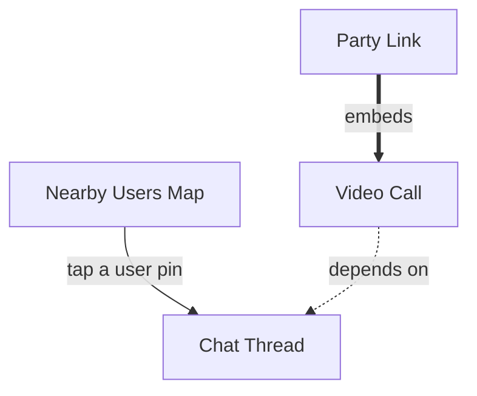

# Feature/Page Node-Graph Schema

## Data model
```json
{
  "nodes": [
    {
      "id": "map-view",
      "label": "Nearby Users Map",
      "type": "screen",
      "status": "locked",
      "notes": "Zoomable, real-time proximity map"
    }
  ],
  "edges": [
    {
      "from": "map-view",
      "to": "chat-thread",
      "type": "navigates-to",
      "label": "tap a user pin"
    },
    {
      "from": "video-call",
      "to": "chat-thread",
      "type": "depends-on",
      "label": "requires an existing conversation"
    },
    {
      "from": "party-link",
      "to": "video-call",
      "type": "embeds",
      "label": "party link opens directly into a call"
    }
  ]
}
```

**Node types**: `screen` (a distinct page/view), `feature` (a capability that lives inside one or more screens, e.g. "reactions"), `system` (backend capability with no direct UI, e.g. "push notifications" — still worth graphing since other nodes depend on it).

**Edge types** — use these three, don't invent ad hoc ones:
- `navigates-to` — user-initiated transition from one screen to another
- `depends-on` — this node cannot function without that node existing first (drives build-sequencing, not just navigation)
- `embeds` — this node's UI contains that node inline (e.g., a chat thread embeds a video-call component) rather than navigating away

**Status field** on nodes: `proposed` (mentioned, not yet confirmed) → `sketched` (wireframe exists) → `locked` (confirmed at the lock-in checkpoint). Never generate a PRD entry for a node that isn't `locked`.

## Rendering to Mermaid
Map directly: each node becomes a Mermaid node, each edge an arrow, edge type becomes the arrow label.



Use solid arrows (`-->`) for `navigates-to`, dotted (`-.->`) for `depends-on`, thick (`==>`) for `embeds` — this visual distinction matters when a founder is scanning the sitemap quickly. Render this client-side with the `mermaid` npm package; do not link out to mermaid.live or any external renderer (see `chatbot-implementation-stack.md`).

## Why edges over a flat list
A flat feature list can be turned into a PRD's bullet points, but it can't answer "if we cut the map screen, what else breaks" (a `depends-on` query) or "how many taps from signup to a user's first video call" (a `navigates-to` path query) — both are real questions a founder or engineer will ask once the PRD exists. Model the graph now so those questions have real answers later instead of requiring another interview pass.
