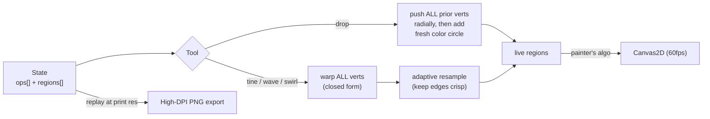

# Closed-Form Marbling Renderer

Render real marbling the way Lu & Jaffer proved you can (IEEE CG&A 32(6), 2012):
**not** by simulating fluid, but by treating the marbling tray as a set of **colored
region boundaries** and applying each tool as a **closed-form homeomorphism of the
plane** to every boundary point at once. A finished marble is just a composition
`Tn ∘ … ∘ T1` of these maps. Pure arithmetic, O(points) per op, 60fps.

## When to use / when NOT

- **Use** to implement drop / tine / comb / wave / swirl ops, to script the four
  canonical Ebru patterns, to keep combed lines crisp, to model ox-gall, or to
  lift a high-res print off the tray.
- **Do NOT** reach for a fluid solver, reaction-diffusion, metaballs, or
  alpha-blended translucent disks. Those produce blurry "smoke goo," not the crisp
  veined cells of real Ebru, and they don't compose, replay, or scale to print.

## Core mental model



Four invariants that make this faithful instead of generic:

1. **Boundaries, not pixels.** Each color region is a *closed polyline*; tools move
   vertices. Smooth maps applied to dense polylines look like smooth dye.
2. **Drops shoulder, they don't blend.** A new drop physically *pushes earlier ink
   aside* (the radial map), so fills stay opaque and you get crisp ring-in-ring.
3. **Everything composes.** State is an ordered op list; you can replay, undo,
   serialize, and re-render at any resolution from the same script.
4. **Resample under combing.** Comb maps stretch segments a lot; subdivide or edges
   go faceted.

---

## The deformation algebra (copy-paste)

All functions take/return `{x, y}` and are pure. `regions = [{ pts:[{x,y}…], color }]`,
oldest first (paint order). Coordinates are in logical tray pixels.

### 1. Ink drop — radial outward push (area-preserving)

> `P' = C + (P − C) · sqrt( 1 + r² / ‖P − C‖² )`

This is *why* nested drops form perfect concentric bullseyes: it maps circles to
circles and is area-preserving away from `C`. The only singularity is a vertex
exactly at `C` — guard with epsilon.

```js
// Push one point away from drop center C with disk radius r.
function dropPush(P, C, r) {
  const dx = P.x - C.x, dy = P.y - C.y;
  const d2 = dx * dx + dy * dy;
  const s = Math.sqrt(1 + (r * r) / Math.max(d2, 1e-6)); // epsilon guards C
  return { x: C.x + dx * s, y: C.y + dy * s };
}

// A full drop op: shoulder every prior vertex aside, then float a new color disk.
function applyDrop(regions, C, r, color, segs = 128) {
  for (const reg of regions) reg.pts = reg.pts.map((P) => dropPush(P, C, r));
  const ring = [];
  for (let i = 0; i < segs; i++) {
    const a = (i / segs) * 2 * Math.PI;
    ring.push({ x: C.x + r * Math.cos(a), y: C.y + r * Math.sin(a) });
  }
  regions.push({ pts: ring, color }); // newest on top (painter order)
}
```

### 2. Tine / comb — drag parallel to a line, decaying with perpendicular distance

> general:  `P' = P + t̂ · z · u^|d|`,  where `d = (P − L) · n̂`
> vertical tine at `xL`:   `(x, y + z·u^|x−xL|)`
> horizontal tine at `yL`: `(x + z·u^|y−yL|, y)`

`t̂` = unit drag direction, `n̂` = its normal, `z` = max displacement (sign = drag
direction; flip it for the tidal reversal), `u ∈ (0,1)` = sharpness/viscosity
(`u^|d|` decays away from the line). **Lower `u` = tighter, crisper comb lines;
`u→1` = broad smear.**

```js
// t = unit tangent {x,y}; displacement is symmetric in |d| but always along +t.
function tineShear(P, L, t, u, z) {
  const nx = -t.y, ny = t.x;                       // unit normal
  const d = (P.x - L.x) * nx + (P.y - L.y) * ny;   // signed perp distance
  const amt = z * Math.pow(u, Math.abs(d));
  return { x: P.x + t.x * amt, y: P.y + t.y * amt };
}
// A "rake" = N parallel tines: call tineShear once per L = base + i*spacing*n̂.
```

### 3. Serpentine wave — horizontal shift set by `y` (basis for Şal S-curves)

> `Wh(x, y) = ( x − A·sin(k·y + φ),  y )`

`A` = amplitude, `k` = spatial frequency in **radians per pixel** (wavelength
`λ = 2π/k`), `φ` = phase (offset successive passes to braid). CSAIL's reference
values are `A≈20`, `λ≈140px`. Chain `Wh` then `Wv` for a woven "peacock" texture;
run the wave *opposite* the last tidal direction for an authentic Şal.

```js
function waveWarp(P, A, k, phase) {
  return { x: P.x - A * Math.sin(k * P.y + phase), y: P.y };
}
```

### 4. Swirl / vortex — decaying rotation about a center (Bülbül Yuvası nests)

> `α(d) = θ₀ · e^(−d/ρ)`, then rotate `(P − C)` by `α(d)` about `C`.

Same decay idea as the tine, but the displacement is *angular* instead of linear.
`θ₀` = peak swirl at center, `ρ` = falloff radius (equivalently `ρ = −1/ln u`).
Strong near the center, fading out → a tight spiral = a nightingale's nest.

```js
function swirl(P, C, theta0, rho) {
  const dx = P.x - C.x, dy = P.y - C.y;
  const a = theta0 * Math.exp(-Math.hypot(dx, dy) / rho);
  const ca = Math.cos(a), sa = Math.sin(a);
  return { x: C.x + dx * ca - dy * sa, y: C.y + dx * sa + dy * ca };
}
```

### 5. Adaptive resampling — the crispness keeper

Comb/wave/swirl maps stretch boundaries; without resampling, long segments go
faceted (polygonal "lightning bolt" edges). After **every** warp pass, subdivide
any segment longer than `maxSeg`. Cap total points with optional decimation so the
frame budget stays bounded.

```js
function resample(pts, maxSeg) {           // closed polyline
  const out = [], n = pts.length;
  for (let i = 0; i < n; i++) {
    const a = pts[i], b = pts[(i + 1) % n];
    out.push(a);
    const len = Math.hypot(b.x - a.x, b.y - a.y);
    if (len > maxSeg) {
      const k = Math.ceil(len / maxSeg);
      for (let j = 1; j < k; j++) {
        const t = j / k;
        out.push({ x: a.x + (b.x - a.x) * t, y: a.y + (b.y - a.y) * t });
      }
    }
  }
  return out;
}
```

### 6. Ox-gall shouldering — radius schedule

Ox-gall (öd) is the surfactant that makes a drop *spread into a disk and push
earlier colors aside* — and **each successive drop spreads slightly less** (earlier
films resist it). You do not model this with extra blending; the §1 push *is* the
shouldering. Just **decay the radius** of later drops and expose gall as a slider
that scales the base radius.

```js
function gallRadius(baseR, gall, priorDrops) {   // gall slider ∈ [0.4, 1.6]
  return baseR * gall * Math.pow(0.985, priorDrops);
}
```

---

## Composition: the op list is the marble

State is `{ regions: [], ops: [] }`. **Mutate `regions` live for 60fps**; use full
`replay()` only for undo (pop op, replay) and export (replay at print resolution).
Serializing `ops` (+ the PRNG seed) makes any marble reproducible and shareable.

```js
function warpFor(op) {                            // op → vertex map
  if (op.t === 'tine')  return (P) => tineShear(P, op.L, op.dir, op.u, op.z);
  if (op.t === 'wave')  return (P) => waveWarp(P, op.A, op.k, op.phase);
  if (op.t === 'swirl') return (P) => swirl(P, op.C, op.theta0, op.rho);
}

function replay(ops, { segs = 128, maxSeg = 3 } = {}) {
  const regions = [];
  for (const op of ops) {
    if (op.t === 'drop') {
      applyDrop(regions, op.C, op.r, op.color, segs);
    } else {
      const f = warpFor(op);
      for (const reg of regions) reg.pts = resample(reg.pts.map(f), maxSeg);
    }
  }
  return regions;
}

// Deterministic positions → reproducible marble from a serialized seed.
function mulberry32(seed) {
  return function () {
    let t = (seed += 0x6d2b79f5);
    t = Math.imul(t ^ (t >>> 15), t | 1);
    t ^= t + Math.imul(t ^ (t >>> 7), t | 61);
    return ((t ^ (t >>> 14)) >>> 0) / 4294967296;
  };
}
```

---

## Traditional Ebru pattern scripts

Each pattern is just an ordered push onto `ops`. They build on each other exactly
as a marbler builds on the tray: a Battal ground first, then comb work over it.

```js
// 2.1 BATTAL ("spattered") — the ground. Many interleaved drops, NO comb.
function battal(ops, rng, W, H, pigments, n, gall) {
  const baseR = Math.min(W, H) * 0.06;
  for (let i = 0; i < n; i++)
    ops.push({ t: 'drop', C: { x: rng() * W, y: rng() * H },
               r: gallRadius(baseR, gall, i), color: pigments[i % pigments.length] });
}

// 2.2 GEL-GIT ("tidal") — parallel tine passes marching across x, z flipping sign.
function gelgit(ops, W, H, { spacing = 24, z = 46, u = 0.92 } = {}) {
  let sign = 1;
  for (let xL = spacing; xL < W; xL += spacing) {
    ops.push({ t: 'tine', L: { x: xL, y: 0 }, dir: { x: 0, y: 1 }, u, z: z * sign });
    sign = -sign;                                   // ebb and flow
  }
}

// 2.3 ŞAL ("shawl") — Gel-Git, THEN S-curves opposite the last tidal direction.
function sal(ops, W, H, opts = {}) {
  gelgit(ops, W, H, opts);
  const { A = 18, k = (2 * Math.PI) / 70, passes = 6 } = opts;   // λ ≈ 70px
  for (let p = 0; p < passes; p++)
    ops.push({ t: 'wave', A, k, phase: p * (Math.PI / 3) });
}

// 2.4 BÜLBÜL YUVASI ("nightingale's nest") — small Battal, then a grid of swirls.
function bulbulYuvasi(ops, rng, W, H, pigments, gall,
                      { grid = 120, rho = 42, theta0 = 4.2 } = {}) {
  battal(ops, rng, W, H, pigments, Math.floor((W * H) / (grid * grid)) * 3, gall);
  for (let y = grid / 2; y < H; y += grid)
    for (let x = grid / 2; x < W; x += grid) {
      const jx = x + (rng() - 0.5) * grid * 0.4;    // jitter so nests aren't gridlocked
      const jy = y + (rng() - 0.5) * grid * 0.4;
      ops.push({ t: 'swirl', C: { x: jx, y: jy }, theta0, rho });
    }
}
```

---

## Rendering & period pigments

Paint **painter's-algorithm, oldest region first** onto a cream "size-water"
ground; opaque fills + a thin warm-dark stroke read as the shouldered seam (the
vein) where the cream peeks through. Caller sets the device transform; geometry
stays in logical coords.

```js
function render(ctx, regions, { W, H, cream, vein, lw = 0.8 }) {
  ctx.fillStyle = cream; ctx.fillRect(0, 0, W, H);          // gum-tragacanth size
  for (const reg of regions) {
    const p = reg.pts;
    ctx.beginPath(); ctx.moveTo(p[0].x, p[0].y);
    for (let i = 1; i < p.length; i++) ctx.lineTo(p[i].x, p[i].y);
    ctx.closePath();
    ctx.fillStyle = reg.color; ctx.fill();
    ctx.lineWidth = lw; ctx.strokeStyle = vein;
    ctx.globalAlpha = 0.35; ctx.stroke(); ctx.globalAlpha = 1; // thin shouldered vein
  }
}
```

Period pigments (artist-pigment appearance — **not** the misleading electric CSS
"indigo / malachite" names). Pull each slightly toward gray; let cream show in veins.

| Pigment | Hex | Note |
|---|---|---|
| Indigo (*Indigofera*) | `#1B3B6F` | muted desaturated navy, never electric blue |
| Madder red (*Rubia*) | `#B23B3B` | earthy brick-rose, slightly orange |
| Gamboge yellow | `#E8A317` | warm saffron-amber, not lemon |
| Malachite green | `#4A8B6F` | cool-mid mineral green, slightly grayed |
| Size-water (cream) | `#F1E9D2` | warm parchment — "the paper" |
| Vein / outline | `#2A2418` | warm near-black for shouldered seams |

---

## High-DPI export — "lift the paper"

Replay the **same op list** onto an offscreen canvas at `scale×`, with a tighter
`maxSeg` (in device px) and denser circles so edges are crisp at print resolution.
Then `toBlob('image/png')` and download. This is the whole reason to keep state as
a script: resolution independence is free.

```js
function liftPaper(ops, W, H, theme, scale = 4) {
  const off = document.createElement('canvas');
  off.width = Math.round(W * scale); off.height = Math.round(H * scale);
  const ctx = off.getContext('2d');
  ctx.scale(scale, scale);                                  // draw in logical coords
  const regions = replay(ops, { segs: 256, maxSeg: 2 / scale }); // ~2 device px edges
  render(ctx, regions, { ...theme, W, H, lw: 0.6 / scale });
  off.toBlob((b) => {
    const a = document.createElement('a');
    a.href = URL.createObjectURL(b);
    a.download = 'su-ebru.png'; a.click();
    URL.revokeObjectURL(a.href);
  }, 'image/png');
}
```

---

## Decision frameworks

**Which deformation?** drop → bloom/ground & bullseyes · tine → straight combed
columns (Gel-Git) · wave → S-curve weave (Şal) · swirl → spiral nests (Bülbül
Yuvası). Compose freely; order matters (ground before comb).

| Knob | Lower value | Higher value | Sane default |
|---|---|---|---|
| `u` (viscosity) | tight, crisp comb lines | broad smear | `0.90–0.94` |
| `z` (tine drag) | gentle nudge | violent drag, may self-intersect | `30–60` px |
| `maxSeg` (resample) | crisp but slower | fast but faceted | `3` px live / `2/scale` print |
| drop `r` base | tiny speckle | few fat blobs | `~6%` of min(W,H) |
| `gall` | drops barely spread | drops dominate, thin veins | `1.0` |
| swirl `ρ` | tiny tight nests | wide lazy swirls | `~35–45` px |

**Live vs replay:** mutate `regions` in place per op for interactivity; only
`replay()` for undo and export. **Point budget:** if a live frame drops below
60fps, raise `maxSeg` or decimate; do not lower drop `segs` (that breaks bullseyes).

---

## Anti-patterns (Novice → Expert → Timeline)

**1. Metaball / fluid-sim "smoke goo."**
- *Novice:* reaches for Navier-Stokes, curl-noise, reaction-diffusion, or metaballs
  to get "swirly" looks. Result: blurry, blendy, non-deterministic, can't export at
  print res, and tanks the frame rate.
- *Expert:* closed-form coordinate deformation of **boundaries**. Exact, O(points),
  60fps, resolution-independent, fully replayable.
- *Timeline:* pre-2012 marbling demos used fluid solvers; Lu & Jaffer (IEEE CG&A
  2012) proved drop+tine maps reproduce real marbling exactly and in real time.

**2. Alpha-blended translucent disks instead of the radial push.**
- *Novice:* draws overlapping `globalAlpha` circles and hopes colors "mix." Gets
  muddy browns and zero ring-in-ring.
- *Expert:* applies the §1 push so earlier ink is physically displaced; fills stay
  opaque; the vein is a seam, not a blend. That's the bullseye.

**3. Combing coarse polylines (no resampling).**
- *Novice:* shears a 64-vertex circle and ships faceted, polygonal "lightning"
  edges.
- *Expert:* subdivides after every warp so no segment exceeds `maxSeg`; smooth dye.
- *Timeline:* the perennial real-time-graphics gotcha — deformation needs vertex
  density proportional to curvature it induces.

**4. Electric CSS pigments + degrees-vs-radians `sin`.**
- *Novice:* uses `#4B0082` "indigo," `#0bda51` "malachite," and `sin(k*y)` with a
  `k` meant for degrees. Result: neon toy with the wrong wavelength.
- *Expert:* muted ground-mineral hexes (table above) and `k` in radians/px
  (`λ = 2π/k`); cream shows through thin veins → reads handmade, not "smoke goo."

**5. Unguarded singularity at a drop/swirl center.**
- *Novice:* divides by `‖P−C‖` with no floor → a `NaN` the instant a vertex lands
  on a center, and the whole tray explodes.
- *Expert:* `Math.max(d2, 1e-6)` epsilon guard on drops; `hypot` is safe for swirl.

---

## Quality checklist

- [ ] Three nested drops at the same center render a **clean concentric bullseye**
      (drop map correct + area-preserving).
- [ ] Combing a Battal yields **smooth, non-faceted** bands at any zoom (resampling
      live).
- [ ] Flipping tine `z` sign produces visible **tidal back-and-forth** (Gel-Git).
- [ ] Şal wave runs **opposite** the final tidal direction; nests in Bülbül Yuvası
      are jittered, not gridlocked.
- [ ] Sustains **60fps** at display resolution for a typical op count (live
      mutation, bounded point budget).
- [ ] `liftPaper` at `scale ≥ 4` exports a **crisp, valid PNG** (tighter `maxSeg`).
- [ ] **No `NaN`s** under stress (drop directly on an existing vertex; overlapping
      swirl centers).
- [ ] Pigments are **muted minerals**, cream shows in veins — never electric.
- [ ] Same `ops` + seed **replays identically** (serializable, undoable marble).

---

## Worked example: a faithful Şal, end to end

```js
const W = 900, H = 1200, gall = 1.0;
const PIG = ['#1B3B6F', '#B23B3B', '#E8A317', '#4A8B6F']; // indigo, madder, gamboge, malachite
const THEME = { cream: '#F1E9D2', vein: '#2A2418' };
const rng = mulberry32(0xEB12);            // seed → reproducible marble

const ops = [];
battal(ops, rng, W, H, PIG, 70, gall);     // 1. stone-like ground; later drops shouldered smaller
gelgit(ops, W, H, { spacing: 26, z: 50, u: 0.92 }); // 2. tidal combed columns (alternating z)
// sal() would add the waves; inline here to show the opposite-direction weave:
const k = (2 * Math.PI) / 70;
for (let p = 0; p < 6; p++) ops.push({ t: 'wave', A: 18, k, phase: p * Math.PI / 3 }); // 3. S-curves

const ctx = canvas.getContext('2d');       // canvas sized W×H (× dpr in real use)
render(ctx, replay(ops, { segs: 160, maxSeg: 3 }), { ...THEME, W, H }); // live preview
// Lift the paper:
liftPaper(ops, W, H, THEME, 4);            // 3600×4800 PNG download
```

**What a novice would ship:** translucent blobs over a metaball field, electric
blue, faceted comb lines, no export. **What this produces:** opaque shouldered
cells with thin cream veins, smooth interlocked shawl S-curves over tidal columns,
deterministic and exportable at print resolution — historically faithful Ebru.

---

## NOT-FOR boundaries

- **Real fluid simulation** (Navier-Stokes, SPH, lattice-Boltzmann) → this skill is
  explicitly the closed-form alternative; don't import a solver.
- **Metaball / blob / "smoke" aesthetics** → wrong model, see anti-pattern #1.
- **Raster image filters** (blur, displacement-map a photo) → this deforms vector
  boundaries, not pixels.
- **Figurative single-stroke marbling** (flowers, the "Oseen flow" velocity field,
  Jaffer's `stroke.pdf`) → out of scope; this covers the four geometric patterns.
- **Non-marbling generative art** → use a general creative-coding skill.

## Sources

- Lu, Jaffer, Jin, Zhao, Mao — "Mathematical Marbling," *IEEE CG&A* 32(6):26–35,
  2012 (drop + tine + wave + composition).
- Jaffer — MIT CSAIL Marbling pages: *Mathematics*, *Dropping-Paint*, *Serpentine*
  (axis-aligned `Fv/Fh`, `Wh`, reference `A/k`); *stroke.pdf* (Oseen flow, out of scope).
- Ebru recipes (Battal / Gel-Git / Şal / Bülbül Yuvası) and ox-gall surfactant
  shouldering — Turkish Arts; Les Arts Turcs; Marmorierfarben.
