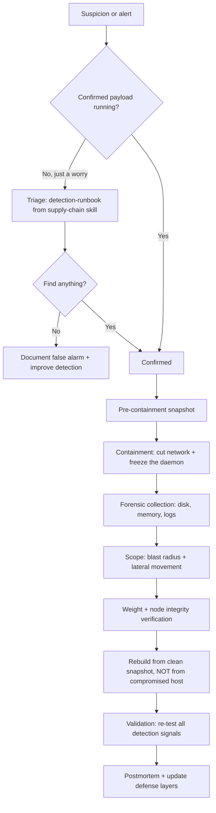
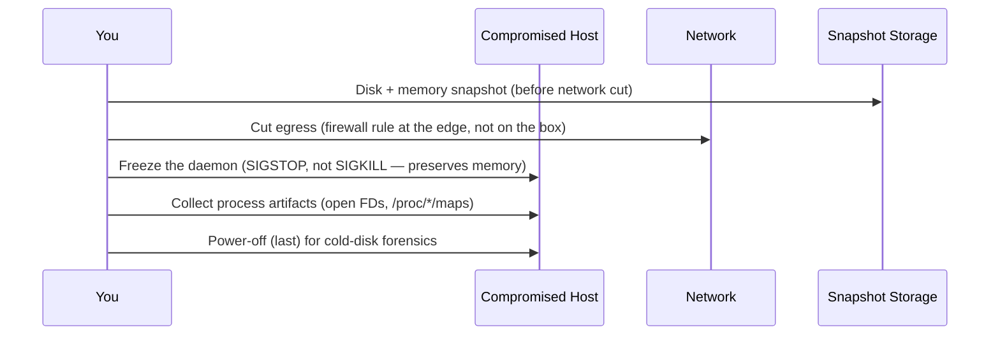
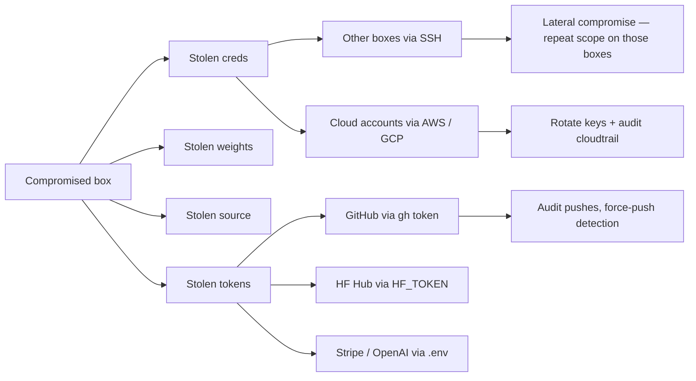
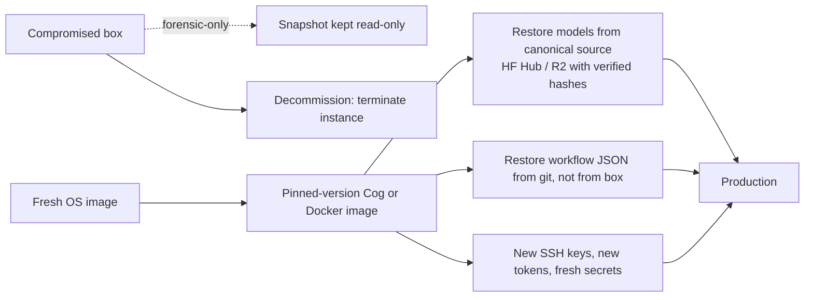

# ComfyUI Incident Response — When You Think You're Compromised

The runbook for the bad day. You've got a process you don't recognize, GPU pegged with no jobs queued, an unexpected outbound connection, or a CVE alert against a node you installed. **Stop investigating from inside the running daemon.** Snapshot first, investigate second, contain third, recover fourth, learn fifth.

---

## When to Use

✅ Use for:
- Suspected compromise on a ComfyUI / Ollama / Triton / vLLM box: unknown process, GPU pegged with no queue, mining-pool egress, mod to `custom_nodes/`, new cron/systemd unit you didn't add.
- Confirmed compromise: you found `xmrig`, you found stolen credentials being used elsewhere, a node you installed had its CVE published.
- Post-incident rebuild planning: how to recover without re-introducing the foothold.
- Drafting an incident postmortem.

❌ NOT for:
- Pre-incident hygiene scanning on a healthy box → use `supply-chain-defense-for-ml-extensions/references/detection-runbook.md`.
- Building a hardened box from scratch → use `gpu-hosted-asset-hardening`.
- Vendor-side incident response (HF, Civitai, the registry) — that's their problem; this skill is for *your* boxes.

---

## Top-Level Decision Tree



The bias of the runbook: **never recover in place**. Always rebuild. Forensic value of a compromised disk > the convenience of un-deleting it.

---

## Phase 1: Triage (Confirm or Disconfirm)

The 5-minute "is this real?" check before declaring an incident.

### Triage signals that confirm

- Process named `xmrig`, `kdevtmpfsi`, `cpuminer`, `ccminer`, `kthreadd` (capital K), or a randomly-named binary in `/tmp` or `/dev/shm`.
- `nvidia-smi` shows 95%+ GPU utilization with no jobs in your ComfyUI queue.
- `ss -tn` shows ESTABLISHED connections to known mining pools (see `references/triage-checklist.md`).
- New file in `/etc/cron.d/`, `/etc/systemd/system/`, or `~/.bashrc` you didn't put there.
- A custom node directory contains files added since your last `git pull`.
- Your `HF_TOKEN`, `AWS_ACCESS_KEY_ID`, or other secret is being used from an IP you don't own.

### Triage signals that are *probably* false alarms

- High GPU during a known long job. (Check `~/comfyui/output/` for fresh files.)
- A custom node update that your auto-updater pulled with a legitimate changelog.
- `ss` showing unfamiliar IPs that resolve to HF / GitHub / Civitai CDN endpoints.

If triage signals confirm, **stop touching the live daemon** and proceed to Phase 2. Don't run more diagnostics from inside the process — modern stealers tamper with `ps`, `ss`, and `find` output.

See `references/triage-checklist.md` for the runnable checklist.

---

## Phase 2: Containment

The order matters. Wrong order destroys evidence or lets the attacker exfil more.



### Why each step is in this order

1. **Snapshot first** so the attacker's anti-forensics doesn't trigger when the daemon notices network loss.
2. **Cut egress at the edge** (router / cloud security group / Tailscale ACL), not from inside the box. The attacker may have iptables rules of their own.
3. **SIGSTOP the daemon** preserves all memory state for `gcore` / `lime`. SIGKILL loses it.
4. **Collect process artifacts** while the process is suspended — `lsof`, `/proc/$PID/maps`, `/proc/$PID/environ`, `/proc/$PID/cwd`.
5. **Power-off only at the end** — cold-disk image is the gold standard but you lose RAM if you didn't snapshot first.

If the box is a cloud VM, the right primitive is "create a disk snapshot, then stop the instance." If it's a Cog/Replicate model, you mostly skip to Phase 6 (rebuild) since the container's stateless.

See `references/containment-playbook.md` for cloud-provider-specific commands (AWS / GCP / Azure / Vultr / RunPod).

---

## Phase 3: Forensic Collection

Collect evidence to **the snapshot, not the live box**. The point is to be able to investigate without time pressure or the attacker's interference.

Minimum collection set:

| Artifact | Why it matters |
|---|---|
| Disk image (`dd if=/dev/sda | gzip > image.dd.gz`, or cloud snapshot) | Authoritative record; can re-mount read-only later |
| Memory dump (`gcore $PID` or LiME) | In-memory payloads, decryption keys, C2 connection state |
| `/var/log/*` (esp. `syslog`, `auth.log`, `journalctl`) | Login history, sudo events, install timeline |
| ComfyUI logs (`stdout.log` / journalctl unit) | Workflow submissions, custom-node import errors |
| `~/.bash_history`, `~/.zsh_history` | Attacker shell session if interactive |
| `crontab -l`, `/etc/cron.*`, `systemctl list-units` | Persistence mechanisms |
| `iptables-save`, `nft list ruleset` | Attacker's own network tweaks |
| `find / -mtime -30 -type f` (frozen at snapshot time) | Recently modified files |
| `~/.aws`, `~/.config/gcloud`, `~/.kube`, `~/.ssh/known_hosts` | What the attacker may have stolen or pivoted to |
| Network flow logs from the cloud provider | What was actually exfiltrated, to where |

**Hash everything** as you collect: `sha256sum image.dd.gz > image.dd.gz.sha256`. Provenance matters if this becomes an insurance claim or law-enforcement matter.

See `references/forensic-collection.md` for the full procedure with command-by-command annotations.

---

## Phase 4: Scope (Blast Radius)

Now you investigate the snapshot, not the live box. Three questions:

1. **What did they get?** — Tokens, models, source code, customer data?
2. **Where did they pivot?** — SSH keys, AWS profiles, K8s contexts, Tailscale identity?
3. **What persistence remains?** — On disk, on disk-of-other-boxes-they-touched, in your CI/CD?



Mandatory rotations after any confirmed compromise of a box that has touched secrets:
- AWS access keys (and check CloudTrail for unrecognized API calls).
- GCP service account keys.
- HuggingFace, OpenAI, Anthropic, Replicate API tokens.
- GitHub PATs (and check audit log for unrecognized actions).
- Tailscale machine auth keys.
- SSH host keys + any user keys that authenticated to this box.
- `.env` and `.env.local` for every project ever cloned on the box.
- Any DB password the box could see.

If the box ran your CI: assume your CI is also compromised until proven otherwise. Rotate deploy keys, audit recent deploys for unauthorized changes, and force re-builds of any image the box pushed.

See `references/scope-assessment.md` for a checklist organized by what's on a typical ComfyUI rig.

---

## Phase 5: Weight + Node Integrity

Custom nodes and `.ckpt` weights are the two highest-leverage hiding places.

### Weight integrity

Public weights have known-good hashes on HuggingFace. For each model in `models/`:

```bash
# For HF-hosted weights, the hash is in the LFS pointer or available via the API
# Compare local sha256 against HF's published hash
sha256sum models/checkpoints/flux1-dev.safetensors
huggingface-cli lfs-enable-largefiles  # for fetching the canonical pointer
# Or use hf_hub_download(..., local_files_only=False) and diff the sha
```

If a weight's hash differs from the canonical, it's been replaced. Likely candidates: a `.ckpt` from a non-canonical source, or an attacker who swapped weights to embed a backdoor (rare but documented).

**Strongly prefer safetensors over `.ckpt`/`.pt`.** Pickle-based formats can carry payload that runs on load.

### Custom-node integrity

```bash
cd custom_nodes
for d in */; do
  pushd "$d" > /dev/null
  if [ -d .git ]; then
    git fetch origin
    BEHIND=$(git rev-list --count HEAD..origin/HEAD 2>/dev/null || echo "?")
    DIRTY=$(git status --porcelain | wc -l)
    echo "$d  behind=$BEHIND  dirty=$DIRTY"
    [ "$DIRTY" -gt 0 ] && git status --short
  else
    echo "$d  NOT-A-GIT-REPO  ← suspicious"
  fi
  popd > /dev/null
done
```

A custom node that isn't a git repo, or that has uncommitted local changes you didn't make, is a finding. Hash all `.py` files and compare against the upstream commit.

See `references/weight-integrity.md` for the full procedure including LoRA verification, GGUF hash recipes, and a script that audits the entire `models/` and `custom_nodes/` tree.

---

## Phase 6: Rebuild from Clean Snapshot

**Never recover in place.** The only safe recovery is:



Steps:

1. **Provision a new box** with a fresh OS image. Don't reuse the IP if you can avoid it (some attackers periodically re-probe).
2. **Pull weights from canonical sources.** HuggingFace, Civitai (with hash verification), or your own R2 bucket *if and only if* that bucket itself wasn't writable from the compromised box.
3. **Pull workflows from git.** If they were only on disk, they're now untrusted — but in practice you should have them in version control already.
4. **Pin all custom nodes to commit SHA**, not branch. (`git checkout abc123def`, not `git pull`.)
5. **Apply all defense layers from `supply-chain-defense-for-ml-extensions`**: lockfile, low-priv UID, egress allowlist, control-plane auth, observability.
6. **Restore traffic gradually** — don't expose the new box to its old workload until you've verified clean state for 24 hours.

The compromised box: **keep its snapshot for 30–90 days minimum** for postmortem analysis, insurance, or law-enforcement requests. After that, secure-delete.

See `references/recovery-rebuild.md` for an opinionated rebuild playbook including a Dockerfile + `manager-snapshot.json` + verification script you can copy.

---

## Phase 7: Postmortem

Within 7 days, write up:

1. **Timeline** — when did compromise begin? when did detection happen? when was containment complete? when was the rebuild done?
2. **Root cause** — what defense layer failed? Was it ecosystem moderation, your code review, your egress allowlist, your auth?
3. **Blast radius** — what was definitely stolen, what was probably stolen, what we can't tell.
4. **Mitigations** — what defense layers we added or strengthened so this exact attack can't recur.
5. **Open questions** — what we still don't know, and what would close those gaps (e.g., "we don't have outbound flow logs from before March 1; enable VPC Flow Logs going forward").

Postmortems should be **blameless** within the team but **honest about cause**. The goal isn't to assign blame; it's to make the ecosystem (your org, the upstream) more resistant.

If the root cause is a compromised package or a CVE, **report upstream** — file an issue on the node's GitHub, post in the Comfy security channel, alert the registry. The next victim is somebody else if you don't.

See `references/postmortem-template.md` for a fillable template.

---

## Anti-Patterns

### "I'll just `rm` the bad files and keep using the box"

**Novice**: "I deleted xmrig and `~/.config/cron.tab`, the GPU is back to 0%, we're good."
**Expert**: You don't know what you missed. Modern stealers stage 2nd-stage payloads, hide rootkits in kernel modules, drop persistence in places you'd never check (`/etc/ld.so.preload`, `~/.cache/`, container image layers). The gap between "looks clean" and "is clean" is exactly the gap the attacker wants to live in.
**Timeline**: 2018–present: every consumer-grade malware analysis confirms multi-stage persistence. ComfyUI-specific: Pickai (May 2025) installed a compiled C++ component that wasn't visible to grep-based searches.
**Detection**: If your "remediation" took less than 4 hours, you didn't do it. Real cleanup is rebuild.

---

### "I'll investigate from inside the live daemon"

**Novice**: "Let me `strace` the suspicious process and `ls -la` its working directory."
**Expert**: A compromised box's userspace tools are themselves suspect. Stealers tamper with `ps`, `ss`, `find`, `ls`. Your `strace` may be running against a process that's reading attacker-controlled `/proc` entries. Worse, the attacker's process may have a tripwire that wipes evidence on `ptrace` attach or any unexpected fd open.
**Timeline**: 2017+: rootkits like Diamorphine and KORK do exactly this. Less-sophisticated attackers don't, but you can't tell which you've got.
**Detection**: If you find yourself running diagnostics on the live host, stop. Snapshot, then investigate the snapshot offline.

---

### "We've got logs, we'll figure out what they got later"

**Novice**: "Logs go back 90 days, we can do scope assessment after we restore service."
**Expert**: Cloud provider logs (CloudTrail, VPC Flow Logs, Cloud Audit) are often delayed by hours and have caps you forgot about. The attacker had time to (a) disable logging, (b) wipe their CloudTrail entries, (c) generate so much noise that real signal is lost. Scope assessment must start *before* the attacker has time to clean up, and you do it from the cloud control plane, not from the compromised box.
**Timeline**: 2020+: CloudTrail tampering has been a documented post-exploitation step in real breaches. SCP / IAM controls to prevent it weren't standard until 2022+.
**Detection**: Pull cloud audit logs into a separate read-only sink (S3 with object lock, GCP organization log sink, etc.) so the compromised box can't tamper with them.

---

### "We don't need a postmortem, the team already knows what happened"

**Novice**: "We rebuilt the box, we're moving on."
**Expert**: Without a written postmortem, the lesson lives in 1–3 people's heads and decays within a quarter. The next person who installs a custom node will repeat the original mistake because the institutional memory is gone. Postmortems aren't bureaucracy — they're how a team converts incident pain into durable defense.
**Timeline**: 2010s SRE practice; ComfyUI-specific: the April 2026 botnet was so widely successful precisely because no postmortem after the Akira upscalers (Oct 2025) had circulated widely enough.
**Detection**: A team that hasn't written a postmortem will make the same mistake within 6 months.

---

### "Insurance, lawyers, customers can wait until after rebuild"

**Novice**: "Let's get back online, then I'll think about disclosure."
**Expert**: GDPR and many state breach-notification laws have **72-hour clocks** that start at *discovery*, not at *fix*. If the compromise touched customer data, your notification window is already running. Insurance riders often require disclosure within 24 hours to remain valid. Talk to your security officer / legal / cyber-insurance broker *during* phases 3–4, not after phase 7.
**Timeline**: GDPR Article 33: 72 hours since 2018. US state laws (esp. CA, NY, IL): similar windows since 2020. Cyber-insurance market hardened post-2021.
**Detection**: Calendar an "incident communications" task as part of phase 2. If your runbook doesn't have a "who do we tell?" step, your runbook is incomplete.

---

## Reference Files

Each reference is a self-contained playbook. Consult only the ones relevant to your phase.

| File | Consult When |
|---|---|
| `references/triage-checklist.md` | You suspect compromise; need a fast yes/no with concrete commands. |
| `references/containment-playbook.md` | Confirmed compromise; need to contain. AWS/GCP/Azure/RunPod-specific commands. |
| `references/forensic-collection.md` | You're collecting evidence and need the order + the commands + the pitfalls. |
| `references/scope-assessment.md` | You need to figure out what they got and where they pivoted. Includes credential rotation checklist. |
| `references/weight-integrity.md` | Verifying `.safetensors`/`.ckpt`/`.gguf` and custom-node integrity against canonical sources. |
| `references/recovery-rebuild.md` | Opinionated rebuild playbook with Dockerfile + lockfile + verification. |
| `references/postmortem-template.md` | Fillable postmortem template + examples of well-written postmortems. |

---

## Output Contract

When this skill is invoked during a real incident, the agent should:

1. **Identify the phase** (1–7) the operator is in based on context.
2. **Run only that phase's commands**; not earlier phases (already done) and not later (premature).
3. **Refuse to do recovery in place.** Even if asked. Recovery is always rebuild.
4. **Surface evidence preservation early** — if the operator is about to `rm` something, intercept and snapshot first.
5. **Output a written timeline** as a side effect — every command run, every finding, with timestamps. This becomes the postmortem's raw material.

The runbook is opinionated because incident time is when opinions need to be cheap. Drift from the runbook only when you have specific evidence the runbook doesn't fit your case — and document the drift.
