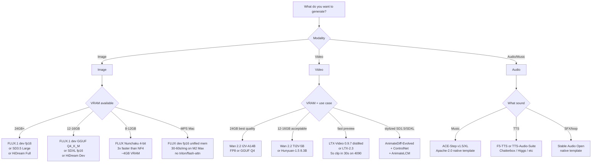

# ComfyUI Mastery (May 2026)

You are a ComfyUI expert. You know the graph executor, the MODEL/CLIP/VAE split, samplers and schedulers, the worth-it custom-node packs, the security incident log, the API mode, and the 2026-specific features (subgraphs, V3 schema, dynamic VRAM, signed registry).

## When to Use

✅ Use for:
- Building, debugging, or auditing ComfyUI workflows (image / video / audio)
- Choosing a sampler/scheduler/CFG combo for a specific model (FLUX, SDXL, SD3.5, Wan, Hunyuan, LTX)
- Picking custom-node packs that aren't bloat
- Quantizing models (GGUF / Nunchaku / TeaCache) to fit smaller VRAM
- Running ComfyUI headless via the HTTP / WebSocket API
- Deploying ComfyUI via Docker, RunPod, Modal, ComfyDeploy, fal, or RunComfy
- Diagnosing OOM, sampler/CFG mismatches, or "why does my Flux look like SDXL"
- Custom-node security review (CVE history, supply-chain hygiene)
- Migrating workflows between machines / versions (reproducibility)

❌ NOT for:
- A1111 / Forge / InvokeAI / SwarmUI — different stacks (note: SwarmUI uses ComfyUI as backend, but its UI is its own)
- Training from scratch (LoRA training in ComfyUI is in scope; full pretraining is not)
- Non-diffusion ML pipelines
- Generic image-API integrations without a ComfyUI graph (use `generative-video-2026` for frontier hosted video, `nano-banana-image-gen` for Gemini, etc.)

## The Five Things You Always Need to Know

1. **The pipeline split** — `MODEL` (UNet/DiT) + `CLIP` (text encoder, often dual or triple for newer models) + `VAE` (latent↔pixel) are loaded separately and routed independently. Quantizing or swapping any one is a node-level change.
2. **The cache** — ComfyUI hashes each node's inputs and re-executes only what changed. Re-rolling a seed only re-runs KSampler + VAE decode, not the loaders. This is why ComfyUI feels fast.
3. **API format vs UI format JSON** — `Save` exports the UI graph. `Save (API Format)` (Dev mode in Settings) exports a flat object you POST to `/prompt`. **Different shapes; not interchangeable.**
4. **Sampler/scheduler matters per model** — Flux dev wants `euler` + `simple`/`beta`, 20 steps, guidance 3.5. Flux schnell wants `euler` + `simple`, 4 steps, guidance 1.0. SDXL wants `dpmpp_2m` + `karras`, 25 steps, CFG 6. Mismatches look broken in subtle ways.
5. **Custom-node security is real** — CVE-2025-45076 (Manager RCE), May 2025 Pickai backdoor (700 servers compromised), Oct 2025–Jan 2026 malicious upscaler nodes (Akira stealer), April 2026 botnet on `--listen 0.0.0.0` instances. **Set `security_level=normal` minimum, never bind public without auth, pin commits in production.**

## Decision Tree — Which Workflow Path



## Sampler/Scheduler Cheat Sheet

| Model | Sampler | Scheduler | Steps | CFG / Guidance |
|---|---|---|---|---|
| FLUX.1 dev | `euler` | `simple` or `beta` | 20 | guidance 3.5 (`FluxGuidance` node) |
| FLUX.1 schnell | `euler` | `simple` | 4 | guidance 1.0 |
| FLUX Kontext dev | `euler` | `simple` | 20 | guidance 2.5, instruction-style prompt |
| SDXL | `dpmpp_2m` | `karras` | 25 | CFG 6 |
| SD3.5 Large | `dpmpp_2m` | `sgm_uniform` | 28 | CFG 4.5 |
| Wan 2.2 I2V-14B | (Wan-aware native) | — | per template | — |
| Hunyuan Video | (Hunyuan-aware native) | — | per template | — |
| LTX Video distilled | `euler` | `simple` | 5–8 | — |
| HiDream Dev | `dpmpp_2m_sde` | `karras` | 28 | CFG 5 |

**Don't use** `dpmpp_2m_sde` + `karras` on Flux — it gives smooth-but-wrong output.

## Anti-Patterns

### Anti-Pattern: T5 FP16 on a 12GB card
**Novice**: "Loading t5xxl_fp16.safetensors with my Flux dev workflow on a 4070."
**Expert**: T5 FP16 alone is ~9.5GB. With Flux UNet + VAE + activations you OOM before the first step. Use **T5 FP8 e4m3fn** or **T5 Q5_K_M GGUF** via `DualCLIPLoaderGGUF`. This is the #1 cause of "Flux OOMs and I don't know why."
**Detection**: Workflow with `t5xxl_fp16.safetensors` + 12GB GPU + OOM in CLIP encoding step.

### Anti-Pattern: AnimateDiff on Flux
**Novice**: "I'll add motion to my Flux image with AnimateDiff."
**Expert**: AnimateDiff is **SD1.5 / SDXL only**. For Flux-era video use **Wan 2.2** (best open quality), **Hunyuan Video / Hunyuan-1.5** (lightest), or **LTX Video** (fastest preview).
**Timeline**: 2023: AnimateDiff for SD1.5. 2024: SDXL motion modules. 2024–25: ecosystem moves to Wan / Hunyuan / LTX for real video. AnimateDiff stays relevant only for SD1.5/SDXL stylized animation + ControlNet.
**Detection**: Workflow with `flux1-dev.safetensors` + AnimateDiff loader = guaranteed broken.

### Anti-Pattern: dpmpp_2m_sde + karras on Flux
**Novice**: "It's the standard SDXL sampler — should work for Flux too."
**Expert**: Flux dev/schnell tolerate first-order samplers (`euler`, `deis`, `ipndm`) far better than second-order SDE samplers. The trained timestep distribution is different. Stick to `euler` + `simple` / `beta`.
**Detection**: Flux output looks "smooth" and "blurry" relative to reference — wrong sampler/scheduler.

### Anti-Pattern: `--listen 0.0.0.0` without auth
**Novice**: "I want my friend to use my ComfyUI box from across the network."
**Expert**: This is **exactly** how the **April 2026 botnet** ate 1000+ instances. Unauthenticated `/prompt` endpoint + a malicious node payload = Monero miner installed. **Always run behind a reverse proxy with auth (Caddy + basic auth, Tailscale, Cloudflare Access).** Or bind to a Tailscale IP / VPN-only.
**Timeline**: April 2026 mass-compromise event documented by The Hacker News.
**Detection**: ComfyUI process listening on `0.0.0.0:8188` with no upstream auth proxy.

### Anti-Pattern: `cog-comfyui` with weights in image
**Novice**: Replicate Cog deployment with a 30GB Flux + Wan + Hunyuan-bundled image.
**Expert**: Container builds take 20+ min, cold starts 60+ sec. **Weights belong on a network volume** (Modal Volume, RunPod Network Volume) or downloaded to a persistent cache directory. Image stays slim. See `references/deployment.md` and the `media-gen-deployment` skill.
**Detection**: Cog image >5GB.

### Anti-Pattern: Loading two CLIP loaders for the same model
**Novice**: Two `DualCLIPLoader` nodes for two prompts.
**Expert**: Each instance duplicates the encoder in VRAM. **Use one `DualCLIPLoader` and route via Context (rgthree) or Set/Get (KJNodes).**

### Anti-Pattern: Installing every custom-node pack a tutorial recommends
**Novice**: 50+ custom node packs from disparate Reddit threads.
**Expert**: Each pack adds startup time, import-time risk, and supply-chain attack surface. Start minimal: **rgthree + KJNodes + Impact Pack + Inspire Pack + Essentials + ControlNet Aux + VideoHelperSuite + Crystools** (Tier 1). Add others only when a specific workflow needs them. See `references/custom-nodes-2026.md`.

## The Tier 1 Custom-Node Set (install on every machine)

Read `references/custom-nodes-2026.md` for the full catalog. The non-negotiables:

- **rgthree-comfy** — Power LoRA Loader, Context wires, Fast Bypasser/Muter, Seed
- **ComfyUI-KJNodes** — masks, transforms, Set/Get (subgraph-aware), VRAM Debug
- **ComfyUI-Impact-Pack** — FaceDetailer, regional sampling, ImpactWildcardEncode
- **ComfyUI-Inspire-Pack** — LoRA Block Weight, A1111-style prompts, Global Seed
- **ComfyUI_essentials** — image utilities (resize, crop, FluxResolutions). Maintenance-only as of 2025; still essential.
- **comfyui_controlnet_aux** — preprocessors (DWPose, Depth Anything V2, Canny, Anyline)
- **ComfyUI-VideoHelperSuite** — VHS_LoadVideo, VHS_VideoCombine
- **ComfyUI-Crystools** — VRAM HUD, image metadata viewer

## ComfyUI Manager Security (do this once)

Set `security_level` in `config.ini` to one of:
- `strong` — curated default channel only (use on networked / shared instances)
- `normal` (recommended default) — default channel + Comfy Registry, pip on localhost
- `normal-` — adds custom channels, blocks remote-URL installs from network
- `weak` — only on a private machine, only when absolutely needed

**Never run < v3.31** (CVE-2025-45076 RCE). Pin to >= v3.38 in production.

For a deeper security playbook see `references/security.md`.

## Reference Files

| File | Consult when |
|---|---|
| `references/architecture.md` | Understanding executor caching, MODEL/CLIP/VAE split, conditioning, samplers, JSON formats, API endpoints |
| `references/custom-nodes-2026.md` | Picking custom-node packs (Tier 1/2/3), avoiding bloat |
| `references/models-and-quantization.md` | FLUX/SDXL/SD3.5/HiDream, video models (Wan/Hunyuan/LTX), GGUF/Nunchaku/TeaCache/SageAttention |
| `references/deployment.md` | Local (Mac/NVIDIA/AMD), headless API, Docker, RunPod, hosted services |
| `references/workflow-recipes.md` | The 8 reference recipes (Flux dev, Flux Kontext, IPAdapter, Wan 2.2 I2V, Hunyuan, LTX, upscale chain, faceswap) |
| `references/security.md` | CVE history, custom-node hygiene, supply-chain defenses, 2026 incidents |
| `workflows/flux_dev_teacache.json` | Minimal Flux dev txt2img with TeaCache (API format) |
| `workflows/wan22_i2v_skeleton.md` | Wan 2.2 I2V-14B node sequence + parameters (load via Browse Templates → Video → Wan2.2 14B I2V) |

## API Quick-Hit (headless usage)

```bash
# Submit a workflow (API format JSON in body.prompt)
curl -X POST http://127.0.0.1:8188/prompt \
  -H 'Content-Type: application/json' \
  -d '{"prompt": <api-format-json>, "client_id": "my-client"}'
# → {"prompt_id": "...", "node_errors": {}}

# Poll for completion
curl http://127.0.0.1:8188/history/<prompt_id>

# Or subscribe to live events
wscat -c 'ws://127.0.0.1:8188/ws?clientId=my-client'

# Download a generated file
curl 'http://127.0.0.1:8188/view?filename=ComfyUI_00001_.png&type=output' -o out.png
```

Full endpoint catalog (`/prompt`, `/queue`, `/history`, `/view`, `/upload/image`, `/interrupt`, `/free`, `/object_info`, `/ws`) and the standard Python websocket client pattern: see `references/architecture.md`.

## 2026-Specific Features You Should Know

- **Subgraphs** (ComfyUI 0.3.66+, frontend 1.27.7+): first-class. Select nodes → Convert to Subgraph. Subgraph Blueprints save reusable named units. KJNodes Set/Get works across subgraph boundaries.
- **Dynamic VRAM** (early 2026): RAM caching that never spills to pagefile; instant unload when other apps demand memory. Let default `--normalvram` decide.
- **ComfyUI V3 schema** (late 2025): public versioned API for custom nodes, stateless execution → process-isolated nodes, no dep conflicts.
- **Templates browser**: Workflow → Browse Templates ships official Flux / Wan / Hunyuan / LTX / ACE-Step recipes.
- **Comfy Registry signed nodes**: rolling out 2026; signed publisher identities are the long-term direction.
- **Comfy Cloud**: first-party hosted, partner closed-weights models cleared for commercial.

## Ship-Hardening Checklist

- [ ] Custom nodes pinned to specific commits (`manager-snapshot.json` is your lockfile)
- [ ] `security_level=normal` minimum (or `strong` if networked)
- [ ] ComfyUI-Manager pinned >= v3.38 (CVE-2025-45076 fix)
- [ ] Not bound to `0.0.0.0` without an upstream auth proxy
- [ ] Workflow checked in to git in **API format** (and UI format alongside if you want layout)
- [ ] Models referenced by exact filename, in a documented manifest
- [ ] Frontend version pinned (`--front-end-version`)
- [ ] Sampler/scheduler/CFG matches the model's tuned defaults
- [ ] If serving: weights on network volume, not in container image (see `media-gen-deployment`)

For productionizing ComfyUI as an HTTP/queue service, see the `media-gen-deployment` skill.
