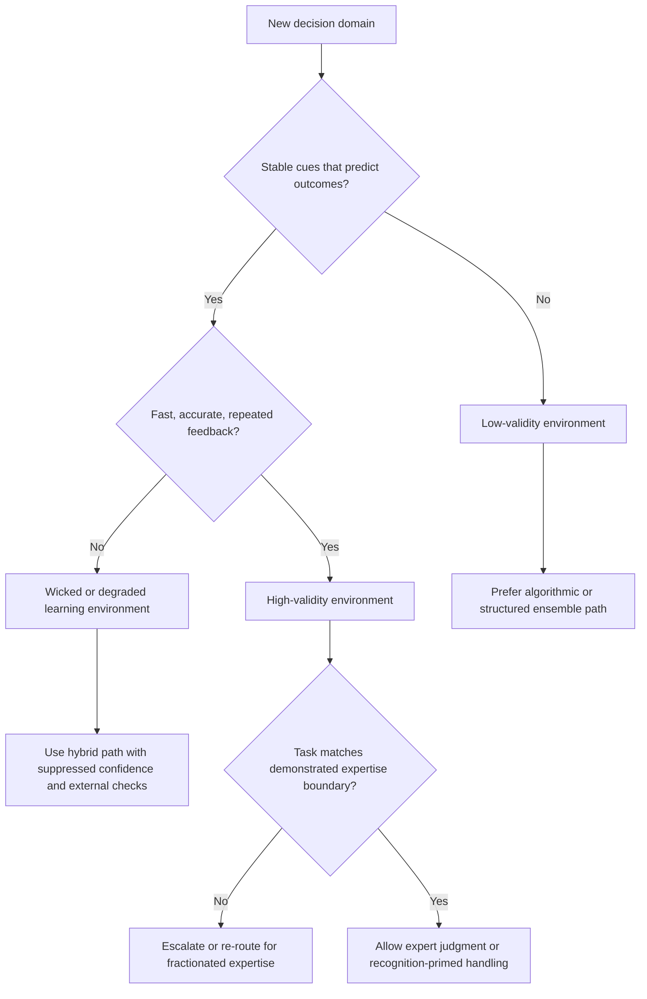

# Conditions for Intuitive Expertise

Use this skill when the hard problem is not generating an answer, but deciding whether intuition, expert judgment, or agent confidence deserves trust in the first place.

## When to Use

- An agent is confidently fluent in a domain where outcome feedback is weak, delayed, or confounded.
- You need to decide whether a task should route to algorithmic scoring, expert judgment, or a hybrid review path.
- A system keeps overreaching from one domain into an adjacent but structurally different one.
- You are designing escalation logic for ambiguous, noisy, or high-stakes decisions.
- You need to audit whether repeated practice in a domain actually builds skill or just entrenches confident noise.

## NOT for Boundaries

This skill is not the primary lens for:
- Deterministic implementation work with explicit acceptance criteria and fast feedback.
- Pure syntax debugging, schema repair, or tasks where correctness is directly testable.
- Situations where the right move is already specified by hard policy or exact computation.
- Generic "trust the expert" arguments that do not examine environment validity or feedback quality.

## Core Mental Models

### Environment Validity Comes First

Expert intuition is only trustworthy when the environment has stable, learnable regularities. If the domain is mostly noise, confidence will still form; it just will not track truth.

### Learning Opportunity Is the Second Gate

Even a valid environment will not produce expertise without timely, accurate feedback. Delayed, corrupted, or selectively remembered feedback produces practiced error rather than practiced skill.

### Confidence Measures Coherence, Not Accuracy

Confidence tracks how internally consistent the available cues feel. In low-validity environments, high confidence is often a hazard signal rather than reassurance.

### Expertise Is Fractionated

Skill at one subtask does not reliably transfer to a neighboring subtask that merely feels similar. The boundary problem matters more than the prestige of the prior success.

### Match Decision Mechanism to Ecology

Use judgment-heavy approaches when tacit cues are real and feedback is clean. Use algorithms or structured ensembles when noise dominates and intuitions cannot be trained safely.

## Decision Points

### 1. Classify the Environment Before the Actor

- Ask whether the domain contains repeatable cue-to-outcome regularities.
- Ask whether the learner receives honest enough feedback to tune those cues.
- Only after that should you decide whether judgment deserves weight.

### 2. Separate Confidence Review from Accuracy Review

- Treat raw confidence as a report about felt coherence.
- If the environment is low-validity, confidence should not drive autonomy.
- If confidence and evidence disagree, trust the evidence and investigate the cue story.

### 3. Check for Fractionated Expertise

- Compare the current task structure to the situations that created the skill.
- If the resemblance is lexical but not structural, downgrade trust.
- Adjacent domains need fresh validation, not inherited authority.

## Failure Modes

### 1. Confidence-As-Evidence

The system treats fluent, high-confidence output as proof of correctness. This repeats the exact illusion-of-validity failure the paper warns about.

### 2. Invalid-Environment Optimism

A team assumes repetition in a noisy domain will produce expertise. It instead produces stronger stories, better rhetoric, and no real predictive gain.

### 3. Wicked-Feedback Training

Feedback arrives late, is politically distorted, or only surfaces successes. Agents then learn the wrong cues and become confidently brittle.

### 4. Fractionation Blindness

A skill that works for one subtask is invoked on a neighboring task with different causal structure. The output sounds plausible because the vocabulary overlaps, but the competence boundary has already been crossed.

### 5. Escalation Theater

Human review is added only after confidence gets high, rather than when environment validity or task-boundary fit is poor. Review then becomes a rubber stamp instead of a real safeguard.

## Worked Examples

### Example 1: Stock Commentary Agent vs. Valuation Model

A team wants an "expert market intuition" agent to decide whether a stock is underpriced. The framework says the environment is low-validity and feedback is heavily confounded, so the agent should not get autonomy based on fluent market narratives. Route instead to an actuarial or ensemble baseline, then use judgment only for anomaly explanation.

### Example 2: Imaging Triage with Domain-Limited Judgment

A radiology-adjacent agent is strong on spotting abnormalities in one imaging modality and is asked to generalize to another that shares surface vocabulary but different cue structure. The framework flags fractionated expertise, so the system should degrade autonomy and require modality-specific validation before trusting the carryover.

## Quality Gates

- The environment has been explicitly classified as high-validity, degraded-validity, or low-validity.
- Feedback-loop quality has been examined, not assumed.
- Confidence is treated as coherence metadata rather than direct evidence.
- The task has been checked against demonstrated competence boundaries.
- Escalation rules are stricter in low-validity domains than in high-validity ones.

## Reference Files

- `references/environment-types-and-decision-quality-reference.md` — Rapid-access reference card mapping environment validity spectrum (zero, degraded, high) to decision quality. **Read when** classifying a domain's feedback structure or designing routing logic.

- `references/environmental-validity-as-trust-signal.md` — Core framework: environment validity (not agent confidence) is the master signal for trusting judgment. **Read when** evaluating whether an agent's intuition deserves trust.

- `references/confidence-as-false-signal.md` — Why subjective confidence diverges from accuracy and what to measure instead. **Read when** auditing overconfidence or calibrating escalation thresholds.

- `references/overconfidence-and-the-illusion-of-validity.md` — Kahneman's illusion of validity: coherent conviction without statistical validity. **Read when** diagnosing why confident judgment fails in low-validity domains.

- `references/fractionated-expertise-and-scope-boundaries.md` — Why competence has sharp edges and does not transfer uniformly across adjacent sub-tasks. **Read when** detecting domain-boundary violations or designing task decomposition.

- `references/fractured-expertise-and-domain-boundary-detection.md` — Fractionated expertise as a structural feature: skilled professionals overreach into adjacent areas. **Read when** auditing scope creep or routing failures across related domains.

- `references/the-boundary-problem-knowing-when-not-to-trust-yourself.md` — Distinguishing genuine expertise from overconfident noise near domain edges. **Read when** designing confidence suppression or escalation triggers.

- `references/recognition-primed-decision-as-agent-architecture.md` — RPD model: how experts decide by pattern recognition without comparing options. **Read when** designing agent architecture for time-pressured or complex judgment tasks.

- `references/recognition-primed-decision-making-for-agents.md` — Klein's fireground commander study: single-option generation under extreme time pressure. **Read when** understanding how expert intuition actually works operationally.

- `references/system1-system2-and-dual-mode-agent-architecture.md` — Dual-process reasoning: System 1 (fast, intuitive) vs. System 2 (deliberate, analytical). **Read when** designing hybrid routing or deciding when to suppress fast judgment.

- `references/two-systems-in-orchestration.md` — System 1 and System 2 in agent orchestration: when to invoke automatic vs. controlled reasoning. **Read when** architecting multi-stage decision pipelines.

- `references/algorithms-vs-human-judgment-when-to-use-which.md` — Meehl paradigm: 70-year meta-analysis showing algorithms outperform human judgment in ~50% of cases. **Read when** deciding whether to route to algorithmic or judgment-heavy paths.

- `references/algorithms-vs-intuition-routing-framework.md` — Routing framework: when statistical models beat expert judgment and why. **Read when** designing decision mechanism (algorithmic, hybrid, or judgment-heavy).

- `references/cognitive-task-analysis-for-tacit-knowledge.md` — Extracting tacit expertise: experts cannot articulate their best decisions. **Read when** auditing whether expert knowledge can be encoded or must remain judgment-based.

- `references/learning-from-tacit-knowledge-and-cognitive-task-analysis.md` — Eliciting tacit knowledge: experts construct post-hoc rationalizations that may not capture real process. **Read when** designing knowledge capture or validating expert explanations.

- `references/premortem-and-calibrated-uncertainty.md` — Pre-mortem and calibration techniques to counter overconfidence in complex systems. **Read when** designing confidence suppression mechanisms or escalation logic.

- `references/validity-environment-and-agent-trust.md` — Master variable: skilled intuition requires high-validity environment + adequate feedback opportunity. **Read when** assessing whether a domain can support reliable expert judgment.

- `references/when-expert-intuition-fails-and-why.md` — Taxonomy: when expert intuition succeeds (fireground commanders) vs. fails (clinical prediction). **Read when** diagnosing why confident judgment is unreliable in a specific domain.

## Anti-Patterns

- Using confidence scores as a primary autonomy gate in noisy domains.
- Assuming years of exposure imply expertise without checking feedback quality.
- Porting a proven skill into adjacent tasks because the terms look familiar.
- Treating algorithmic methods as universally inferior or universally superior.
- Auditing outputs without auditing the ecology that produced them.

## Shibboleths

You have internalized this skill if you naturally ask:
- "What kind of environment is this before we talk about trust?"
- "What feedback actually taught this agent or expert?"
- "Is this the same task structure, or just an adjacent one?"
- "Does confidence here mean evidence, or just coherence?"
