# Conserved Capacity, Admission, and Settlement

Use this skill to keep four authorities separate:

1. a scheduler proposes an eligible attempt;
2. a capacity broker reserves a native resource vector;
3. an admission writer consumes both exactly once and creates a lease;
4. an effect boundary closes authority and hands evidence to an independent settlement authority.

The skill designs or audits records. It cannot reserve real capacity, admit a body, issue a capability, schedule a node, settle compensation, or prove containment.

## Activate when

- a node attempt, retry, repair, renewal, consuming gather, or resurrection needs scarce capacity;
- a crash or lost acknowledgement could duplicate a lease, effect, refund, slash, or payout;
- an external effect may be ambiguous and capacity reuse must fail closed;
- Stop must retain capacity for reconciliation and teardown;
- effect closure must not wait for compensation or dispute settlement;
- a no-settlement profile still needs explicit conservation and terminal records.

## Do not activate for

- deciding which roadmap node runs next;
- estimating demand, price, or model quality;
- turning tokens, subscription allowance, cash, time, concurrency, and attention into one invented currency;
- deciding whether an effect is authorized;
- grading whether work is correct;
- making legal, tax, employment, custody, or moral-status decisions.

## Authority and resource rules

- **Native vectors only.** Every dimension keeps its native unit and source: calls, tokens, seconds, dollars, slots, attempts, network bytes, or attention events.
- **Reservation is not admission.** `ReservationCommit` is exact, expiring, one-use capacity evidence. It cannot create a lease.
- **Admission has no scheduling discretion.** The admission writer may consume an exact `EligibilityCommit` and `ReservationCommit`; it may not select a different node, route, provider, or resource vector.
- **Every consuming attempt pays capacity rent.** Retry, renewal, rework, successor, elastic slot, provider call, and model-consuming gather each bind to a current reservation.
- **Stop reserve is protected.** Reconciliation, fence, teardown, and receipt publication have explicit reserved capacity that ordinary work cannot consume.
- **Ambiguity holds resources.** `AMBIGUOUS` and `QUARANTINED_UNRESOLVED` expose no retry authority and do not release affected capacity.
- **Containment does not wait for settlement.** Effect closure and an idempotent settlement-outbox record share one local transaction. Settlement consumes asynchronously.
- **Settlement is control-disjoint.** Capacity broker, scheduler, admission writer, effect boundary, and settlement authority are distinct principals and key domains.
- **Compensation is a new effect.** Payment, refund, slash, reputation, and salvage funding require their own authorization and receipt.
- **No-settlement is explicit.** It means no bond, bounty, payout, slash, or refund; model/API usage remains accounted in its own dimensions.

## State spine

```mermaid
stateDiagram-v2
  [*] --> Eligible: exact EligibilityCommit
  Eligible --> Reserved: one-use ReservationCommit
  Reserved --> Admitted: atomic consume + lease + durable dispatch intent
  Admitted --> Running: observed start
  Running --> EffectClosed: effect authority closed
  Running --> Ambiguous: lost or conflicting acknowledgement
  Ambiguous --> Reconciled: independent evidence
  Ambiguous --> Quarantined: bounded workflow terminal
  Reconciled --> EffectClosed
  Quarantined --> Quarantined: capacity held; no retry
  EffectClosed --> HandoffReady: settlement outbox committed
  HandoffReady --> Settled: independent terminal
  HandoffReady --> Unsettled: disagreement or unavailable authority
  Settled --> [*]
  Unsettled --> [*]
```



`Quarantined` is a workflow terminal, not proof that the external effect did not occur. A separately reserved no-effect observer may investigate, but is neither retry nor successor.

## Required attempt identity

Bind every record to:

- plan digest and revision;
- node ID, attempt ID, and body generation;
- principal and authority epoch;
- repository, immutable target, route, and provider profile;
- policy, eligibility, reservation, review, and evaluation digests;
- idempotency key and expiry.

A mismatch rejects the join. “Same task” or “same agent” is never enough.

## Crash and conservation method

1. Declare resource dimensions and their ledger owners.
2. Define the reservation linearization point.
3. Atomically write reservation consumption, lease, and durable dispatch intent.
4. Crash immediately before and after every durable write.
5. Duplicate, reorder, delay, and lose every acknowledgement.
6. Reconstruct balances from receipts only.
7. Prove no lease without consumed capacity, no double release, and no reuse under ambiguity.
8. Close effect authority before asynchronous settlement.

## Anti-patterns

### Free subscription capacity

**Wrong:** record a subscription-backed model call as zero because no invoice line exists.
**Right:** track remaining allowance, reset window, model tier, call/token estimates, and confidence in native units.

### Broker as scheduler

**Wrong:** the capacity broker picks the next node because it sees availability.
**Right:** it returns an exact reservation or denial for a scheduler-supplied attempt.

### Ambiguous retry

**Wrong:** timeout releases capacity and retries automatically.
**Right:** retain the hold and require independent reconciliation.

### Settlement in Stop

**Wrong:** teardown waits for a payout or slash decision.
**Right:** close effect authority, commit the handoff, then settle asynchronously.

## Output and validation

- [`schemas/conserved-attempt-v1.schema.json`](schemas/conserved-attempt-v1.schema.json) — closed record shape.
- [`examples/valid-no-settlement-attempt.json`](examples/valid-no-settlement-attempt.json) — no-effect, no-settlement fixture.
- [`scripts/validate-conserved-attempt.mjs`](scripts/validate-conserved-attempt.mjs) — semantic auditor.
- [`scripts/test-bundle.mjs`](scripts/test-bundle.mjs) — adversarial mutations.
- [`references/authority-and-conservation.md`](references/authority-and-conservation.md) — joins, ambiguity, and settlement semantics.
- [`tests/activation.md`](tests/activation.md) — positive and negative activation corpus.

```bash
node skills/conserved-capacity-admission-and-settlement/scripts/validate-conserved-attempt.mjs \
  skills/conserved-capacity-admission-and-settlement/examples/valid-no-settlement-attempt.json
node skills/conserved-capacity-admission-and-settlement/scripts/test-bundle.mjs
```

Static success proves only the supplied record. It never authorizes scheduling, execution, payment, retry, or release.
