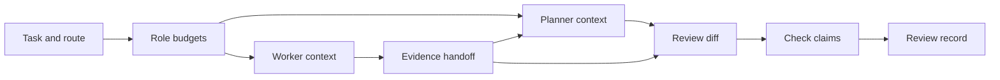
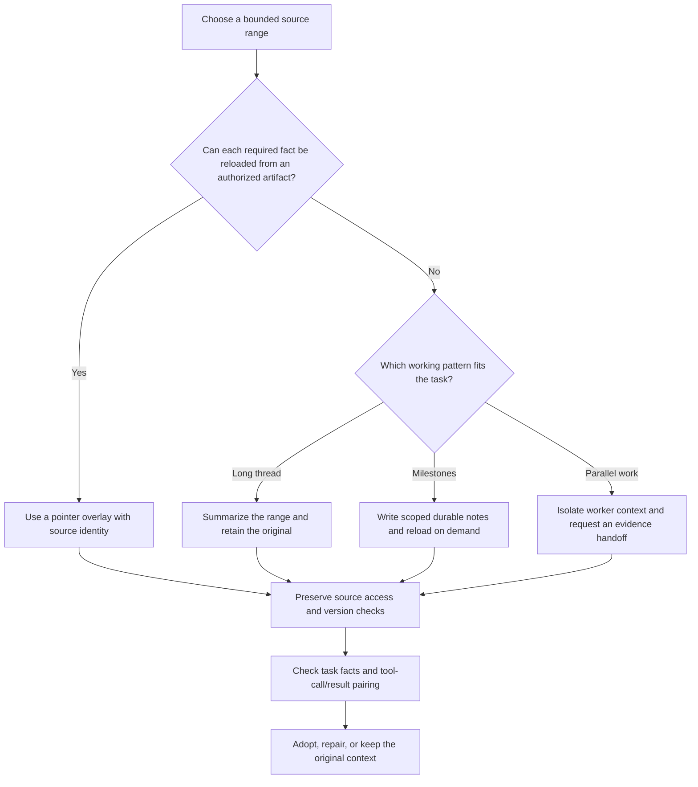
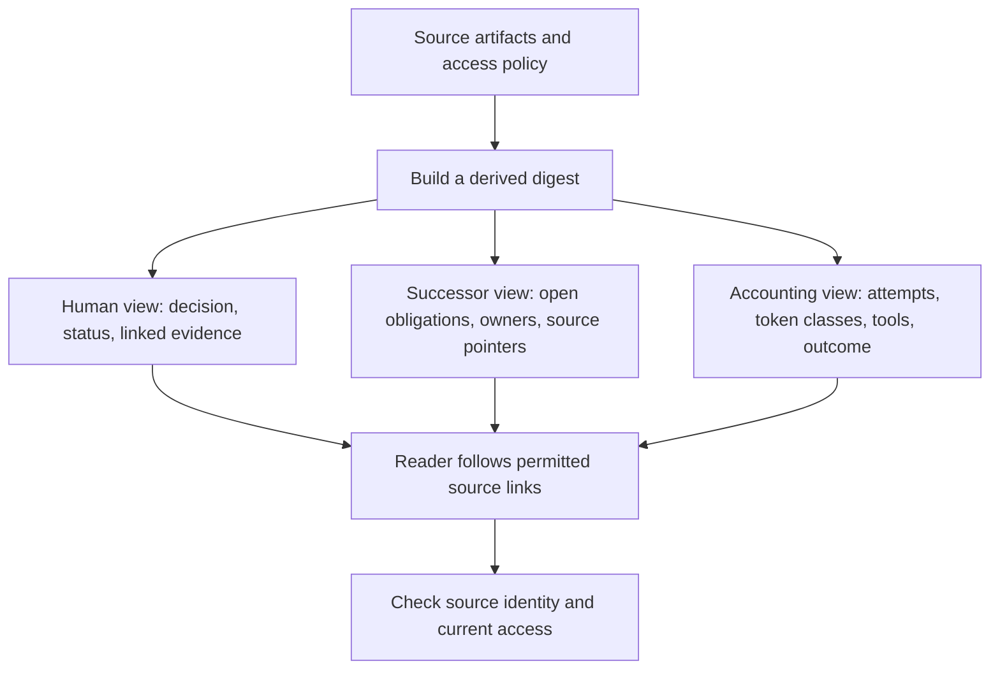
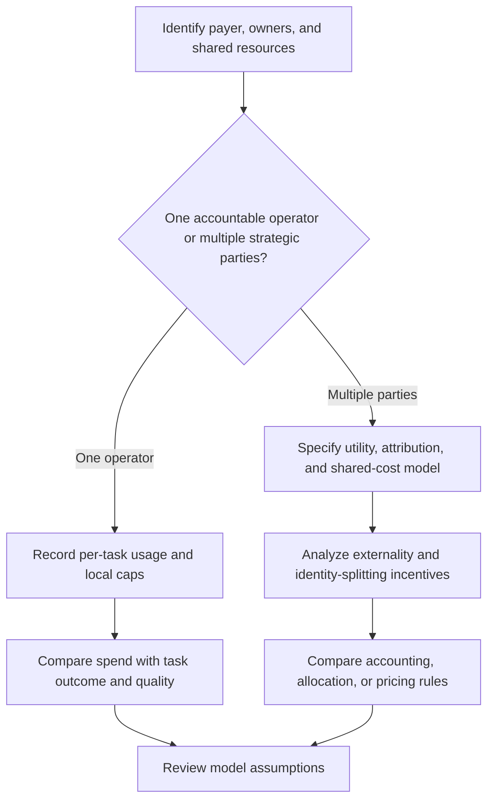

# Context Economics for Agent Swarms

## Halt and authority gate

This skill observes, forecasts, and returns capacity evidence. It does not admit
a body, authorize a provider call, transfer identity, clear an operator/runtime
halt, or issue a rebodiment verdict. During a halt, work only from inert files,
schemas, fixtures, PR evidence, and fake observations. Any live observation or
durable note must use an independently authorized interface outside this skill.

**Working thesis.** Token usage can be a directly metered API cost, a provider-native
subscription allowance, or both under different routes. Input tokens also occupy
context even when a pricing rule discounts cached input. A compaction changes the
working representation and may affect evidence retention, but files, diffs, database
records, tool receipts, UI views, and permissioned links can also carry the work's
provenance. Budget, compaction, and digest design therefore need separate ledgers and
separate checks.

This skill helps plan per-role context budgets, choose compaction methods, construct
reader-specific digests, record cost and capacity evidence, and evaluate whether a
particular compression policy preserves the task facts it needs. It does not assume
compression is cheaper or safer without measurement.

---

## CORE FRAME — four economic views that must not collapse

| Identity | What a token is here | Who pays attention | The optimization target |
|---|---|---|---|
| **Cash cost** | metered API, tools, labor, credits, and recurring commitments, as applicable | the operator or payer | compare complete costs for the same task and quality target |
| **Context occupancy** | input/output tokens and other content counted in the model's working window | the acting model and caller | preserve required information within measured route constraints |
| **Evidence access** | artifacts, receipts, permissions, links, and derived digests | operators, reviewers, successors | keep claims traceable and access-controlled |
| **Scarce allowance** | provider-native request/token/percentage windows and reset rules | account owner and scheduler | retain native units and make unknown capacity explicit |

> **Legibility-with-zoom.** Treat each digest as a derived view with source pointers,
> not as a replacement for underlying evidence. This is a local design analogy to
> Scott's critique of high-modernist simplification; it is not an empirical result
> about language-model summaries. Pointers still require correct identity, permission,
> availability, and source-version checks.

---

## DECISION POINTS

### 1. Per-agent context budget allocation

The diagram is a workflow, not a token-size prescription. Treat role budgets,
loaded-tool sets, digest lengths, and reviewer evidence as hypotheses. Measure them
for the exact model, task class, tool pack, and evidence requirements. A small planner
view, an isolated worker window, and a diff-anchored review are useful starting
configurations, not universally optimal allocations.

Estimate usable context from the exact route's documented limit and a task-specific
evaluation. Test required facts at different positions and lengths with matched task
conditions. Set thresholds only as versioned local policy with measured error bounds;
recheck after changing model, prompt, tools, context composition, or task mix. No fixed
budget, digest length, or tool-count threshold is portable across those changes.

### 2. Which compaction strategy when context fills

**Two families of move, both non-destructive when done right.** *Macro-compaction*
operates on message *ranges*: lay a non-destructive **overlay** over a span of cold
history — a pointer overlay when the range is reconstructable, a summary overlay when it
isn't — and never delete the original, so you can always zoom back. When you
re-summarize, regenerate factual claims from immutable artifacts. The previous
summary may remain in view only as untrusted comparison input for omission and
drift detection; it is never the factual source. *Micro-compaction* is a read-time pass over individual aged tool outputs. A policy may
replace oversized output with a bounded preview while preserving the source artifact and
any required call/result pairing. Choose a retention count and preview size from measured
context pressure and task-specific retrieval needs; the last few outputs are not a
universal relevance rule.

**Pointer and summary overlays are different.** A pointer is reconstructable only
when the referenced artifact is durable, available, authorized for this reader, and
bound to the correct source version. Otherwise it is a missing input, not lossless
compression. A summary is a lossy derived view even when its source remains available.
Do not overwrite the source artifact with the summary. Tool-call/result pairing must
be preserved whenever the target protocol requires it; verify that rule against the
specific harness/version rather than assuming all providers use the same history
format. Sub-agent isolation reduces what the parent receives but still incurs worker,
merge, and handoff context costs.

> **Boundary rule — never split a pair.** Any move that summarizes or truncates message
> history — macro range overlays and micro tool-output truncation alike — must shift its
> boundaries so a `tool_use` and its matching `tool_result` are never separated. Drop one
> and keep the other can make a provider reject the reconstructed history. This
> has been observed in specific harness versions, but is not asserted as a
> universal status code or recovery command. Make pair integrity a precondition
> on every compaction step and keep a versioned reproduction fixture.

*Durable-agents cross-reference:* micro/macro compaction, overlays, and boundary-aware
ranges are the *in-session* half of the durable-agent picture. For the full industry
comparison (Cloudflare, Temporal, LangGraph, Letta) and how Port Daddy's primitives map
onto it, see `docs/research/durable-agents-landscape-2026-07.md`. This cross-reference
is not a provider capability claim; refresh the cited landscape before relying on it.

### 3. Shared digest (the swarm's compaction) — granularity

Choose fields for each reader's decision. A link is useful only if it resolves to the
right artifact and the reader is authorized. A digest must not imply that a source was
read or a task succeeded merely because it has a link.

### 4. Metering / charging token spend across a fleet (mechanism design)

The one-operator case often begins with accounting rather than an auction, but it can
still involve internal incentives, shared limits, and policy constraints. In a
multi-party design, an externality charge is one candidate mechanism, not a generally
correct price. State the identity, budget, and cost-incidence assumptions and analyze
them with the mechanism-design skill before making incentive claims.

### 5. Subscription capacity when per-call cost is unknowable

A prepaid subscription is not `FREE`. Keep two ledgers:

- **financial:** recurring commitment, API/prepaid dollars, product credits,
  reservations, charges, and refunds;
- **capacity:** provider-native percentage/request/token windows, reset times,
  context, concurrency, and observation quality.

Do not invent a cross-provider exchange rate or “tasks remaining.” Condition a
burn distribution on provider, model, effort, task class, context, tool pack, and
execution mode. Return `eligible` only when fresh allocatable native capacity—
after operator reserve, outstanding reservations, unresolved-attempt holds,
drift margin, and checkpoint tail—covers forecast p95 burn. A separate lifecycle
authority decides admission. Tighten capabilities and checkpoint before the hard
wall; hibernate with no process when no route fits. `null`, stale, unsupported,
or contradictory observations mean `UNKNOWN`, not unlimited use.

Port Daddy coordination commands such as `pd` are outside this skill and remain
subject to the active operator/runtime policy. Never invoke them merely to fill
or persist a capacity report, especially while a halt is active.

Read `references/subscription-capacity-ledger.md` before designing an allowance
observer, backend ranking, model switch, or subscription-backed fleet budget. Read
`references/compaction-methods-and-cost-example.md` before adopting an ACON/PCC/Slipstream
procedure or claiming compaction reduces cost or preserves behavior.
Emit `capacity-evidence` that validates against
`schemas/capacity-evidence.schema.json`, then run
`scripts/validate-capacity-evidence.mjs` for native-unit arithmetic, alias
conservation, forecast-route ownership, observation freshness, strict
`issuedAt <= evaluatedAt < expiresAt` reservation freshness, reservation
coverage, strict calendar timestamps, and execution-class separation. The checker
requires Ajv 8 with the JSON Schema 2020 API resolvable by Node; it does not install
dependencies.
`fake-or-replay` evidence describes a simulation only. A separate, authorized
real-observation pipeline may consume a documented structured provider or
first-party-client source, but this schema and validator still do not authenticate
that source, establish capacity, grant admission, or authorize launch.

---

## FAILURE MODES AND LOCAL HYPOTHESES

Treat each entry as a testable possibility, not a universal causal law. Record the exact
model, route, prompt, tools, task class, evidence positions, and evaluation set.

**Position-sensitive retrieval.** Liu et al. report position-sensitive performance,
including U-shaped patterns, for the models and tasks they evaluated. This does not
establish a universal positional law or current-model threshold. *Local check:* hold the
task, model, prompt, and evidence constant while moving a required fact through the
context. *Response:* if a position effect appears, use a structured high-risk-fact section
and verify it against its source pointer.

**Context-length effects.** Task accuracy or latency may change as context length grows,
even when needed facts remain present. Architecture-level compute cost and model behavior
are separate claims; an attention-complexity expression does not establish why an answer
failed. *Local check:* compare controlled lengths and positions, score task success and
evidence use, and record versions. *Response:* choose a local budget from the measured
quality/cost frontier; do not assume monotone degradation or a fixed safe threshold.

**Summary drift across rounds.** A later summary may change, omit, or invent a consequential
claim; repeated summarization can propagate an earlier error. *Detection:* compare each
summary with immutable artifacts, required task facts, denied actions, and next-step intent.
*Response:* regenerate from authorized artifacts, retain source pointers, and evaluate a
finite continuation as well as immediate fact coverage. The linked ACON and Slipstream
references provide source-specific procedures and do not claim error-free summaries.

**Over-flattening.** A digest may remove a distinction needed by a decision or point to an
artifact the reader cannot access. This is a design risk, not an empirical result attributed
to Scott. *Detection:* test required facts and source access with the intended reader.
*Response:* preserve the source, provide permitted links, and mark missing evidence rather
than turning it into a claim.

**Cost attribution gaps.** A task may use metered API calls, recurring subscriptions,
credits, tools, and human time. Without per-task records, the operator cannot compare
complete cost with outcome. Record actual usage by route, token class, attempt, cache state,
tool, and result; calculate cash only where the actual billing mode supports it.

**Unknown or exhausted subscription allowance.** A missing or stale native-window reading
must not be converted into unlimited capacity or zero marginal scarcity. Preserve the
provider's unit, observation time, reset window, parser version, and uncertainty. Keep
capacity eligibility separate from lifecycle authority and launch permission.

**Tool-definition overhead.** Tool schemas may consume input and alter cache reuse, but no
fixed tool count or unused-context percentage is a general quality threshold. Measure
schema token share, selection/argument errors, latency, cache effects, and task outcome with
the actual tool set. Load tools progressively only if the measured policy preserves the
required capabilities and improves the target trade-off.

---

## WORKED EXAMPLE — a 6-agent feature swarm

**Task:** ship a feature across 6 parallel agents under one operator, cash- and
subscription-capacity-capped.

1. **Budget by role.** In this constructed scenario, suppose the orchestrator uses a
   12K working cap, each worker 40K, and the reviewer 8K; the caps and four-tool worker
   pack are examples to evaluate, not universal recommendations. Record input, cache,
   output, route, and effort separately.
2. **Compact by reconstructability.** Worker tool output that's in git → evict + pointer.
   Worker state that is not reconstructable → an authorized artifact recording verified
   decisions, unresolved questions, and source pointers. Do not ask for private reasoning
   traces as a substitute for evidence.
3. **Build the shared digest twice, for two readers.** For an operator view, present
   status, the decision needed, and authorized links to the diff or evidence. For a successor,
   provide open obligations, current owners, and source pointers. The sample's agent counts
   are illustrative; verify each claim from its artifact and do not imply a risky action
   such as termination without a separate authorization.
4. **Meter.** Record usage per agent-task and its outcome. In this constructed case, an
   internal cap breach becomes a review event; the specific block/continue policy belongs
   to the operator and must include any API or tool charges already incurred.
5. **Watch the cascade.** Reviewer compacts from the *diff*, never from worker summaries, so a
   worker's unsupported claim is checked against its source before the merge decision;
   this reduces one propagation path but does not guarantee that unsupported claims are caught.
6. **Preserve allowance.** If a current, attributable native window becomes tight, compare
   the projected request plus checkpoint tail with allocatable capacity; block or checkpoint
   according to the explicit policy. A scenario state is not provider telemetry.

Treat the role budgets and outcomes above as a planning example only. Compare candidate
allocations under equal task, model, tool, and evidence conditions. Measure task completion,
critical-fact retention, tool cost, cache behavior, latency, and failure recovery before
choosing one as a local default.

---

## QUALITY GATES

- [ ] Each agent has an explicit per-tier token budget sized to *effective* context, not the advertised window.
- [ ] Every compaction step has a chosen strategy (evict+pointer / in-context summary / structured note / sub-agent isolation) with a stated reason.
- [ ] Recursive summaries compact from durable artifacts, not from the previous summary.
- [ ] Consequential digest claims identify source artifact/version and reader access state; links do not imply a successful read or verified claim.
- [ ] The digest is produced per-reader (operator vs successor agent vs billing), not one-size-fits-all.
- [ ] Token spend is metered per agent-task in a ledger keyed to outcomes; cap breaches loud-fail.
- [ ] Cash, product credits, and subscription windows remain distinct native-unit ledgers.
- [ ] Every subscription route records authentication mode, observation quality, remaining/reset evidence, reserve, and forecast error.
- [ ] Missing capacity is `UNKNOWN`; no scheduler infers unlimited, empty, or zero-cost capacity.
- [ ] p95 action burn plus checkpoint tail fits allocatable capacity after reserve, outstanding reservations, unresolved-attempt holds, and drift margin.
- [ ] Every forecast route belongs to the same bucket's canonical route aliases; no caller-selected outsider route can borrow its allowance.
- [ ] Every admissible committed reservation is live at evaluation time under `issuedAt <= evaluatedAt < expiresAt`; `CHECKPOINT_NOW` blocks a new admission even when previous evidence has a committed reservation.
- [ ] Accounting, internal budget rules, and any pricing mechanism match the actual payer/owner model; no auction is presumed necessary or sufficient.
- [ ] Tool exposure has a measured budget for the target task and route; no universal tool count is assumed.
- [ ] Position/length comparisons use controlled task conditions, required-fact checks, and versioned route details.

## NOT-FOR BOUNDARIES

- **Memory storage architecture** (vector stores, tiers, persistence) → `always-on-agent-architecture`.
- **What to capture as input / retrieval weighting** → `always-on-agent-inputs`.
- **Single-prompt wording** → `prompt-engineer`.
- **Formal mechanism-design proofs (VCG, PoA bounds)** → `nisan-et-al-2007-algorithmic-game-theory`.
- **Dynamic task decomposition / replanning** → `wang-et-al-2025-tdag`.

## KEY SOURCES

- Anthropic, *Effective Context Engineering for AI Agents* (2025) — engineering guidance on retrieval, compaction, note-taking, and long-horizon context.
- Liu et al., *Lost in the Middle* (TACL 2024 / arXiv:2307.03172) — position-sensitive performance in the evaluated models and tasks.
- Kang et al., ACON v3 (arXiv:2510.00615v3); *Parallel Context Compaction* v1 (arXiv:2605.23296v1); *Slipstream* v1 (arXiv:2605.08580v1) — distinct source-specific algorithms, setup, and limits in the linked methods reference.
- Nisan, Roughgarden, Tardos, Vazirani, *Algorithmic Game Theory* (2007) — metering, externalities, sybil.
- Scott, *Seeing Like a State* (1998) — an analogy for retaining source detail when building derived operational views; not evidence about LLM summaries.
- `references/subscription-capacity-ledger.md` — dated official provider evidence pointers, native-unit schema, and policy boundaries.
- `references/compaction-methods-and-cost-example.md` — source-grounded ACON/PCC/Slipstream procedures, a controlled local evaluation recipe, and corrected illustrative price/context arithmetic.

## Bundle Index

- `references/subscription-capacity-ledger.md` — dated subscription-capacity evidence and preemption rules.
- `schemas/capacity-evidence.schema.json` — versioned native-unit evidence and
  reservation contract; load whenever capacity may gate a body or model call.
- `scripts/validate-capacity-evidence.mjs` — static shape and consistency checker for arithmetic, timestamps, route ownership, aliases, forecasts, and reservation declarations. It does not authenticate or commit them.
- `references/compaction-methods-and-cost-example.md` — compaction procedures, evaluation steps, and cost/context example.
- `examples/capacity-evidence.ready.json` — admissible fake-observer fixture.
- `examples/capacity-evidence.unknown.json` — supported fail-closed unknown
  fixture.
- `agents/openai.yaml` — optional specialist descriptor with explicit
  non-authority and no-live-observation boundaries.
- `tests/validate-capacity-evidence.test.mjs` — schema parity, nine root-audit regressions, and capacity/alias/time boundary cases. Requires the same Ajv 8 dependency.
- `tests/activation.md` — positive and negative routing cases.
- `CHANGELOG.md` — evolution of the skill contract.
