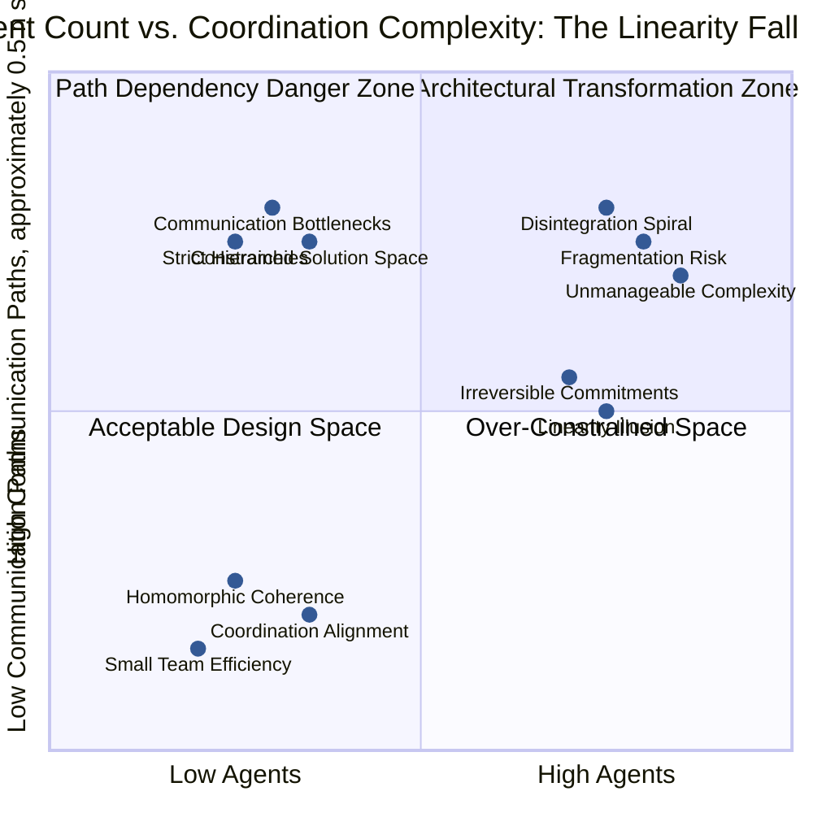

# Agent Count vs. Coordination Complexity: The Linearity Fallacy

```mermaid
quadrantChart
%%{init: {"themeVariables": {"quadrantPointFill": "#345995"}}}%%
    title Agent Count vs. Coordination Complexity: The Linearity Fallacy
    x-axis Low Agents --> High Agents
    y-axis Low Communication Paths --> High Communication Paths, approximately 0.5 n squared
    
    quadrant-1 Architectural Transformation Zone
    quadrant-2 Path Dependency Danger Zone
    quadrant-3 Acceptable Design Space
    quadrant-4 Over-Constrained Space
    
    Homomorphic Coherence: [0.25, 0.25]
    Coordination Alignment: [0.35, 0.2]
    Small Team Efficiency: [0.2, 0.15]
    
    Fragmentation Risk: [0.8, 0.75]
    Disintegration Spiral: [0.75, 0.8]
    Unmanageable Complexity: [0.85, 0.7]
    
    Irreversible Commitments: [0.7, 0.55]
    Linearity Illusion: [0.75, 0.5]
    
    Strict Hierarchies: [0.25, 0.75]
    Communication Bottlenecks: [0.3, 0.8]
    Constrained Solution Space: [0.35, 0.75]
```
