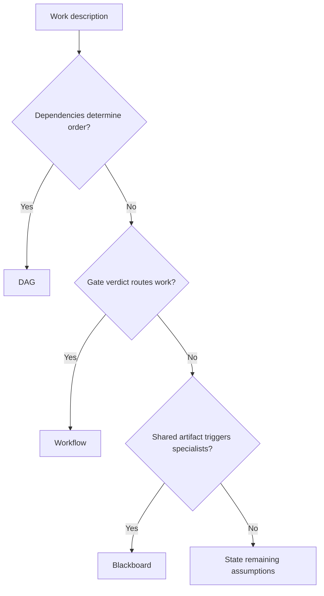
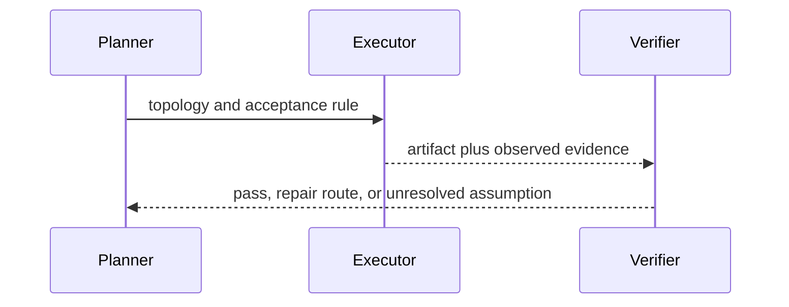

# Topology Evidence Addendum

The topology label should describe who routes work and where state changes, not imply runtime capabilities. The workflow-pattern study catalogs control-flow patterns and compares workflow-language capabilities [van der Aalst et al., 2003](https://doi.org/10.1023/A:1022883727209); Nii describes blackboard application and skeletal systems [Nii, 1986](https://doi.org/10.1609/aimag.v7i3.550). These works inform the pattern vocabulary; they do not prescribe universal worker counts, routing thresholds, or product support.
