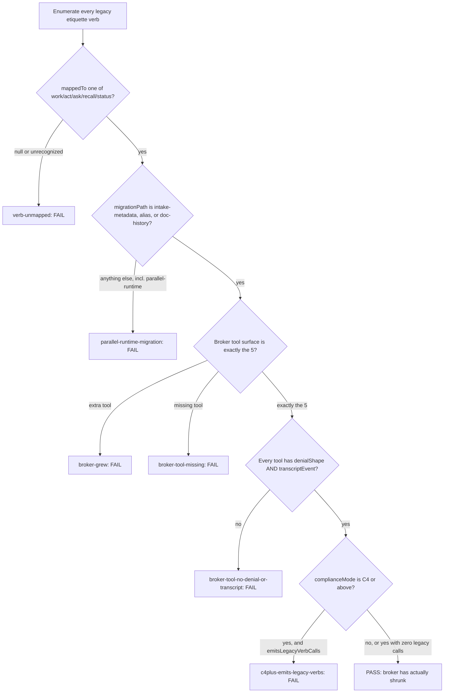

# Coordination Verb Broker Migration

Audit whether an enforced-coordination MCP has really shrunk — not grown — its legacy etiquette verbs into the 5 enforced tools, with a real migration path and a hard compliance gate.

## Use This For

- Reviewing a broker-collapse migration plan before it ships, confirming every legacy verb maps to exactly one of `work`/`act`/`ask`/`recall`/`status`.
- Verifying each of the 5 enforced tools carries one denial shape and one transcript event before advisory bodies are asked to depend on it.
- Gating a body's promotion from advisory coordination (`C0`-`C3`) to enforced coordination (`C4`+) against the IT-018 Broker Collapse requirement of zero legacy-verb calls.
- Catching a "parallel runtime truth" migration — a legacy verb kept alive as a second live code path instead of being retired to metadata, an alias, or documented history.
- Producing a deterministic pass/fail signal for CI or a governance review, not a prose opinion about how the migration "feels."

## Do Not Use This For

- Deciding whether an inbound event should be allowed to spawn an agent at all (`fleet-event-spawn-trust`).
- Specifying the cryptographic mechanism (signed capability token, macaroon, etc.) behind a broker tool's denial (`agentic-zero-trust-security`).
- Designing how agents discover and invoke each other or shard work across a swarm (`swarm-invocation-designer`).

## Collapse Gate

1. **Enumerate the full legacy-verb inventory.** The documented collapse expects ~19 verbs; reconcile the spec's `legacyVerbs` list against that inventory before trusting anything downstream.
2. **Confirm every verb's `mappedTo` target.** A `null` mapping, or a value that isn't one of the 5 canonical tools, means an old client can still call that verb forever with no enforced counterpart.
3. **Confirm every verb's `migrationPath` is a real retirement.** Only `intake-metadata`, `alias`, and `doc-history` count. Anything else — named "parallel-runtime" or not — means a second live implementation still answers the same question as the new tool.
4. **Confirm the broker tool surface is exactly the 5.** No bridge/shim/compat tool, and none of the 5 missing — a legacy verb mapped to a tool that doesn't exist is not actually migrated.
5. **Confirm every one of the 5 tools declares a denial shape and a transcript event.** A tool that can't reject a call in one documented shape, or can't be proven to have run via one documented event, isn't auditable as enforced.
6. **Check the declared `complianceMode`.** `C0`-`C3` may still emit legacy-verb calls without penalty; `C4` and above must prove `emitsLegacyVerbCalls: false` (see `references/compliance-mode-gate-ladder.md` for how to prove it from a transcript, not source code).
7. **Run `scripts/broker_migration_audit.mjs`** and treat any critical finding as a hold on calling the migration done.

## Output Contract

The scorer reads a JSON spec with these fields:

- `brokerTools[]`: `{ name, denialShape: bool, transcriptEvent: bool }` — should be exactly `work`/`act`/`ask`/`recall`/`status`.
- `legacyVerbs[]`: `{ name, mappedTo: 'work'|'act'|'ask'|'recall'|'status'|null, migrationPath: 'intake-metadata'|'alias'|'doc-history'|'parallel-runtime' }`.
- `complianceMode`: `'C0'..'C6'`.
- `emitsLegacyVerbCalls`: `boolean`.

Use `scripts/broker_migration_audit.mjs` to audit that spec and return `{ pass, score, findings, recommendations }`.

## Anti-Patterns

### The Silent Unmapped Verb

**Novice**: Ship a migration plan where a legacy verb is just... left off the mapping table, on the assumption someone will get to it later.
**Expert**: Every legacy verb needs an explicit, valid `mappedTo` target before the plan counts as done — an absent or unrecognized mapping is exactly the verb an old client keeps calling forever with no enforced counterpart.
**Detection**: `broker_migration_audit.mjs` fires `verb-unmapped` (critical) when a legacy verb's `mappedTo` is `null` or is not one of the 5 canonical tools, and `legacy-inventory-incomplete` (high) when the total verb count doesn't match the documented ~19.

### The Bridge Tool ("just for now")

**Novice**: Add a 6th tool (`legacy_bridge`, `verb_router`, a "compat layer") to shim old callers over to new tools temporarily, and let it become permanent — or quietly drop one of the 5 while adding it.
**Expert**: The broker surface is exactly 5 tools, forever, each fully equipped. Any 6th tool is the collapse failing to happen; any missing one of the 5 means legacy verbs are mapped to a tool that doesn't exist.
**Detection**: Fires `broker-grew` (critical) when `brokerTools` contains a name outside `work`/`act`/`ask`/`recall`/`status`, `broker-tool-missing` (critical) when one of the 5 is absent, and `broker-tool-no-denial-or-transcript` (critical) when a present tool lacks a denial shape or a transcript event.

### Parallel Runtime Truth

**Novice**: Keep a legacy verb's original implementation live "just in case," routing some callers to it and some to the new tool — and call that the migration. Then declare enforced compliance while the old calls quietly keep flowing.
**Expert**: A legacy verb's real retirement path is intake-metadata, an alias, or documented history — never a second live code path. And a body claiming `C4`+ must prove, from its own transcript, that it makes zero legacy-verb calls — not just that its source code intends to stop.
**Detection**: Fires `parallel-runtime-migration` (critical) when any legacy verb's `migrationPath` isn't `intake-metadata`/`alias`/`doc-history`, and `c4plus-emits-legacy-verbs` (critical) when a `C4`+ body's `emitsLegacyVerbCalls` is still `true`.

## References

| File | Load When |
| --- | --- |
| `references/verb-collapse-migration-paths.md` | Building or reviewing the legacy-verb-to-tool mapping table, or deciding which of the 3 real retirement paths a verb should take. |
| `references/compliance-mode-gate-ladder.md` | Gating a body's compliance-mode claim, or figuring out how to actually prove `emitsLegacyVerbCalls: false`. |
| `examples/expected-output.md` | Need to see a bad migration audited, then the same migration fixed and passing. |
| `examples/sample-input.json` | Need a complete, passing broker-migration spec to start from. |
| `templates/output-template.md` | Need a reusable migration gap report template to fill in. |
| `schemas/broker-migration-spec.schema.json` | Need to validate a broker-migration-spec JSON payload's structure before auditing it. |
| `scripts/broker_migration_audit.mjs` | Need deterministic scoring of a broker-collapse migration's completeness. |
| `agents/openai.yaml` | Need a subagent descriptor for delegated broker-migration auditing. |
| `README.md` | Need the quick-start path through this skill's files. |
| `CHANGELOG.md` | Need this skill's version history. |

<!-- BEGIN BUNDLE INDEX (auto: index_references.py) -->

## Skill Bundle Index

*Every file in this skill, and when to open it. Auto-generated; run `scripts/index_references.py --fix`.*

**root**
- [`CHANGELOG.md`](CHANGELOG.md) — Coordination Verb Broker Migration — Changelog — - Initial skill creation - Core process defined: mapping → migration path → tool surface → compliance-mode gate - Reference files and determ
- [`README.md`](README.md) — Coordination Verb Broker Migration — Audit whether an enforced-coordination MCP has actually shrunk its ~19 legacy etiquette verbs into the 5 enforced tools — `work`/`act`/`ask`

**`agents/`**
- [`agents/openai.yaml`](agents/openai.yaml) — openai (data/schema)

**`examples/`**
- [`examples/expected-output.md`](examples/expected-output.md) — Example Output: Coordination Verb Broker Migration — Scenario: a team ships a "broker collapse" migration plan that looks done — it has a mapping table and a compliance-mode declaration — but o
- [`examples/sample-input.json`](examples/sample-input.json) — sample input (data/schema)

**`references/`**
- [`references/compliance-mode-gate-ladder.md`](references/compliance-mode-gate-ladder.md) — Compliance Mode Gate Ladder — Use this when you need to decide what a body's declared compliance mode (`C0`-`C6`) actually obligates it to, or when you're gating a body's
- [`references/verb-collapse-migration-paths.md`](references/verb-collapse-migration-paths.md) — Verb Collapse & Migration Paths — Use this when you need to build or review the legacy-verb-to-broker-tool mapping itself: which of the ~19 legacy etiquette verbs maps to whi

**`schemas/`**
- [`schemas/broker-migration-spec.schema.json`](schemas/broker-migration-spec.schema.json) — broker migration spec.schema (data/schema)

**`scripts/`**
- [`scripts/broker_migration_audit.mjs`](scripts/broker_migration_audit.mjs)

**`templates/`**
- [`templates/output-template.md`](templates/output-template.md) — Broker Migration Gap Report — Fill in every section before declaring a broker-collapse migration complete.

<!-- END BUNDLE INDEX -->
