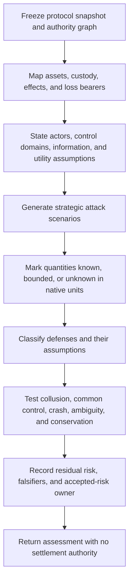

# Cryptoeconomic Protocol Security

Analyze how strategic participants can extract value, impose cost, capture adjudication, or shift loss. Bonds and reputation are possible controls, not proof of security. Start with authority, custody, evidence, and bounded effects; add incentives only where assumptions are explicit and falsifiable.

## Activate when

- work uses a bond, bounty, escrow, slash, refund, reputation score, or salvage fund;
- identities can vote, review, adjudicate, claim scarce work, or form quorums;
- publication order, timing, metadata, or privileged observation creates extractable value;
- requester, worker, oracle, custodian, or platform can collude;
- ambiguous external effects or disputes change payment or reputation;
- a protocol needs an accepted-risk ledger with measurable re-evaluation triggers.

## Do not activate for

- setting a payout, bond, or damage number without an evidenced loss model;
- auditing Solidity/EVM implementation details or blockchain consensus;
- treating an agent as employee, contractor, property, person, or taxpayer;
- declaring custody, beneficial ownership, fairness, or legality;
- launching workers, admitting bodies, moving funds, or resolving a dispute;
- ordinary reputation UX with no strategic allocation or enforcement effect.

## Threat families are open, not exhaustive

Always inspect the families below, then add protocol-specific ones:

1. authority and governance capture;
2. undercollateralization, limited liability, and correlated loss;
3. griefing, denial, abandonment, and liveness extortion;
4. Sybil multiplicity, collusion, bribery, and common control;
5. oracle, evidence, appeal, and dispute capture;
6. ordering, front-running, metadata leakage, and privileged information;
7. custody, liquidity, insolvency, run, and lock-up risk;
8. replay, equivocation, double claim, and cross-domain settlement;
9. reputation laundering, retaliation, discrimination, and newcomer exclusion;
10. externalities whose costs fall outside the mechanism.

“Not applicable” needs a falsifiable reason. No list is complete merely because every row is filled.

## Analysis sequence



## Scenario contract

Each scenario records:

- threat family, attacker coalition, target, prerequisites, sequence, and information advantage;
- gain, attacker cost, victim loss, and system externality as `KNOWN`, `BOUNDED`, or `UNKNOWN` native quantities;
- evidence references and explicit assumptions;
- affected control domains and correlated-failure channels;
- defense references, residual severity, falsifier, and re-evaluation trigger.

Do not manufacture a point estimate to satisfy a template. Unknown is safer than a false number.

## Defense classes

| Class | Examples | Caveat |
|---|---|---|
| Structural | scope limits, reference monitor, one-use authority, independent custody | must prove complete mediation for the claimed effect |
| Cryptographic | commitments, signatures, witnessed append logs, threshold release | integrity and ordering do not prove factual truth or independence |
| Economic | bonds, escrow, fees, rewards, slashing | assumes utility, recoverability, sufficient capital, and bounded loss |
| Procedural | appeals, cooling-off, review, reconciliation, insured fallback | may be slow, capturable, or unavailable under correlated failure |
| Social | reputation, vouching, public history | vulnerable to Sybil identities, collusion, retaliation, sparse data, and exclusion |
| Accepted risk | named owner, trigger, review date, containment | not a euphemism for unexamined risk |

High-impact risk cannot rely on social or economic defense alone when the attacker may be irrational, judgment-proof, externally funded, or able to cause unbounded damage.

## Settlement and evidence boundaries

- Effect containment and settlement are different authorities.
- Requester, worker, custodian, oracle, recorder, and adjudicator control domains must be explicit.
- Quorum count is not independence; shared ownership, keys, evidence, model, incentives, or communication can collapse it to one witness.
- Every settlement criterion names admissible evidence and minimum witness class.
- Conflicting or unavailable evidence yields `UNSETTLED`, not a synthesized green result.
- Payment, refund, slash, reputation change, and salvage funding are new effects with separate authorization and receipts.
- A no-settlement profile is legitimate for inert or research work, but model/API usage and externalities remain accounted.

## Quantitative discipline

Use interval or distributional reasoning only when inputs are evidenced. At minimum distinguish:

- maximum reachable loss versus likely loss;
- attacker profit versus griefing ratio;
- capital posted versus capital actually recoverable;
- independent identities versus common-control identities;
- liquid escrow versus delayed or disputable claims;
- individual failure versus correlated failure;
- direct mechanism balance versus externalized cost.

Sensitivity analysis is required around unknown or policy-selected inputs. A bond-to-damage ratio is meaningful only when both terms share an evidenced scope and unit.

## Anti-patterns

### Exactly five attacks

**Wrong:** a fixed list proves coverage.

**Right:** use the registry as a prompt, then model protocol-specific strategy and externalities.

### More collateral is safer

**Wrong:** raise bonds until defection is expensive.

**Right:** reduce reachable damage first; analyze limited liability, participation exclusion, correlation, custody, and recoverability.

### Diverse-looking quorum

**Wrong:** five agents imply five independent witnesses.

**Right:** prove distinct control domains, evidence sources, keys, and incentives.

### Slashing work quality

**Wrong:** slash whenever an evaluator says output is bad.

**Right:** slash only for predeclared, attributable, observable behavior under an independently reviewable dispute process.

## Output and validation

- [`schemas/mechanism-security-assessment-v2.schema.json`](schemas/mechanism-security-assessment-v2.schema.json)
- [`examples/valid-no-settlement-assessment.json`](examples/valid-no-settlement-assessment.json)
- [`scripts/validate-mechanism-assessment.mjs`](scripts/validate-mechanism-assessment.mjs)
- [`scripts/test-bundle.mjs`](scripts/test-bundle.mjs)
- [`references/threat-model-and-source-ledger.md`](references/threat-model-and-source-ledger.md)
- [`tests/activation.md`](tests/activation.md)

```bash
node skills/cryptoeconomic-protocol-security/scripts/validate-mechanism-assessment.mjs \
  skills/cryptoeconomic-protocol-security/examples/valid-no-settlement-assessment.json
node skills/cryptoeconomic-protocol-security/scripts/test-bundle.mjs
```

The assessment cannot set prices, hold funds, adjudicate evidence, authorize effects, or establish legal or moral status.
