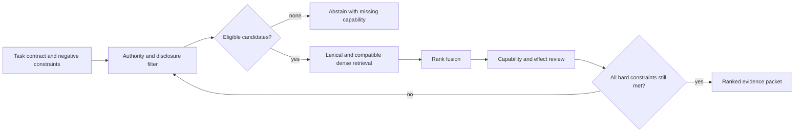
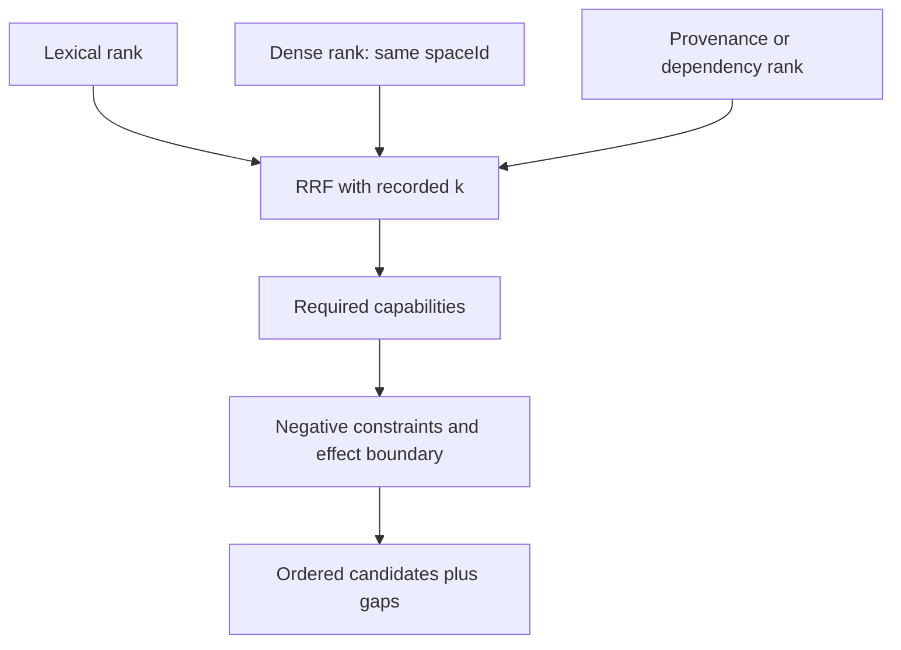

# DAG capability ranker

Rank a supplied candidate set for a stated task. A rank is a comparative recommendation, never a probability that a skill will succeed and never permission to run it. Preserve the query, catalog snapshot, policy version, and explanation so a later reviewer can reproduce the order.

## 1. Establish eligibility before retrieval

Write the required capabilities, prohibited effects, corpus/disclosure scope, tool authority, and evaluation target. Remove candidates that cannot satisfy a hard constraint before retrieval or fusion. If no candidate remains, abstain and name the unmet capability; do not loosen a safety, disclosure, or effect constraint because the ranker found a nearby wording match.

When text or code retrieval is needed, use a local policy-selected hybrid retriever. Apply repository/harbor/account, retention, and redaction filters first. Dense results may only be compared when their immutable `spaceId` matches the query's model, preprocessing, pooling, dimensions, normalization, metric, precision, and quantization recipe. A local policy label records a choice; it does not establish a source guarantee.

## 2. Fuse evidence, then inspect capability coverage

RRF can combine independent ranked lists without treating their scores as commensurate probabilities:

`RRF(d) = sum_i 1 / (k + rank_i(d))`.

Record the lists, omitted candidates, `k`, and ties. Cormack, Clarke, and Buettcher describe RRF as an IR fusion method; it does not prove an agent's competence, authorization, or outcome probability. Bruch, Gai, and Ingber report that fusion behavior is benchmark-dependent, so do not claim RRF is universally best. For each fused candidate, inspect required capability evidence and prohibited-effect evidence separately; a high retrieval rank cannot repair a missing requirement.

## 3. Evaluate without invented universal cutoffs

Evaluate candidate recall, capability-check precision, abstentions, and downstream task outcome on a representative labeled set or reviewed cases. Split by task family, policy, catalog revision, and effect class where those factors change the decision. Historical run data can be evidence only when its outcome predicate, cohort, missingness, and time window are recorded. Cold-start candidates should be marked as having limited evidence, not automatically penalized by a fabricated count threshold.

### Worked positive case

The task requires static TypeScript review and forbids live requests. After authority filtering, X ranks `(lexical 1, dense 6)` and Y ranks `(lexical 4, dense 1)`. With the illustrative local choice `k=60`, RRF puts Y first. The capability review finds Y permits a live probe and lacks an offline procedure, so Y is excluded and the eligible-set ranking is recomputed. X is recommended with the retrieval ranks and the reason it satisfies the effect constraint.

### Worked negative case

Candidate Z has the best semantic rank but embeds a different `spaceId` from the query. Do not normalize or compare its vector score. Retain lexical evidence only under a policy-permitted, explicitly degraded contract. A requested hybrid contract remains unmet: report the incompatible dense evidence and either use an authorized re-embedding migration or abstain.

## 4. Output contract and limits

Return: task contract; policy and catalog snapshots; applied filters; retrieval lists and compatible `spaceId`; fusion parameters; rank order; capability/effect evidence; gaps; abstentions; and evaluation status. Read [authority-filtered hybrid ranking](references/authority-filtered-hybrid-ranking.md) for the source notes. Cite [Cormack et al., 2009](https://cormack.uwaterloo.ca/cormacksigir09-rrf.pdf) for RRF and [Bruch et al., 2022](https://arxiv.org/abs/2210.11934) for method sensitivity. These sources address retrieval experiments, not authorization or agent performance.

Do not use this skill for semantic discovery alone, an unstructured catalog browse, execution scheduling, or a release decision. Use `dag-semantic-matcher` for candidate discovery, `dag-skill-registry` for catalog evidence, `dag-graph-builder` for planning, and `dag-pattern-learner` for outcome-history analysis.

Before recommending, inspect the [operational preference worksheet and failure checks](references/authority-filtered-hybrid-ranking.md#operational-preference-worksheet). They preserve reliability, latency and resource trade-offs separately from retrieval relevance.
