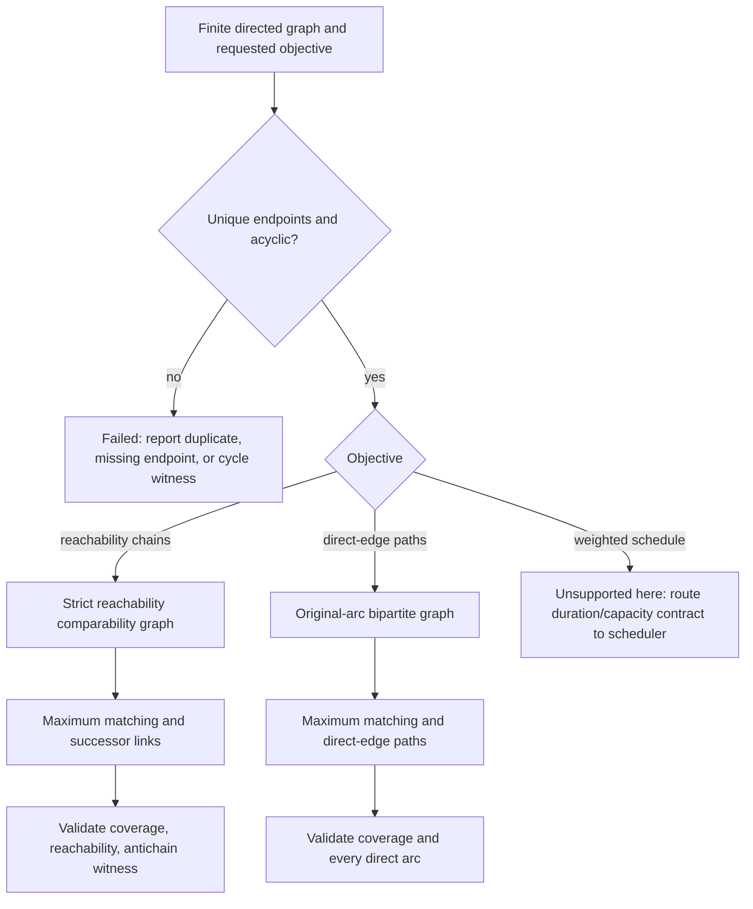

# DAG chain decomposition

Use when the requested result is an order-theoretic partition of a nonempty finite DAG. First choose the objective: a reachability-chain partition, a direct-edge vertex-disjoint path cover, or a weighted schedule are different outputs. This skill proves only the first two; a weighted request routes to `dag-task-scheduler` with its duration/capacity data intact.

## Objective and proof procedure

1. Check semantic input facts before construction: node IDs are unique, every edge endpoint exists, no self-loop/duplicate edge changes the intended relation, and the directed graph is acyclic. JSON Schema checks field shape; it cannot establish those graph facts.
2. For a reachability-chain partition, define strict comparability `u < v` iff a nonempty directed path leads from `u` to `v`. Build left/right vertex copies and an edge `uL—vR` for each strict comparable pair. A maximum matching of size `m` reconstructs successor links and produces `|V|-m` chains. Check every adjacent pair in every returned chain by reachability and every vertex exactly once. An equal-size antichain witness completes the finite-poset proof obligation under Dilworth/Fulkerson.
3. For a direct-edge path cover, build the same matching construction from original arcs only. It returns vertex-disjoint direct-edge paths, which can require more paths than a reachability-chain partition. Do not use a transitive witness as though it were an arc.
4. Treat width as a lower bound on the number of reachability chains under the stated finite-poset objective. It neither supplies workers, durations, queues, communication costs, nor makespan. If any of those are requested, return `unsupported` for this skill’s output and route the same graph to the scheduler.
5. If using Chen’s 2009 procedure, retain only source-supported phases: DAG stratification, chain generation, and virtual-node resolution; the body distinguishes virtual nodes generated for actual nodes from those generated for virtual nodes and names a combined alternating graph for resolution. The retrievable source scope does not verify a generic adjacent-level matching implementation or prove it gives an exact minimum partition.

## Four decision methods

### 1. Decomposition strategy selection

Select the mathematical objective before choosing an algorithm. A stratified application graph can be a useful representation, but stratification is not itself a proof that its largest level is width or that a local assignment is globally minimum. If the model is tangled, identify missing endpoints, direction semantics, or cycles before changing the graph representation.

### 2. Virtual node versus immediate assignment

Chen 2009’s source-described virtual-node phases are a method-specific deferred-resolution mechanism, not a general instruction to create placeholders whenever depth exceeds a threshold. Record whether a virtual node was generated for an actual node or another virtual node, retain its source/target relation, and resolve only through the source-named combined alternating graph procedure when that source has been fully implemented and checked. Otherwise return an incomplete proposal, not an optimal assignment.

### 3. Assignment and matching

For the exact finite-poset objective, maximum matching belongs on the full strict-reachability bipartite graph. For direct paths, it belongs on original arcs. In either case, reconstruct each successor/predecessor relation from matching edges and verify the output; a matching at an arbitrary level interface is not automatically a proof for either global objective.

### 4. Width measurement and validation

An antichain witness proves a lower bound. An equal number of valid reachability chains plus a maximum-matching certificate proves the exact result for the stated finite poset. A sink-peeling level can be a useful shape view but is not necessarily maximum width. Never turn width into “minimum agents” without a separate capacity/scheduling model.

## Five diagnostic procedures

**Sub-width compression fallacy.** If fewer chains are claimed than the antichain witness size, reject the result. The repair is a matching/coverage audit, not resource spawning.

**Premature assignment.** If an application heuristic makes local commitments without a global certificate, label the result heuristic or incomplete. Do not claim Chen virtual-node resolution unless its exact source procedure is present.

**Depth-width confusion.** Report longest-path depth and antichain width as different graph properties. Neither is a processor count or a duration estimate.

**Local optimization without a valid objective.** A level-wise matching may be useful for a named method, but cannot substitute for closure matching when the requested output is a reachability-chain proof. Preserve the selected objective in output JSON.

**Resource spawning before matching.** A new chain is a structural partition member, not a live worker. Verify the partition first; the scheduler later decides resource admission from independent duration/capacity evidence.

## Constructed application fixtures

### Example 1: deployment graph, partition versus schedule

Constructed direct arcs are `db-dev→api-dev→verify-dev`, `db-stage→api-stage→verify-stage`, and `verify-dev→promote-stage`, `verify-stage→promote-prod`. A chain/path partition can expose ordered members, but it cannot claim three environments need three agents or that promotion has a completion time. The finite fixture in [proof and application fixtures](references/proof-and-application-fixtures.md) supplies an exact chain/antichain result and separately shows the additional data a schedule would require.

### Example 2: sensor pipeline with deferred semantics

Constructed arcs are `ingest-temperature→quality-temperature→aggregate`, `ingest-vibration→quality-vibration→aggregate`, and `aggregate→alert`. “Post-quality processing” has no graph node until its input/output contract is known; it is not a virtual-node result by itself. A proposal may record an unresolved virtual-node role, but a verified chain partition contains only actual graph vertices. The fixture identifies the negative case where missing quality semantics prevent a verified claim.

### Example 3: legal concatenation witness

For arcs `a→x`, `c→x`, `x→b`, `x→d`, use direct-path cover `[[a,x,b],[c],[d]]`. In the constructed Algorithm-3 iteration searching backward from `d`, visit incoming `x`, continue past interior `x` because it is not a current chain endpoint, then find endpoint `c`. The witness `c→x→d` permits member chains `[c]` and `[d]` to join as `[c,d]`; `x` remains assigned to `[a,x,b]`. The result `[[a,x,b],[c,d]]` is vertex-disjoint. This illustrates witness versus membership, not a source-mandated DFS tie order or global implementation proof.

## Quality gates and boundaries

Record objective, graph revision, node/edge semantics, closure or direct-arc basis, matching size, output partition, and validation status. A `verified` exact chain result includes nonempty chains, matching certificate, and antichain witness; a `verified` direct path result includes nonempty paths and matching certificate; schedule requests route out as unsupported. Shape validation is not semantic graph proof.

Do not use this skill to dispatch work, choose worker counts, compute a calendar, update a changing graph, or promise Chen/Fulkerson behavior without the corresponding constructed graph and proof artifacts.

Read [finite proof and application fixtures](references/proof-and-application-fixtures.md), [Chen source boundary](references/chen-source-boundaries.md), and [schema examples](schemas/examples.md).
