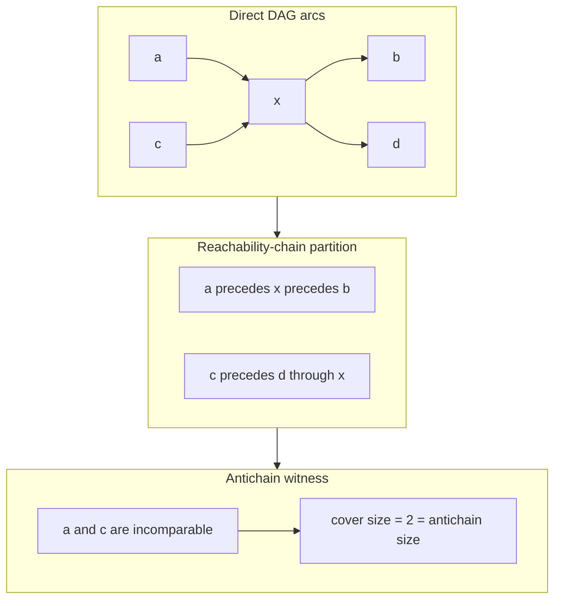

# Reachability-chain cover and antichain certificate

```mermaid
flowchart TB
  subgraph DAG[Direct DAG arcs]
    a[a] --> x[x]
    c[c] --> x
    x --> b[b]
    x --> d[d]
  end
  subgraph Cover[Reachability-chain partition]
    C1[a precedes x precedes b]
    C2[c precedes d through x]
  end
  subgraph Witness[Antichain witness]
    W[a and c are incomparable]
    K[cover size = 2 = antichain size]
    W --> K
  end
  DAG --> Cover
  Cover --> Witness
```

The chain `c < d` uses reachability through `x`; it is not a direct-edge path within one vertex-disjoint component.
